# Day 8 — ROS 2 기초 실습 과제 (turtlesim / 토픽 / 서비스)

- 날짜: 2026-08-24 (월)
- 환경: Ubuntu 22.04.5 LTS + ROS 2 Humble (Lenovo Legion 5 15IMH05H)
- 성격: **R2R 강의 진도와 별개로 연구실에서 내려온 과제** (진도 체크리스트에는 반영하지 않음)
- 제출 방식: 과제별 전체화면 캡처를 메신저로 인증 (보고서·소스코드 제출 없음)

## 0. 오늘의 목표

과제 안내서 기준 4개 과제 수행.

| 구분 | 과제명 | 핵심 명령어 | 결과 |
|---|---|---|---|
| 과제 1 | 환경 설치 및 Turtlesim 기초 검증 | `turtlesim_node` + `rqt_graph` | 수행 완료 (인증 캡처 요건은 아래 6절 참고) |
| 과제 2 | 토픽 통신 (Pub/Sub) 송수신 검증 | `demo_nodes_py talker / listener` | 완료 |
| 과제 3 | 명령어로 거북이 원형 궤적 그리기 | `ros2 topic pub /turtle1/cmd_vel` | 완료 |
| 과제 4 | 서비스 호출 — 두 번째 거북이 소환 | `ros2 service call /spawn` | 완료 |

과제 자체보다 **"토픽과 서비스가 어떻게 다른 통신 방식인지"를 몸으로 체감하는 것**이 실제 목적이라고 판단하고 진행했다. 안내서의 "4대 통신 메커니즘"을 4개 과제가 1:1로 다루는 것이 아니라, 실제로 다루는 것은 토픽과 서비스 2개뿐이다. (과제 2와 과제 3은 둘 다 토픽이며, 발행 주체가 파이썬 코드냐 CLI냐만 다르다.)

---

## 1. 환경 확인 — `humble` alias

새 터미널마다 ROS 2 환경 변수를 로드해야 하는데, 이 노트북은 `.bashrc` 자동 소싱 대신 alias 방식으로 세팅해 둔 상태다.

```bash
alias   # 현재 터미널에 등록된 별칭 목록 전체 출력
```

- `alias`: 긴 명령어에 짧은 별명을 붙이는 기능. 인자 없이 실행하면 등록된 별칭 목록을 보여준다.
- 등록해 둔 별칭:
  ```
  alias humble='source /opt/ros/humble/setup.bash; echo "ROS2 humble is activated"'
  ```
  `;` 뒤의 `echo`는 소싱이 끝난 뒤 확인 메시지를 찍어주는 부분이다. 소싱은 원래 아무 출력이 없어서 성공 여부를 알 수 없는데, 이 한 줄 덕분에 눈으로 확인할 수 있다.
- 윈도우 비교: 바탕화면 바로가기와 비슷하다. 짧은 이름 하나로 긴 원본 명령을 대신 실행한다.

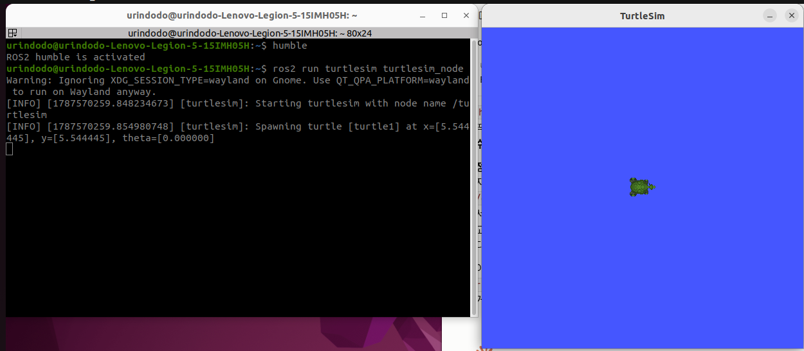

**확인한 것**: `humble` 실행 시 `ROS2 humble is activated`가 출력되면 그 터미널에서 `ros2` 명령을 쓸 수 있다.
**주의**: alias는 **터미널 창마다 새로 실행**해야 한다. 앞 창에서 실행했다고 새 창에 자동 적용되지 않는다. 오늘 터미널을 5~6개 열었는데 매번 첫 줄은 `humble`이었다.

---

## 2. 과제 1 — Turtlesim 기초 검증

### 실행

```bash
# 터미널 1
ros2 run turtlesim turtlesim_node

# 터미널 2
ros2 run turtlesim turtle_teleop_key

# 터미널 3
rqt_graph
```

- `ros2 run <패키지명> <실행파일명>`: 특정 패키지 안의 노드를 실행한다.
- `turtlesim`의 `sim` = simulation. 실제 하드웨어 없이 화면 위 거북이를 로봇 대신 움직여보는 연습용 시뮬레이터.
- `teleop` = teleoperation(원격 조작), `key` = keyboard. 즉 `turtle_teleop_key` = "키보드로 원격 조작하는 노드". (비밀번호 key가 아니다.)

### 출력 해석

`turtlesim_node` 실행 시 나온 로그:

```
Warning: Ignoring XDG_SESSION_TYPE=wayland on Gnome. Use QT_QPA_PLATFORM=wayland to run on Wayland anyway.
[INFO] [turtlesim]: Starting turtlesim with node name /turtlesim
[INFO] [turtlesim]: Spawning turtle [turtle1] at x=[5.544445], y=[5.544445], theta=[0.000000]
```

- 첫 줄 Warning은 에러가 아니다. 화면 표시 방식(Wayland/X11) 관련 안내이며, GUI 창이 정상적으로 떴으므로 무시해도 된다.
- `Starting turtlesim with node name /turtlesim`: 노드 이름이 `/turtlesim`으로 시작됨.
- `Spawning turtle [turtle1] at ...`: `turtle1`이라는 거북이가 화면 중앙(x≈5.54, y≈5.54)에 생성됨. `theta`는 방향(각도).

### 막혔던 부분 — 방향키를 눌러도 거북이가 안 움직임

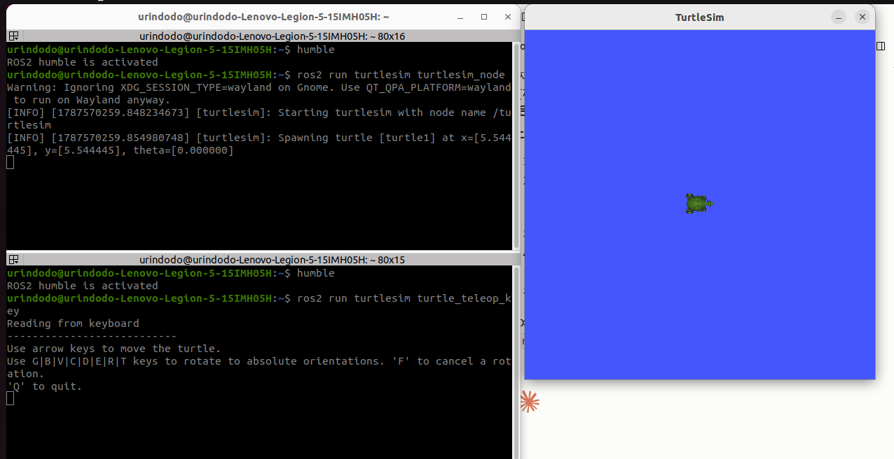

원인은 과제 안내서 FAQ Q2에 있던 그대로였다. **`teleop_key`는 그 노드가 실행된 터미널 창이 포커스(활성 창)일 때만 키 입력을 받는다.**

- OS는 키보드 입력을 **활성 창 딱 하나에만** 전달한다. `teleop_key` 창을 클릭해서 포커스를 주지 않으면 방향키가 애초에 그 프로그램까지 도달하지 않는다.
- 해결: `teleop_key`가 실행 중인 터미널 **안쪽을 마우스로 클릭**한 뒤 방향키 입력. (이 터미널 테마는 활성 창의 제목 표시줄이 빨간색으로 바뀌어서 구분하기 쉽다.)

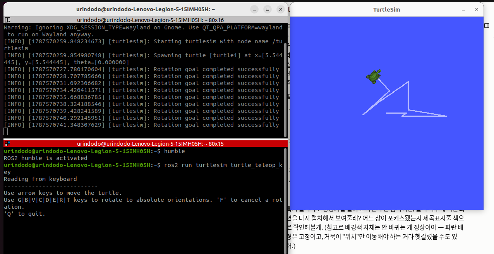

### 여기서 헷갈렸던 것 — 왜 아래 창에 입력했는데 위 창에 로그가 뜨나

창 포커스와는 완전히 별개의 이야기였다.

- 아래 창(`teleop_key`): 키 입력을 감지해서 **명령만 보내는** 노드
- 위 창(`turtlesim_node`): 그 명령을 받아 **실제로 거북이를 움직이고 로그를 찍는** 노드
- 두 노드는 화면상의 창으로 연결된 게 아니라 **ROS 2 토픽(`/turtle1/cmd_vel`)으로 연결**되어 있다. 그래서 입력은 아래, 동작 로그는 위에 뜬다.

### rqt_graph — 노드 관계 시각화

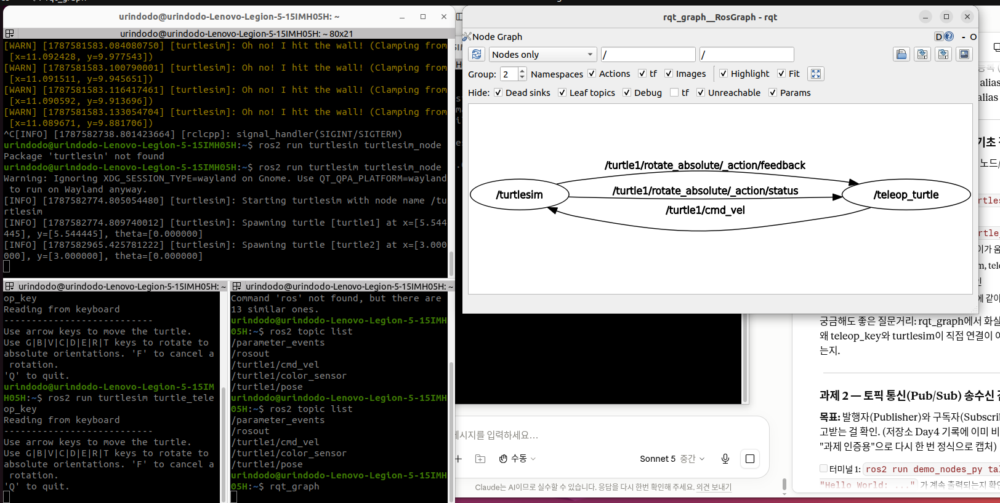

- 타원 = 노드, 화살표 = 통신 경로, 화살표 위 글자 = 그 경로의 토픽/액션 이름
- `/turtle1/cmd_vel`: `teleop_turtle` → `turtlesim` 방향. 속도 명령 토픽.
- `/turtle1/rotate_absolute/_action/feedback`, `.../status`: `turtlesim` → `teleop_turtle` 방향. teleop에서 `G/B/V/C/D/E/R/T` 키로 "절대 방향 회전"을 시켰을 때 진행상황과 상태를 되돌려주는 **액션** 관련 채널.
- 화면 좌우 배치(어느 노드가 왼쪽에 오는지)는 실행할 때마다 달라진다. **의미가 있는 것은 화살표의 방향**이지 노드의 위치가 아니다.
- 상단 설정: `Nodes only` 모드라 토픽이 별도 사각형으로 표시되지 않고 화살표 라벨로만 나온다.

**추가로 확인한 것 — 거북이를 2마리 만들어도 노드는 2개 그대로다.**
이 캡처는 과제 4까지 끝낸 뒤 다시 찍은 것이라, 터미널 로그에 `Spawning turtle [turtle2] at x=3.000, y=3.000`이 남아 있다. 그런데도 그래프에는 `/turtlesim`과 `/teleop_turtle` **두 노드만** 보인다.
→ `turtle2`는 독립된 노드가 아니라 **`turtlesim` 노드 내부에서 관리하는 객체**이기 때문이다. 실제로 생성 로그를 찍은 주체도 `[turtlesim]`이다. "거북이 = 노드"가 아니라 "시뮬레이터 = 노드, 거북이 = 그 안의 객체"라는 구분이 여기서 확인된다.

**이 그림이 나중에 4대 통신 메커니즘을 이해하는 결정적 단서가 됐다 (6절 참고).**

---

## 3. 과제 2 — 토픽 통신 (Pub/Sub)

```bash
# 터미널 1
ros2 run demo_nodes_py talker

# 터미널 2
ros2 run demo_nodes_py listener
```

첫 시도에서 `deom_nodes_py`로 오타를 냈고, `Package 'deom_nodes_py' not found`가 떴다. 리눅스는 패키지명을 철자까지 정확히 일치시켜야 하며, 비슷한 이름을 알아서 찾아주지 않는다.

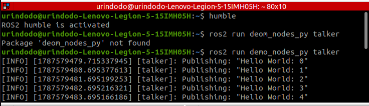

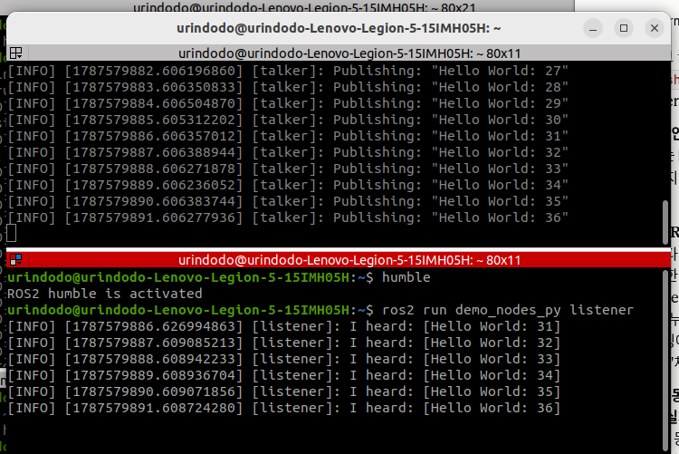

talker가 27~36을 발행하는 동안 listener가 31~36을 그대로 수신했다. (listener를 나중에 켰기 때문에 앞번호는 받지 못했다 — 정상이다.)

### 여기서 정리된 개념

**Q. `demo_nodes_py`가 통신 상대를 특정하는 건가?**
아니다. `demo_nodes_py`는 **코드가 들어있는 폴더(패키지) 이름**일 뿐이고, talker와 listener는 그 안에 함께 들어있는 예제 프로그램 2개다.

**실제로 연결을 결정하는 것은 토픽 이름이다.**
- talker 코드: `create_publisher(String, 'topic', 10)` → `'topic'`이라는 이름으로 발행
- listener 코드: `create_subscription(String, 'topic', ...)` → 같은 이름을 구독
- **이름이 같으면 자동 연결**된다. 서로를 지목한 것이 아니다.

**비대칭 구조**
- 발행자는 누가 듣는지 **전혀 모르고 신경 쓰지 않는다.** 구독자가 0명이어도 계속 쏜다.
- 구독자만 "나는 이 채널을 듣겠다"고 스스로 선택한다.
- 라디오 비유: 방송국은 특정 청취자를 지정하지 않고 주파수로 송출만 하고, 청취자가 그 주파수에 맞춘다.

**그래서 생기는 위험**: 다른 패키지의 talker가 같은 `'topic'` 이름으로 발행하면, listener는 **누가 보냈는지 구분 없이 뒤섞어 받는다.** ROS 2는 이걸 막아주지 않는다. 토픽은 1:1이 아니라 **N:M 공용 채널**이기 때문이다. 이름 충돌을 피하는 것은 개발자 책임이며, 실무에서는 네임스페이스(`turtle1/`, `turtle2/` 같은 접두어)나 구체적인 토픽 이름으로 분리한다.

→ **이 위험은 과제 3에서 실제로 재현됐다.**

---

## 4. 과제 3 — CLI로 원형 궤적 그리기

```bash
ros2 topic pub -r 10 /turtle1/cmd_vel geometry_msgs/msg/Twist \
  "{linear: {x: 2.0, y: 0.0, z: 0.0}, angular: {x: 0.0, y: 0.0, z: 1.8}}"
```

### 명령어 분해

| 조각 | 의미 |
|---|---|
| `ros2 topic pub` | 토픽에 데이터를 직접 발행. 코드를 짜지 않고 CLI로 publisher 역할을 대신함 |
| `-r 10` | rate(빈도). **1초에 10번 반복 발행.** 이 옵션이 없으면 1번만 쏘고 끝나서 거북이가 살짝 움직이다 멈춘다 |
| `/turtle1/cmd_vel` | 발행 대상 토픽 이름 |
| `geometry_msgs/msg/Twist` | 메시지 타입. 로봇 속도 표준 형식이며 `linear`(직진)와 `angular`(회전)로 구성 |
| `"{linear: ..., angular: ...}"` | 실제 값. `linear.x=2.0`(전진) + `angular.z=1.8`(회전)을 동시에 주면 원이 그려진다 |

원 반경 공식은 안내서 FAQ Q3 기준 `R = v / ω` (선속도 ÷ 각속도). `linear.x`를 키우거나 `angular.z`를 줄이면 원이 커진다.

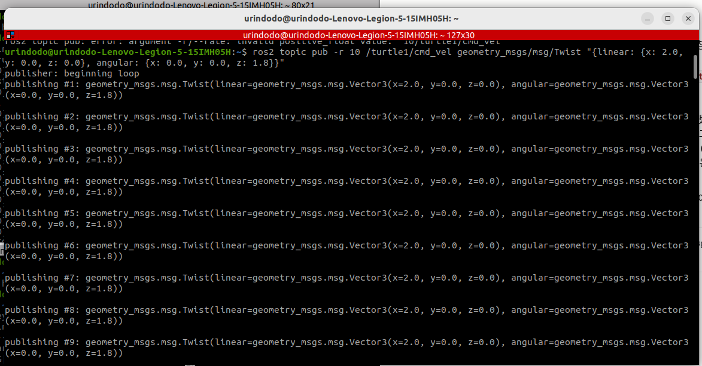

출력의 `publisher: beginning loop`는 반복 발행 시작 신호이고, `publishing #1, #2, ...`는 발행 횟수다. 매번 같은 Twist 값이 반복 출력되는 것이 정상이다.

### 시행착오 1 — `-r 10` 파싱 에러

첫 시도에서 `argument -r/--rate: invalid positive_float value: '10/turtle1/cmd_vel'` 계열 에러가 났다.
→ **추정**: `-r`과 `10` 사이 또는 `10`과 토픽 이름 사이의 띄어쓰기가 어긋나 `10/turtle1/cmd_vel`이 통째로 rate 값으로 읽힌 것으로 보인다. (에러 줄이 화면 상단에서 잘려 원문 전체를 확보하지 못했으므로 **미확인 추정**이다.) 띄어쓰기를 정확히 맞춰 다시 입력하니 정상 동작했다.

### 시행착오 2 — 발행자 2개 충돌 (과제 2에서 배운 N:M의 실증)

`topic pub`을 돌리는 상태에서 `teleop_key`로 방향키를 누르니, 거북이가 원을 그리다 궤도를 벗어났다. 여기에 종료하지 않은 `topic pub`이 중복 실행되면서 화면이 완전히 엉켰고 `Oh no! I hit the wall!` 로그가 쏟아졌다.

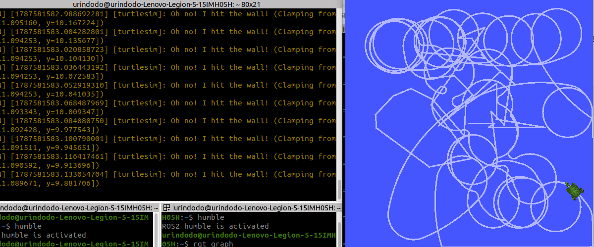

원인: `/turtle1/cmd_vel` **하나의 토픽에 발행자가 둘 이상 붙은 상태**. 구독자(turtlesim)는 누가 보냈는지 구분하지 않고 **가장 최근에 도착한 메시지를 그대로 적용**한다. 충돌을 조율해주는 장치는 없고, 나중에 온 것이 이긴다.

해결: `topic pub` 프로세스와 `teleop_key`를 모두 `Ctrl+C`로 종료하고, turtlesim을 재시작한 뒤 `topic pub`만 단독 실행.

### 중간 점검 — `ros2 topic list`

```bash
ros2 topic list
```

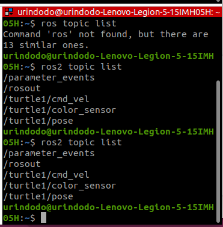

(첫 줄은 `ros`로 오타를 내서 `Command 'ros' not found, but there are 13 similar ones.`가 떴다. `ros2`로 정확히 입력해야 한다.)

출력:
```
/parameter_events
/rosout
/turtle1/cmd_vel
/turtle1/color_sensor
/turtle1/pose
```

**중요**: 이 목록은 특정 터미널의 토픽이 아니라 **이 컴퓨터의 ROS 2 네트워크 전체에 열려있는 토픽**이다. 토픽은 터미널 소속이 아니라 시스템 공용 채널이기 때문이다.

- `/parameter_events`, `/rosout`: ROS 2가 기본으로 만드는 시스템용 토픽(파라미터 변경 알림, 로그)
- `/turtle1/pose`: turtlesim이 거북이의 현재 위치·각도를 계속 발행하는 토픽 (turtlesim도 발행자였다는 사실을 여기서 처음 확인)
- `/turtle1/color_sensor`: 거북이가 지나간 자리의 색 정보

### 결과

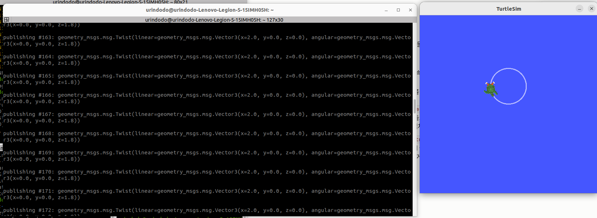

---

## 5. 과제 4 — 서비스 호출로 두 번째 거북이 소환

```bash
ros2 service call /spawn turtlesim/srv/Spawn "{x: 3.0, y: 3.0, theta: 0.0, name: 'turtle2'}"
```

첫 시도에서 두 군데를 틀렸다.
- `call`과 `/spawn` 사이 띄어쓰기 누락 → `invalid choice: 'call/spawn'`
- 서비스 타입 구분자를 `.`으로 씀 (`turtlesim.srv.Sq`) → 올바른 형식은 `/` 구분 (`turtlesim/srv/Spawn`)

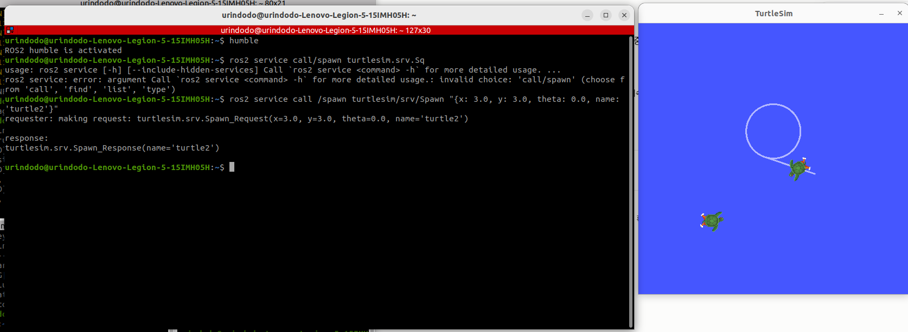

출력:
```
requester: making request: turtlesim.srv.Spawn_Request(x=3.0, y=3.0, theta=0.0, name='turtle2')

response:
turtlesim.srv.Spawn_Response(name='turtle2')
```

### 명령어 분해

| 조각 | 의미 |
|---|---|
| `ros2 service call` | 서비스를 호출한다 (`topic pub`의 서비스 버전) |
| `/spawn` | 호출할 서비스 이름 |
| `turtlesim/srv/Spawn` | 서비스 타입. 요청(Request)과 응답(Response)의 구조를 정의 |
| `"{x: 3.0, y: 3.0, theta: 0.0, name: 'turtle2'}"` | 요청값 |

`spawn`은 게임·프로그래밍에서 쓰는 단어로 **"(객체를) 생성해서 등장시키다"**는 뜻. 리스폰(respawn)의 그 spawn이다.

### 여기서 체감한 토픽과의 차이

거북이가 움직이는 과정 없이 **즉시 생성되고 끝난 것이 정상 동작**이다.

| | 토픽 (`topic pub`) | 서비스 (`service call`) |
|---|---|---|
| 반복 | `-r 10`으로 시작하면 알아서 계속 흐름 | **매번 직접 호출해야 함** |
| 응답 | 없음. 누가 듣는지도 모름 | 반드시 1회 응답 |
| 비유 | 라디오 방송 | **함수 호출** (`result = 함수(인자)`) |
| 관찰되는 것 | 매 순간 조금씩 변하는 과정 | 요청 → 결과, 끝 |

거북이를 하나 더 만들려면 `name: 'turtle3'`으로 값을 바꿔 **다시 호출**해야 한다. 실제 코드에서는 "배터리 20% 이하면 충전소 호출 서비스를 부른다"처럼 프로그램이 필요한 타이밍에 알아서 호출하도록 짜게 된다.

---

## 6. 개념 정리 — 4대 통신 메커니즘의 실제 위계

과제 안내서 5.1의 표는 토픽 / 서비스 / 액션 / 파라미터를 **나란히 4개**로 놓는다. 그런데 실습하며 확인한 바로는 **이 넷은 같은 층위가 아니다.**

```
바탕: 소켓 (양방향 통신 능력 그 자체)
  │
  ├─ 토픽    (원초적 패턴 1: 응답 없이 계속 흐름)
  └─ 서비스  (원초적 패턴 2: 요청-응답 1회)
       ├─ 액션     = 서비스(목표/취소/결과) + 토픽(피드백/상태) 조합
       └─ 파라미터 = 서비스 패턴을 "노드 설정값 조회/변경"에 특화
```

**확인한 근거**: 과제 1의 rqt_graph 캡처에서 액션 관련 화살표가 `/turtle1/rotate_absolute/_action/feedback`, `.../status`라는 **토픽 이름**으로 표시됐다. 액션의 feedback/status 부분이 내부적으로 토픽으로 구현되어 있다는 뜻이다.

**추정**: 파라미터가 서비스 패턴 위에 구현되어 있다는 부분은 "Get/Set이 곧 요청-응답"이라는 구조적 유추이며, 오늘 실습으로 직접 확인하지는 않았다.

즉 안내서의 표는 **"어떤 상황에 무엇을 쓸지"에 대한 사용 목적 기준 분류**이고, 구현 계층으로 보면 뿌리는 토픽과 서비스 2개다.

### 각 통신 방식 정의 (오늘 기준 정리)

- **토픽(Topic)**: 발행자가 응답을 기다리지 않고 계속 흘려보내는 단방향 방송. N:M 공용 채널. 예: `/cmd_vel`, 센서 스트리밍
- **서비스(Service)**: 한 번 요청하면 한 번 응답하고 끝나는 함수 호출식 통신. 1:1. 예: `/spawn`
- **액션(Action)**: 오래 걸리는 작업을 요청하고, 수행 중 진행상황(Feedback)을 계속 보고받다가 최종 결과(Result)를 받는 방식. **"동작 대신 상태만 보여주는 것"이 아니라 동작을 수행하면서 진행상황도 함께 알려주는 것.** 예: `rotate_absolute`
- **파라미터(Parameter)**: 노드가 가진 설정값을 실행 중에 외부에서 읽거나(Get) 바꾸는(Set) 방식. 예: 최대 속도, PID 게인

### 헷갈렸던 것 — `-r 10`과 QoS는 다른 이야기

| | `-r 10` | QoS (Quality of Service) |
|---|---|---|
| 무엇 | 발행 **빈도** (1초에 몇 번 publish 하나) | 메시지의 **전달·보관 방식** 약속 |
| 대응 코드 | `create_timer(0.5, callback)` | `create_publisher(String, 'topic', 10)`의 **마지막 `10`** (큐 깊이) |
| 예시 항목 | — | 재전송 여부(reliable/best-effort), 큐에 몇 개까지 쌓을지, 새 구독자에게 과거 메시지를 줄지 |

치트시트 파이썬 코드의 `create_publisher(String, 'topic', 10)`에서 끝의 `10`이 바로 QoS 큐 깊이였다. `-r 10`의 `10`과 숫자만 같고 의미는 완전히 다르다 (하나는 속도, 하나는 버퍼 크기).

---

## 7. 노드와 실행 구조에 대해 정리된 것

- **노드(Node)** = "딱 한 가지 역할만 하는 독립 프로그램 한 개". 로봇 전체를 프로그램 하나로 짜지 않고 역할별로 쪼갠 뒤 메시지로 연결하는 것이 ROS 2의 설계 철학이다.
- **"노드 하나당 터미널 하나"가 본질이 아니다.** 터미널이 하나씩 필요했던 이유는 이 프로그램들이 **끝나지 않고 계속 실행되며 터미널을 점유**하기 때문이다(포그라운드 실행). 백그라운드 실행이나 launch를 쓰면 창을 나누지 않아도 된다. 오늘은 각 노드의 로그를 눈으로 봐야 해서 일부러 나눠 썼다.
- **노드를 잘게 쪼개면 켤 프로그램이 많아지는 문제**는 `ros2 launch`로 해결한다. launch 파일에 "이 노드들을 이런 설정으로 함께 켜라"를 적어두고 한 줄로 실행한다.
  - **주의**: launch는 **여러 프로그램을 한 번에 켜주는 리모컨**이지, 여러 노드를 **하나로 합치는 것이 아니다.** 실행 후에도 각 노드는 여전히 독립된 프로세스다.
  - 합치지 않는 이유: ① 하나가 죽어도 나머지는 살아있다 ② 부품 교체가 쉽다(키보드 조작 노드를 AI 판단 노드로 갈아끼워도 turtlesim 쪽은 손대지 않는다) ③ 실제 로봇은 카메라·모터·판단부가 물리적으로 다른 기계에서 도는 경우가 있어 애초에 합칠 수 없다
- **묶음의 두 단계**: 패키지(같은 주제의 노드들을 담은 배포 단위, 예: `turtlesim`) / launch 파일(실행 시 함께 켤 조합)

---

## 8. 오늘의 시행착오 모음

| 증상 | 원인 | 해결 |
|---|---|---|
| 방향키를 눌러도 거북이가 안 움직임 | `teleop_key` 터미널이 포커스 상태가 아님 | 해당 터미널 안쪽 클릭 후 입력 |
| `Package 'deom_nodes_py' not found` | 패키지명 오타 | `demo_nodes_py` 정확히 입력 |
| `Package 'turtlesin' not found` | 패키지명 오타 (`turtlesim`의 `m`→`n`) | `turtlesim` 정확히 입력 |
| `Command 'ros' not found` | `ros2`의 `2` 누락 | `ros2` 입력 |
| `invalid positive_float value` | `-r` 옵션 값 파싱 실패 (띄어쓰기 문제로 **추정**) | 띄어쓰기 정확히 맞춰 재입력 |
| 원이 엉키고 `Oh no! I hit the wall!` 반복 | `/turtle1/cmd_vel`에 발행자가 2개 이상 (teleop + 중복 실행된 topic pub) | 모두 `Ctrl+C` 종료 후 turtlesim 재시작, `topic pub` 단독 실행 |
| `invalid choice: 'call/spawn'` | `call`과 `/spawn` 사이 띄어쓰기 누락 | 띄어쓰기 추가 |
| 서비스 타입을 못 찾음 | 구분자를 `.`으로 씀 (`turtlesim.srv.Spawn`) | `/` 구분으로 수정 (`turtlesim/srv/Spawn`) |

---

## 9. 인증 캡처 정리

| 과제 | 안내서 요건 | 보유 캡처 | 요건 충족 |
|---|---|---|---|
| 과제 1 | 거북이 GUI 창 **+** rqt_graph 노드 관계도가 **한 화면**에 | 재촬영본 있으나 rqt_graph 창이 거북이 창을 **덮고 있음** | ❌ **재촬영 필요** |
| 과제 2 | 송신 로그와 수신 로그가 함께 보이는 화면 | `2026-08-24-task2-talker-listener.png` | ✅ |
| 과제 3 | 완전한 원형 궤적 + 실행 중인 터미널 | `2026-08-24-task3-circle.png` | ✅ |
| 과제 4 | 거북이 2마리 + `Spawn_Response(name='turtle2')` 응답 | `2026-08-24-task4-spawn-turtle2.png` | ✅ |

**과제 1 재촬영 방법**

1차 시도에서는 rqt_graph를 따로 확대해서 보느라 거북이 창이 함께 담기지 않았고, 2차 시도에서는 rqt_graph 창이 거북이 창 **위에 겹쳐** 떠서 거북이가 가려졌다. 두 번 다 "창을 동시에 켜는 것"과 "창이 동시에 보이는 것"이 다르다는 점을 놓친 것이 원인이다.

다음 촬영 시 순서:
1. `turtlesim_node`를 실행해 거북이 창을 띄운다.
2. 거북이 창을 화면 **한쪽(예: 오른쪽)** 으로 드래그해서 옮긴다.
3. `rqt_graph`를 실행하고, 그 창을 **반대쪽(왼쪽)** 으로 옮긴 뒤 거북이 창을 가리지 않을 만큼 크기를 줄인다.
4. 두 창이 **서로 겹치지 않는지 눈으로 확인**한 뒤 전체화면 캡처.

---

## 10. 회고

**계획 대비 실적**: 목표했던 4개 과제 전부 수행 완료. 다만 과제 1의 인증 캡처가 요건(두 창 동시 노출)을 충족하지 못해 재촬영이 필요하다.

**잘된 점**
- 안내서를 그대로 따라 하는 데 그치지 않고, "왜 이 명령이 이렇게 동작하는가"를 매 단계 확인하며 진행했다.
- 시행착오가 오히려 개념 확인 기회가 됐다. 특히 발행자 2개 충돌은 "토픽은 N:M 공용 채널이며 충돌을 막아주지 않는다"는 이론을 실물로 보여줬다.
- 안내서 표를 그대로 외우지 않고 rqt_graph의 실제 출력을 근거로 "액션은 토픽+서비스의 조합"이라는 구조를 확인했다.

**부족했던 점 / 원인**
- 프로세스 종료 관리가 미흡했다. `topic pub`을 종료하지 않은 채 새로 실행해 화면이 엉켰다. **원인**: 포그라운드 실행 중인 터미널이 여러 개일 때 어느 창에서 무엇이 돌고 있는지 추적하지 못함. **대책**: 다음 실습부터는 실행 중인 터미널에 역할을 적어두거나, 새 명령 전에 `ros2 node list`로 현재 떠 있는 노드를 먼저 확인한다.
- 명령어 띄어쓰기·구분자 오타가 반복됐다(`call/spawn`, `turtlesim.srv.`, `deom_`, `ros`). **원인**: 긴 명령어를 손으로 타이핑. **대책**: 자주 쓰는 명령은 메모해두고 복사해서 쓴다.

**아직 확인하지 못한 것 (미확인으로 명시)**
- `-r` 파싱 에러의 정확한 원문 (화면 잘림)
- 파라미터(Parameter)는 실습하지 않았다. 개념만 정리한 상태.
- 액션을 직접 호출해본 적은 없다. rqt_graph에서 흔적만 확인했다.

## 11. 다음 계획

- [ ] 과제 1 인증 캡처 재촬영 (거북이 창 + rqt_graph 한 화면)
- [ ] R2R 입문과정 진도 재개 (별도 과제로 중단됐던 지점부터)
- [ ] `ros2 interface show geometry_msgs/msg/Twist`로 메시지 구조 직접 조회해보기
- [ ] `ros2 node list` / `ros2 node info`로 노드 상태 조회 습관 들이기
- [ ] 액션과 파라미터 직접 실습 (오늘은 개념만 정리)
- [ ] 여유가 되면 `ros2 launch`로 turtlesim + teleop을 한 번에 실행해보기
