# ROS 2 3단계 실습 — 진행 기록 (RGB-D Camera / RealSense D435i)

> 이 문서는 **"무엇을 실제로 했고, 무엇을 이해했나"**를 남기는 실행 로그다.
> 절차·체크리스트 원본은 `ros2-camera-practice-plan.md`(프로젝트 문서)에 있고, 이 문서는 그것을 대체하지 않는다.

---

## 진행 상태 (한 줄 요약)

**Phase A~G 전체 완료. G(launch 파일 하나로 카메라+red_object_tf+aruco_board_tf 통합, marker_length를 하드코딩에서 ROS2 Parameter로 전환) 완성 — 터미널 1개(`ros2 launch vision_pkg vision.launch.py`)로 전체 시스템이 뜨는 것까지 확인. 계획서의 제출물 1~8 전부 완성. 남은 건 Phase H(설명 리허설, 실제 평가 대비 질문 12개에 자기 말로 답하기)뿐.**

---

## 0. 환경 (확인된 사실)

| 항목 | 값 | 확인 방법 |
|---|---|---|
| OS | Ubuntu 22.04 (Jammy) | — |
| ROS 2 | Humble Hawksbill | — |
| 노트북 | Lenovo Legion 5 15IMH05H | — |
| 카메라 | Intel RealSense **D435I** | launch 로그 |
| Serial No. | 033422070476 | launch 로그 |
| FW version | 5.17.3.10 | launch 로그 |
| Product ID | 0x0B3A | launch 로그 |
| RealSense ROS | **v4.58.3** | launch 로그 |
| LibRealSense | **v2.58.3** | launch 로그 |
| USB 연결 | Bus 002 / port 2-3 / **USB type 3.2** (lsusb -t 기준 5000M) | `lsusb`, `lsusb -t`, launch 로그 |
| Depth 스트림 | Z16, 848x480, 30fps | launch 로그 |
| Color 스트림 | RGB8, 1280x720, 30fps | launch 로그 |

### 확립된 alias (`~/.bashrc`)

```bash
alias rebash='source ~/.bashrc'
alias ros_domain='export ROS_DOMAIN_ID=13; echo "ROS_DOMAIN_ID=$ROS_DOMAIN_ID"'
alias humble='source /opt/ros/humble/setup.bash; ros_domain; echo "ROS2 humble is activated"'
```

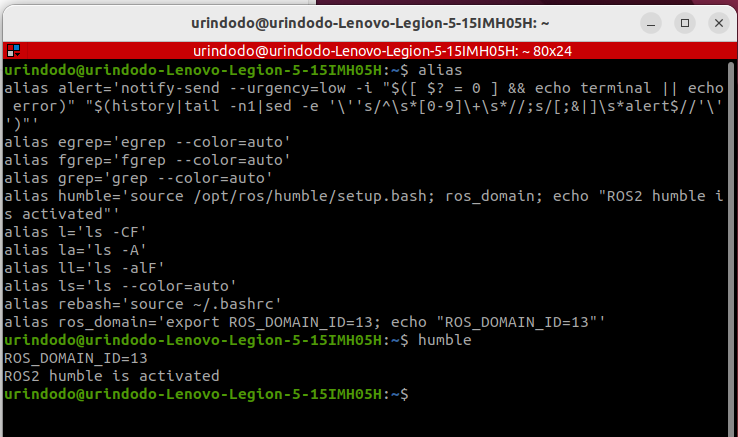
*`alias` 명령으로 등록된 alias 전체 목록 확인. `humble` 실행 시 `ROS_DOMAIN_ID=13` → `ROS2 humble is activated` 출력.*

- `conda activate` 스타일의 **명시적 활성화** 방식. 터미널을 열 때 자동으로 켜지지 않는다(의도된 설계 — 여러 ROS 버전 충돌 방지).
- 그 대가: **새 터미널을 열 때마다 `humble`을 다시 쳐야 한다.** `rebash`는 `.bashrc`만 다시 읽을 뿐 ROS를 켜지 않는다.
- `ros_domain`의 echo는 처음엔 하드코딩된 문자열이었으나, **실제 변수(`$ROS_DOMAIN_ID`)를 출력하도록 수정함** — "메시지가 떴다"가 아니라 "값이 실제로 들어갔다"를 검증하기 위해서.

---

## 1. 실행 기록

### 8/31 — Phase A + Phase B-2 ~ B-4

**A. 드라이버 설치**

```bash
sudo apt update
sudo apt install ros-humble-realsense2-*
```

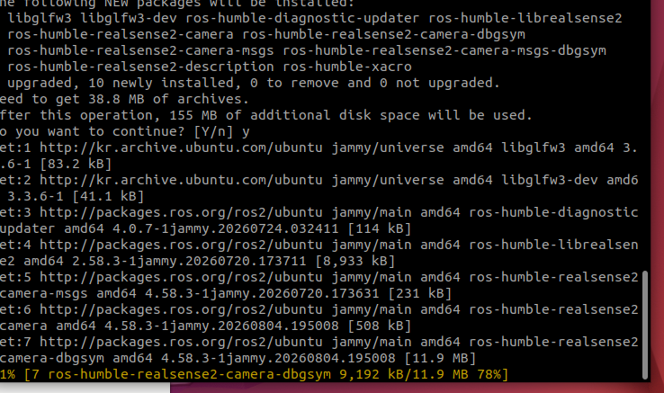
*설치되는 패키지들: `ros-humble-librealsense2`(2.58.3), `ros-humble-realsense2-camera`(4.58.3), `-camera-msgs`, `-description` 등*

설치 확인:

```bash
ros2 pkg list | grep realsense
# → realsense2_camera / realsense2_camera_msgs / realsense2_description
```

**B. 하드웨어 인식 확인**

```bash
lsusb | grep -i intel      # → Bus 002 ... Intel(R) RealSense(TM) Depth Camera 435i
lsusb -t                   # → 해당 서브트리에서 5000M(USB 3.0) 확인
```

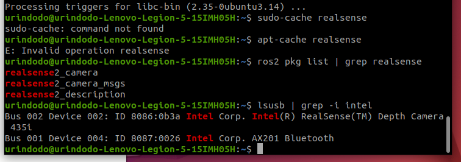
*위쪽 두 줄은 오타(아래 3-② 참고). 아래에서 패키지 설치와 USB 인식 확인.*

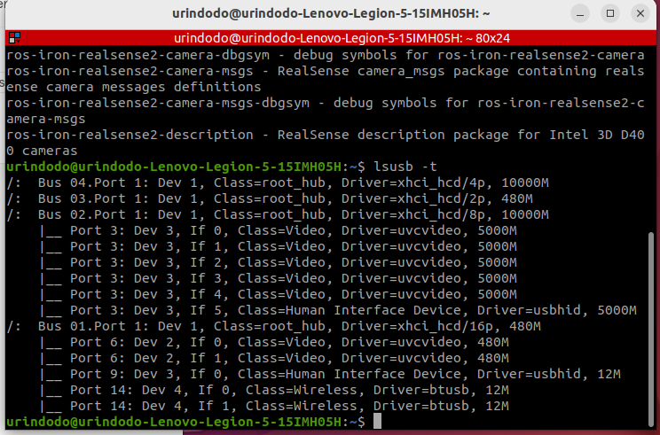
*`Bus 02.Port 1` 아래 `Port 3`에 `Class=Video, Driver=uvcvideo, 5000M`이 여러 개(=여러 스트림 인터페이스) + `Class=Human Interface Device, Driver=usbhid`(=IMU, 모델명의 "i"). **5000M = USB 3.0 속도**로 연결됨 확인.*

**C. 카메라 노드 실행 (B-2)**

```bash
humble
ros2 launch realsense2_camera rs_launch.py align_depth.enable:=true
```

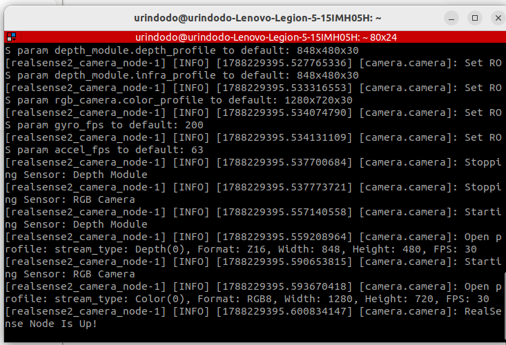
*스트림 2개(`Open profile:` Depth Z16 848x480x30 / Color RGB8 1280x720x30)가 열리고 마지막에 `RealSense Node Is Up!`*

→ 성공 판정 기준: 로그 마지막이 `RealSense Node Is Up!`, 그 앞에 두 스트림의 `Open profile:` 줄이 각각 있고 에러 없음.
→ `WARNING ... No valid configuration file found at : ~/.realsense-config.json loading defaults` 는 **에러 아님** (커스텀 설정 파일이 없으니 기본값으로 켠다는 안내).

**D. Node / Topic 구조 확인 (B-3)** — 새 터미널에서 `humble` 먼저

```bash
ros2 node list                                        # → /camera/camera  (노드 1개)
ros2 topic list -t                                    # 토픽 + 메시지 타입 목록
ros2 topic info /camera/camera/color/image_raw        # → Publisher count: 1
ros2 topic hz  /camera/camera/color/image_raw         # → average rate: ~30.0
```

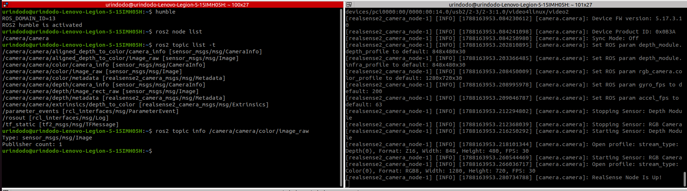
*`ros2 node list` → `/camera/camera` **하나**. `ros2 topic list -t` → 토픽 이름 + 메시지 타입. `/camera/camera/...`(camera 두 번) 네임스페이스 실측 확인.*

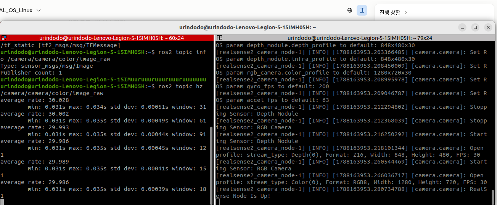
*`average rate: 29.99~30.03` — 설정한 30fps대로 실제 데이터가 흐르고 있음.*

**E. 영상 눈으로 확인 (B-4)**

```bash
ros2 run rqt_image_view rqt_image_view
```
- 드롭다운에서 `/camera/camera/color/image_raw` → 컬러 영상 확인
- 드롭다운에서 `/camera/camera/aligned_depth_to_color/image_raw` → **흑백(회색조) 영상 확인**

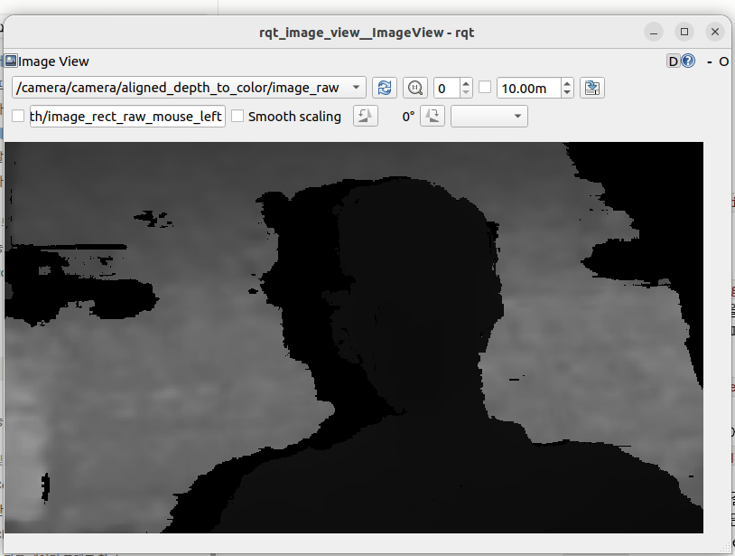
*Depth 영상. 사람 실루엣이 어두운 덩어리로, 배경이 밝은 회색으로 구분됨 = 거리 차이를 정상 감지 중.*

### 9/1 — 재연결 + Phase B-5

**A. 재연결 후 확인**

```bash
lsusb | grep -i intel      # Bus 002 유지 확인 (Device 번호는 꽂을 때마다 바뀜 — 정상)
humble
ros2 launch realsense2_camera rs_launch.py align_depth.enable:=true pointcloud.enable:=true
```

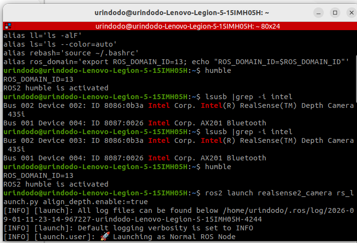
*Bus 002 유지 확인. Device 번호(002→003)는 꽂을 때마다 바뀌는 일련번호라 정상.*

**B. RViz에서 PointCloud 확인 (B-5)**

```bash
humble
rviz2
```
1. `Displays` → `Global Options` → **Fixed Frame** 을 `map` → **`camera_link`** 로 변경
2. `Add` → `By topic` → `/camera/camera/depth/color/points` → **PointCloud2** 선택 → OK
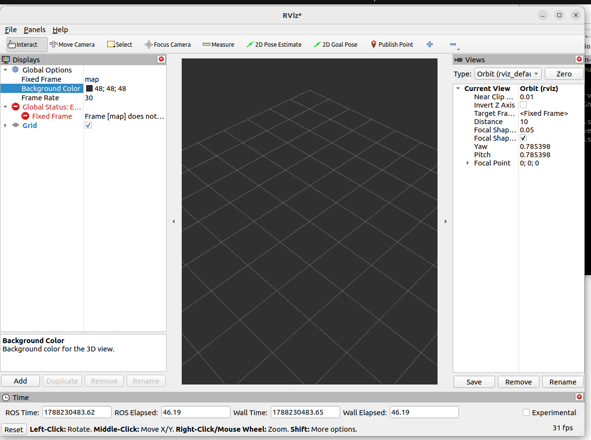
*처음 켰을 때. Fixed Frame이 기본값 `map`이라 `Global Status`에 빨간 X.*

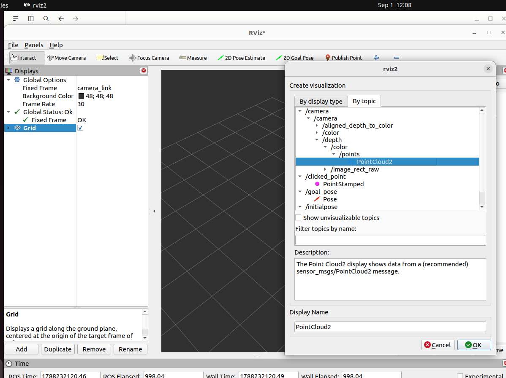
*Fixed Frame을 `camera_link`로 바꾸니 `Global Status: Ok`. `Add → By topic`에서 `/camera/camera/depth/color/points → PointCloud2` 선택.*

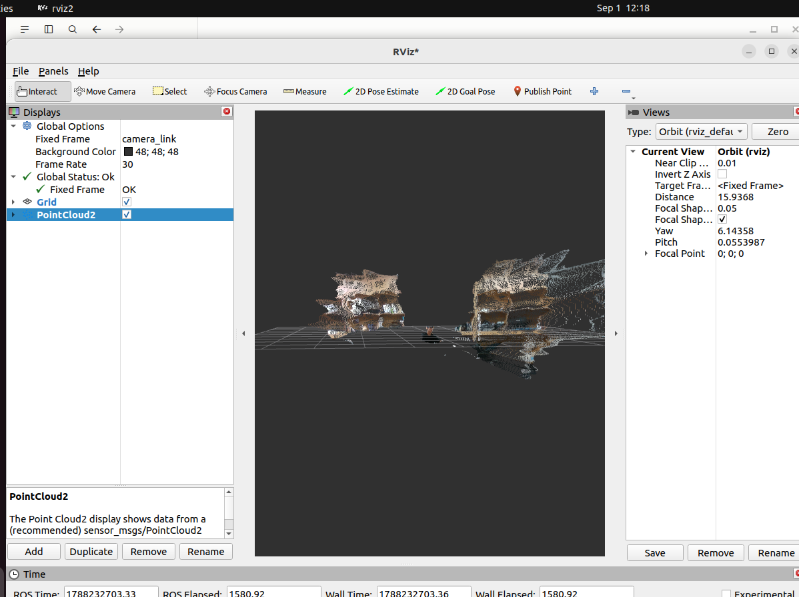
*3D 점군 표시 성공. 시점을 돌리기 전에는 무엇인지 알아보기 어렵고, 시점을 카메라 방향으로 맞추면 물체 형태가 드러난다.*

3. → 3D 점군이 화면에 표시됨. 마우스 드래그로 시점을 돌리면 방 안 물체의 입체 형태가 보임.

---

## 2. 실측값 — Phase B-6 기록표

| 항목 | 값 | 상태 |
|---|---|---|
| Camera Model | D435i | 확인 |
| RGB Topic | `/camera/camera/color/image_raw` (`sensor_msgs/msg/Image`) | 확인 |
| Depth Topic | `/camera/camera/depth/image_rect_raw` (`sensor_msgs/msg/Image`) | 확인 |
| Aligned Depth Topic | `/camera/camera/aligned_depth_to_color/image_raw` (`sensor_msgs/msg/Image`) | 확인 |
| CameraInfo Topic | `/camera/camera/color/camera_info` (`sensor_msgs/msg/CameraInfo`) | 확인 |
| PointCloud Topic | `/camera/camera/depth/color/points` (`sensor_msgs/msg/PointCloud2`) | 확인 |
| 기타 | `/camera/camera/extrinsics/depth_to_color`, `/camera/camera/*/metadata`, `/tf_static` | 확인 |
| 주요 Frame | `camera_link` (RViz Fixed Frame으로 사용) | 확인 |
| RGB Hz (실측) | **≈ 30.0** (min 0.031s / max 0.035s / std dev 0.0005s) | 확인 |
| Depth Hz (실측, aligned) | **≈ 30.0** (min 0.029s / max 0.035s / std dev 0.0004~0.0009s) | 확인 |

> 측정 명령어:
> ```bash
> ros2 topic hz /camera/camera/color/image_raw
> ros2 topic hz /camera/camera/aligned_depth_to_color/image_raw
> ```
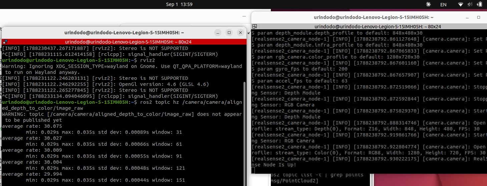
*`aligned_depth_to_color/image_raw` → `average rate: 29.99~30.08`. RGB와 동일하게 30fps.*

> 측정 시작 직후 나오는 `WARNING: topic [...] does not appear to be published yet`는 **에러가 아니라 정상** — 첫 메시지가 도착하기 전 한 번 뜨고, 데이터가 들어오면 바로 `average rate:` 출력으로 넘어간다.

### FPS는 어디서 정해졌나 (설정한 적 없는데 30이 나온 이유)

우리가 따로 설정하지 않았다. `rs_launch.py`에 정의된 **기본값**이 그대로 적용된 것이고, 그 사실이 launch 로그에 그대로 찍힌다:

```
Set ROS param depth_module.depth_profile to default: 848x480x30
Set ROS param rgb_camera.color_profile  to default: 1280x720x30
Set ROS param gyro_fps  to default: 200
Set ROS param accel_fps to default: 63
```

`848x480x30` = **가로 x 세로 x FPS**. 즉 30은 여기서 온 값이고, `ros2 topic hz`로 잰 ≈30.0은 "설정대로 실제로 나오고 있다"는 검증 결과다.

바꾸고 싶으면 다른 파라미터와 똑같이 `:=`로 덮어쓰면 된다:

```bash
ros2 launch realsense2_camera rs_launch.py depth_module.depth_profile:=640x480x15
```

⚠️ 단, 아무 숫자나 되는 게 아니라 **카메라 하드웨어가 지원하는 조합(profile)**만 가능하다. 지원하지 않는 값을 넣으면 노드가 스트림을 못 열고 에러를 낸다.

---

## 3. 겪은 문제와 해결 (같은 실수 반복 방지용)

### ① 패키지 설치 실패 — `ros-humble-realsense-*`

- **증상**: 패키지를 못 찾음
- **원인**: 실제 패키지 이름이 `ros-humble-realsense2-camera` 처럼 **"realsense" 뒤에 숫자 2가 붙어있음**. glob 패턴 `realsense-*`가 매칭 실패
- **교훈**: 설치 전에 `apt-cache search realsense`로 **실제 이름을 먼저 확인**한다
- 참고: 위 `images/04_lsusb_tree.png` 위쪽에 `apt-cache search realsense` 결과 일부가 보인다

### ② `apt-cache realsense`, `sudo-cache realsense` — 명령어 오타

- **원인**: `apt-cache`는 조회 전용 도구라 (1) `sudo`가 필요 없고 (2) `search` / `show` / `policy` 같은 **동작 단어가 반드시 필요**
- **패턴**: 리눅스 CLI는 대체로 `도구 → 동작 → 대상` 순서

### ③ `rqt_image_view: command not found` (설치는 되어 있는데 실행 안 됨)

- **처음 세운 가설(틀림)**: 터미널에서 `humble`을 안 켜서 PATH에 없다 → `humble` 켜도 여전히 실패해서 **가설 폐기**
- **진단 절차**:
  ```bash
  dpkg -L ros-humble-rqt-image-view | grep bin   # → 결과 없음 (bin에 실행파일 없음!)
  ros2 pkg executables rqt_image_view            # → rqt_image_view rqt_image_view (ROS는 알고 있음)
  ros2 run rqt_image_view rqt_image_view         # → 실행 성공
  ```

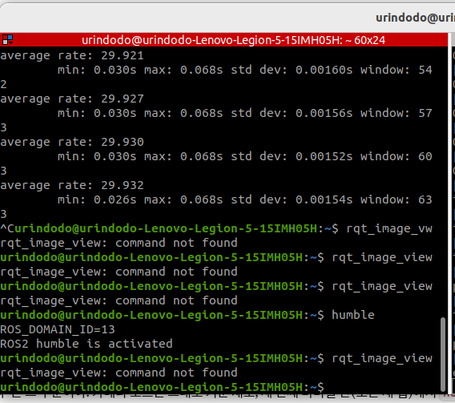
*`humble`을 켠 뒤에도 여전히 `command not found` → "터미널에서 ROS를 안 켰다"는 첫 가설이 틀렸음을 확인.*

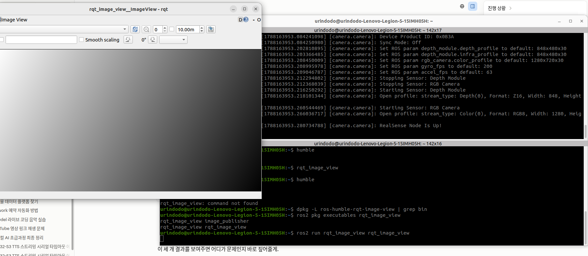
*`dpkg -L ... | grep bin` → 출력 없음(PATH에 실행파일 없음). `ros2 pkg executables` → ROS는 알고 있음. `ros2 run`으로 실행하니 창이 뜸.*
- **진짜 원인**: 이 패키지는 실행파일을 PATH의 표준 bin 경로에 두지 않고 **ROS2의 패키지 등록 시스템(ament index)에만 등록**한다. bash는 못 찾지만 `ros2 run`은 찾는다.
- **교훈**: "설치됨" ≠ "bash가 바로 실행할 수 있음". ROS 프로그램이 없다고 나오면 `ros2 run <패키지> <실행파일>`을 먼저 시도한다.

### ④ RViz 화면이 비어있음

- **증상**: `Global Status`에 빨간 X, `Frame [map] does not exist`
- **원인**: RViz 기본 Fixed Frame이 `map`인데, 우리 시스템에는 그 frame이 없음 (카메라 관련 frame만 존재)
- **해결**: Fixed Frame을 `camera_link`로 변경 → `Global Status: Ok`

### ⑤ PointCloud 토픽이 없음

- **증상**: RViz의 `By topic` 목록에 점군 토픽이 안 보임
- **확인 (추측 대신 명령어로)**:
  ```bash
  ros2 topic list -t | grep points    # → 빈 결과
  ros2 node info /camera/camera       # → Publishers 목록에 points 없음
  ```

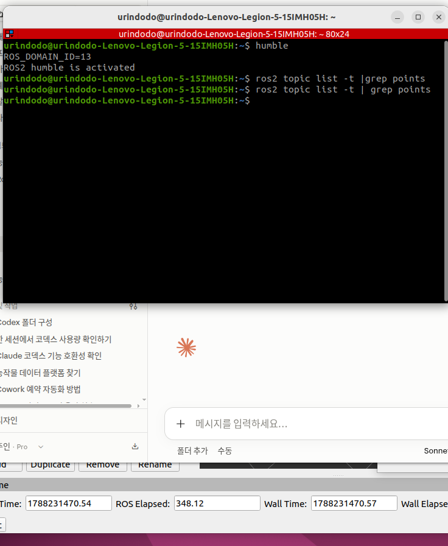
*`grep points` 결과가 비어 있음.*

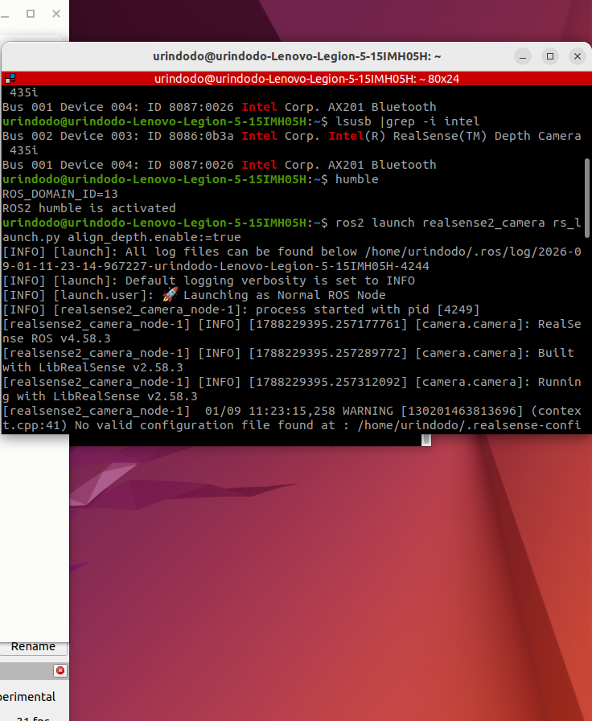
*`ros2 node info /camera/camera`의 Publishers 목록에 `points` 없음 → 노드가 점군을 아예 발행하지 않는 상태.*

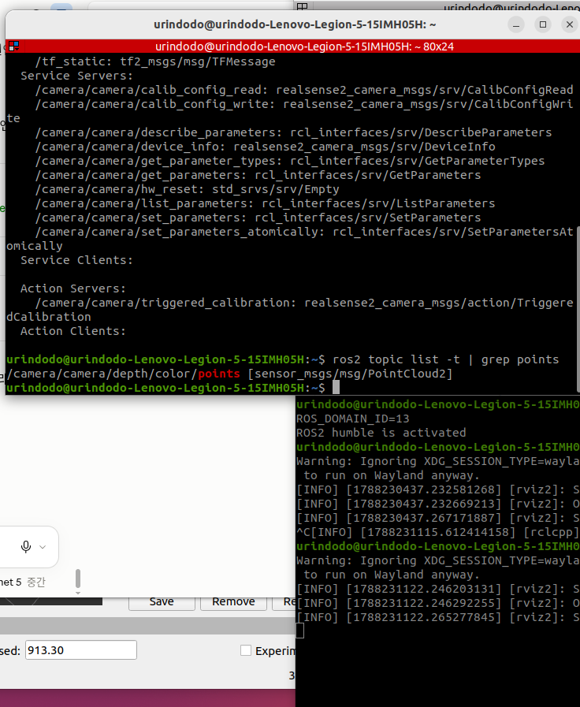
*`pointcloud.enable:=true`로 재실행 후 → `/camera/camera/depth/color/points [sensor_msgs/msg/PointCloud2]` 생성 확인.*
- **원인**: 그날 실행한 launch 명령어에 `pointcloud.enable:=true`가 빠져 있었음 (터미널 히스토리에서 실제 명령어 줄 확인)
- **해결**: `Ctrl+C` 후 옵션 포함해서 재실행
- **교훈**: GUI에서 "안 보인다"고 GUI를 의심하기 전에, **터미널 명령어로 그 데이터가 실제로 존재하는지부터 확인**한다

### ⑥ 새 터미널에서 ROS 명령어가 안 먹음

- **원인**: alias 기반 명시적 활성화 방식이라 새 터미널마다 `humble`을 쳐야 함. `rebash`로는 안 됨.

---

## 4. 이해한 개념

### 이 과제 전체의 뼈대

```
Camera → ROS Topic → Subscriber → Vision 처리 → 3D Position/Pose → TF/Marker → RViz
```

지금까지 한 Phase A~B는 이 사슬의 **첫 고리(Camera → Topic)만 떼어내서 확실히 검증한 것**이다.
7단계를 한 번에 만들고 실패하면 원인 후보가 7개가 되지만, 층별로 먼저 검증해두면 나중에 문제 발생 시 "이미 검증된 층"을 후보에서 제외할 수 있다. (= 보쇼 프로젝트에서 쓰던 "층으로 나눠 검증" / 수직 슬라이스와 같은 원리)

### 용어·문법

| 용어 | 뜻 |
|---|---|
| **스트림(stream)** | 센서 데이터가 끊이지 않고 계속 흘러나오는 것. 사진 1장이 아니라 "초당 30장씩 계속" 자체. `Starting Sensor` + `Open profile` 로그가 스트림을 켠 기록. |
| **`ros2 topic list -t`의 `-t`** | `--show-types`. **tree가 아님.** 토픽 이름 옆에 메시지 타입을 같이 표시. |
| **`ros2 topic hz`** | 해당 토픽의 실제 발행 주기를 **계속 측정하며 갱신 출력**. Ctrl+C로 종료. `window:` 숫자는 지금까지 관찰한 메시지 개수. |
| **`ros2 node info <노드>`** | 그 노드가 무엇을 구독/발행하고 어떤 서비스·액션을 제공하는지 전체 명세를 한 번에 보여줌. "이 토픽이 왜 없지?"를 확정할 때 유용. |
| **`ros2 pkg executables <패키지>`** | 그 패키지 안에 실행 가능한 프로그램이 뭐가 있는지 ROS2 관점에서 조회. |
| **RViz** | **R**OS **Vi**suali**z**ation. 계산은 하지 않고, 받은 데이터를 3D로 **그리기만** 한다. |

### launch 명령어의 구조

```bash
ros2 launch realsense2_camera rs_launch.py align_depth.enable:=true pointcloud.enable:=true
#          └ 패키지 이름       └ 그 안의 launch 파일  └ 파라미터 덮어쓰기 (:=)
```

- `rs_launch.py`는 Intel이 패키지에 포함해서 배포한 launch 스크립트. 그 안에 수십 개의 파라미터가 **기본값과 함께** 정의돼 있다.
- `align_depth.enable` / `pointcloud.enable`은 **양자택일이 아니라 각각 독립된 선택 스위치(기본값 false)**. RGB·Depth 스트림 자체는 옵션 없이도 이미 켜진다.
  - `align_depth.enable:=true` → Depth를 RGB 화각에 맞춰 정렬한 토픽을 **추가로** 발행
  - `pointcloud.enable:=true` → 3D 점군 토픽을 **추가로** 발행
- `ros2 run`(노드 1개 직접 실행)과 달리, `launch`는 파라미터를 미리 정리해두고 켤 수 있고 **여러 노드를 동시에** 띄울 수도 있다.
  - 다만 이번 `rs_launch.py`는 **노드를 1개만** 띄웠다. 근거: 모든 로그 줄의 태그가 `[realsense2_camera_node-1]` 하나뿐이고, `ros2 node list` 결과도 `/camera/camera` 하나.
  - **노드 개수 ≠ 토픽 개수.** 노드 1개가 여러 토픽을 동시에 발행한다.

### 토픽 네임스페이스 함정 (실측으로 확정)

- v4.55.1 이후 드라이버의 기본 네임스페이스는 `/camera/camera/...` — **camera가 두 번**.
- 2~3년 전 튜토리얼은 `/camera/color/image_raw`로 나오므로 그대로 쓰면 "토픽 없음"이 된다.
- 우리 환경(v4.58.3)에서 `ros2 topic list -t`로 실제 이름이 `/camera/camera/...`임을 **직접 확인함.**

### `aligned_depth_to_color`의 의미

이름의 `color`는 "색깔 영상"이라는 뜻이 **아니다.** "**컬러 카메라의 화각에 맞춰 정렬(align)된 Depth**"라는 뜻.
그래서 이 토픽을 `rqt_image_view`로 보면 흑백(회색조)으로 보이는 게 정상 — Depth 이미지는 색이 아니라 **거리값 하나**를 픽셀마다 담고 있고, 뷰어가 그 숫자를 밝기로 바꿔 그리기 때문.

### Depth Image vs PointCloud2

| | Depth Image | PointCloud2 |
|---|---|---|
| 형태 | **2D 격자** (픽셀마다 거리값 1개) | **3D 점들의 집합** (점마다 X, Y, Z + 색) |
| 3D 좌표 | 아직 없음. 직접 계산해야 함 | 이미 계산 완료된 상태 |
| 용도 | (u,v) 위치를 알 때 그 지점 거리 조회 | 장면 전체의 입체 구조를 보기 |

Depth → 3D 좌표 변환 공식 (CameraInfo의 Intrinsics `fx, fy, cx, cy` 필요):

```
X = (u - cx) * Z / fx
Y = (v - cy) * Z / fy
Z = depth 값
```

PointCloud2는 이 계산을 **모든 픽셀에 대해 미리 다 해놓은 결과물**이다.

### 계산은 어디서 일어나는가 (자원 사용처)

| 단계 | 하는 일 | 어디서 | 자원 |
|---|---|---|---|
| 1 | Raw Depth 계산 (스테레오 매칭) | 카메라 온보드 **D4 Vision Processor 칩** | 카메라 하드웨어 (→ 카메라 발열 원인) |
| 2 | Depth → XYZ 역투영 (PointCloud 생성) | **호스트(노트북)에서 실행되는 `realsense2_camera_node`** (librealsense의 처리 블록 사용) | **노트북 CPU** |
| 3 | 3D 화면 렌더링 | **RViz** | 노트북 GPU |

> **근거**: librealsense 소스의 point cloud는 `src/proc/pointcloud.h`에 있는 **호스트측 처리 블록**이며, intrinsics를 써서 `depth_to_points()`로 소프트웨어 역투영을 수행한다. 즉 카메라 ASIC이 아니라 호스트에서 계산된다.
> (플랫폼에 따라 GPU 가속 경로가 존재할 수 있는지는 **미확인** — 우리 환경 기준으로는 CPU 경로로 본다.)

### 관심영역(ROI)만 계산 vs 전체 계산 — 계산량 외의 이유

계산량 절약도 맞지만, 더 근본적인 기준은 **"이 시스템이 무엇을 알아야 하는가(임무의 범위)"**다.

- **우리 과제 (로봇팔로 빨간 물체 잡기)**: 목표 대상이 사전에 정해져 있음 → 검출된 그 지점의 XYZ 하나만 계산해도 임무 수행에 충분. (Phase E에서 이 방식을 쓸 예정)
- **자율주행 등**: 어디서 무엇이 나타날지 사전에 알 수 없음 → **관심영역을 미리 정의할 수 없으므로** 화면/센서 범위 전체를 조밀하게 인식해야 함. 이건 최적화의 문제가 아니라 안전 요구사항의 문제.
- 참고로 로봇팔도 나중에 "팔이 주변 물체와 충돌하지 않게" 하려면 다시 넓은 범위 인식이 필요해질 수 있다.

### 도구 선택: `rqt_image_view` vs `rviz2`

- `rqt_image_view` — 2D 이미지 **하나만** 빠르고 가볍게 확인. 3D 렌더링을 안 해서 자원을 덜 씀.
- `rviz2` — TF / Marker / PointCloud / 이미지를 **한 화면에 겹쳐서** 보는 종합 3D 도구. 더 무겁지만 Phase D 이후엔 필수.

### DDS와 보안 (알아두고 넘어간 것)

- 다른 터미널에서 켠 노드끼리도 자동으로 연결되는 이유: ROS 2는 중앙 서버(ROS1의 roscore) 없이 **DDS discovery**로 서로를 자동으로 찾는다. 같은 `ROS_DOMAIN_ID`(우리는 13)면 연결된다.
- ⚠️ **`ROS_DOMAIN_ID`는 보안 장치가 아니다.** 같은 네트워크에서 그룹을 나누는 편의 기능일 뿐. 기본 설정의 DDS는 **암호화도 인증도 없어서**, 같은 도메인에 들어오면 누구나 토픽을 구독할 수 있고 가짜 데이터를 같은 이름으로 발행(스푸핑)할 수도 있다.
- 실제 대책은 **SROS2 (Secure ROS 2)** — DDS-Security 표준 기반으로 인증서와 접근 권한 목록(ACL)을 붙여 암호화·인증·권한 제어를 거는 ROS 2의 공식 보안 확장. 설정 비용(인증서/keystore 관리) 때문에 학습·연구실 폐쇄망에서는 보통 쓰지 않는다.
- **판단**: 지금 단계(폐쇄망 학습)에서는 불필요. 다만 실제 로봇을 외부 접근 가능한 망에 올릴 때는 반드시 검토할 항목으로 남겨둔다.

### RViz에서 "안 보인다"의 흔한 원인

1. **Fixed Frame이 존재하지 않는 frame**으로 설정됨 (기본값 `map` 그대로 둔 경우)
2. **시점(카메라 각도)이 엉뚱한 방향** — 데이터는 정상인데 보는 각도 때문에 안 보이거나 이상해 보임. 오른쪽 `Views` 패널의 `Yaw`/`Pitch`/`Distance`가 그 각도값이고, 마우스 드래그로 바뀐다.
3. 해당 토픽이 실제로 발행되고 있지 않음 (→ 터미널에서 `ros2 topic list`로 먼저 확인)

---

## 5. 미확인 / 다음에 할 것

### 확인 완료 (9/1 추가)

| 항목 | 값 | 의미 |
|---|---|---|
| OpenCV 버전 | **4.5.4** | 4.7 미만 → Phase F에서 **구 API** 사용: `cv2.aruco.detectMarkers()`, `cv2.aruco.estimatePoseSingleMarkers()`. `solvePnP` 직접 호출 불필요(4.10+ 대상이었던 방식) |
| cv_bridge 설치 여부 | **설치됨** (`ros2 pkg list \| grep cv_bridge` → `cv_bridge`) | Phase D-1(Image Subscriber)에서 바로 사용 가능 |

> `cv2`(OpenCV)와 `cv_bridge`는 별개의 소프트웨어다. `cv2`는 ROS와 무관하게 독립적으로 설치되는 범용 컴퓨터 비전 라이브러리(실제 이미지 처리 엔진)이고, `cv_bridge`는 ROS2 이미지 메시지(`sensor_msgs/msg/Image`)와 OpenCV 형식(numpy 배열) 사이를 변환해주는 ROS2 패키지(통역사)다. `cv_bridge`는 자체 OpenCV를 갖지 않고 시스템에 설치된 OpenCV(4.5.4)를 그대로 사용한다.

### 남은 것

없음 — Phase C 진입 전 확인 목록 완료.

### 의도적으로 건너뛴 것

- **B-1 `realsense-viewer`** — ROS 이전에 하드웨어를 먼저 검증하는 단계. `ros2 launch`가 한 번에 성공해서 생략함. (나중에 카메라가 안 켜지는 문제가 생기면 이 도구로 "하드웨어 무죄"를 먼저 확인할 것. 단, viewer가 카메라를 점유하면 ROS 노드가 못 여니 확인 후 반드시 종료)
- **B-7 두 번째 카메라(D455/D415) 비교** — 선택 항목

### 다음 단계: Phase C — 내 workspace / package 만들기

```bash
mkdir -p ~/ros2_ws/src
cd ~/ros2_ws/src
ros2 pkg create --build-type ament_python vision_pkg
cd ~/ros2_ws
colcon build --symlink-install
source ~/ros2_ws/install/setup.bash
ros2 run vision_pkg <노드이름>
```

- 지금까지는 **남이 만든 패키지를 실행만** 했고, Phase C부터는 **내 패키지**를 만든다.
- 빈 노드(print 한 줄)로 **골격이 도는지 먼저 확인**한 뒤에 비전 코드를 얹는다. (안 될 때 원인이 "패키지 설정"인지 "코드"인지 구분하기 위해)
- 이후 추가할 alias:
  ```bash
  alias sws='source ~/ros2_ws/install/setup.bash; echo "ros2_ws is sourced!"'
  ```
  → 새 터미널마다 `humble` → `sws` 두 번.

---

## 6. 설명할 수 있어야 할 것 (평가 대비 — Phase B 범위)

- [x] Camera Node는 무엇을 Publish하는가?
- [x] RGB Topic과 Depth Topic의 Message Type은? (둘 다 `sensor_msgs/msg/Image`)
- [x] `aligned_depth_to_color`는 왜 따로 있는가?
- [x] Depth Image와 PointCloud2는 무엇이 다른가?
- [x] CameraInfo에는 왜 Intrinsics가 필요한가? (2D 픽셀 → 3D 좌표 역투영 공식에 fx, fy, cx, cy가 들어가므로)
- [ ] (u,v)와 (X,Y,Z)의 관계 — Phase E에서 코드로 직접 다룬 뒤 다시 정리


---

## 7. Phase C — workspace / package 생성 (9/1 추가)

### 실행 기록

```bash
mkdir -p ~/ros2_ws/src
cd ~/ros2_ws/src
humble
ros2 pkg create --build-type ament_python vision_pkg
```

생성된 패키지 구조 (`ament_python` 기본 템플릿 — apt처럼 다운로드하는 게 아니라 `ros2 pkg create`가 로컬에 즉석으로 만들어주는 것):

```
vision_pkg/
├── package.xml       # 패키지 "신분증" (이름, 버전, 의존성)
├── resource/          # ROS2가 패키지 존재를 인식하는 표시 파일
├── setup.cfg
├── setup.py           # 핵심 — console_scripts로 실행 진입점 등록
├── test/
└── vision_pkg/         # 진짜 소스코드(.py)가 들어가는 폴더 (바깥과 이름 같아서 혼동 주의)
```

빈 노드 작성 (`vision_pkg/vision_pkg/hello_node.py`):

```python
import rclpy
from rclpy.node import Node

class HelloNode(Node):
    def __init__(self):
        super().__init__('hello_node')
        self.get_logger().info('vision_pkg 골격 정상 작동!')

def main():
    rclpy.init()
    node = HelloNode()
    rclpy.spin(node)

if __name__ == '__main__':
    main()
```

`setup.py`의 `entry_points`에 등록:

```python
entry_points={
    'console_scripts': [
        'hello_node = vision_pkg.hello_node:main',
    ],
},
```

빌드 + 실행:

```bash
cd ~/ros2_ws
colcon build --symlink-install
# → Starting >>> vision_pkg / Finished <<< vision_pkg [1.89s] / Summary: 1 package finished

# 새 터미널에서
humble
source ~/ros2_ws/install/setup.bash
ros2 run vision_pkg hello_node
# → [INFO] [hello_node]: vision_pkg 골격 정상 작동!
```

추가한 alias (`~/.bashrc`):

```bash
alias sws='source ~/ros2_ws/install/setup.bash; echo "ros2_ws is sourced!"'
```

→ 새 터미널마다 `humble` → `sws` 두 번.

### 겪은 문제

**colcon: command not found (3번 반복, 원인이 매번 달랐음)**

| 시도 | 상태 | 원인 |
|---|---|---|
| 1차 | 실패 | `humble` 안 켠 터미널 — colcon이 PATH에 없음 |
| 2차 | 실패 | `humble` 켰지만 `colcon buid`로 오타 (`build`의 l 누락) |
| 3차 | 실패 | 철자도 정확했는데도 실패 → **2회 실패 규칙**: 같은 접근 반복 대신 새 가설 필요 |

3차 실패 후 진단:
```bash
which colcon                              # 없음
apt list --installed | grep colcon        # 없음
```
→ **진짜 원인**: `colcon` 자체가 이 컴퓨터에 설치되어 있지 않았음 (`ros-humble-desktop` 설치에 포함 안 됨).

```bash
sudo apt install python3-colcon-common-extensions
```
설치 후 정상 빌드됨. **교훈**: 같은 명령어가 여러 번 실패하면 매번 같은 원인으로 단정하지 말고, 그때그때 다른 확인 명령(`which`, `apt list`)으로 원인을 좁혀야 한다.

### 이해한 개념 (Phase C)

- **`ros2 pkg create`**: apt 설치와 달리 네트워크 다운로드가 아니라, ROS2 도구에 내장된 템플릿으로 로컬에서 즉석으로 파일/폴더 구조를 생성.
- **`--build-type ament_python` vs `ament_cmake`**: Python 노드 작성용 vs C++ 노드 작성용. `rclpy`(Python)로 ROS2 API 전체 사용 가능해서, 실시간 고성능이 필요 없는 한 C++(`rclcpp`)는 필수가 아님. (`realsense2_camera`처럼 기존에 존재하는 C++ 패키지는 그냥 갖다 쓰면 됨 — 우리가 만드는 코드만 Python이어도 충분.)
- **`console_scripts` 등록의 의미**: "터미널에서 이 이름을 치면, 이 파일의 이 함수를 실행해라"를 **미리 선언**해두는 것. 파일이 존재해도 이 등록이 없으면 `ros2 run`이 못 찾는다.
- **`colcon build`가 하는 일**: 컴파일이 아니라(Python은 컴파일 불필요) **ROS2 시스템에 정식 등록**하는 작업. `~/ros2_ws/install/`에 실행 스크립트를 만들고 ament index에 패키지를 등록해야 `ros2 run`이 찾을 수 있다. `python3 hello_node.py`로 직접 실행하는 것과 다른 점: 직접 실행은 그냥 스크립트 하나 돌리는 것뿐이고, ROS2 생태계(다른 노드/launch 파일의 의존성 대상)의 일원으로는 인식되지 않는다.
- **`--symlink-install`**: 파일을 복사하는 대신 원본에 심볼릭 링크(바로가기)로 연결. Python 코드는 수정 후 재빌드 없이 바로 반영됨(C++는 여전히 재빌드 필요).
- **`colcon`이라는 이름**: 공식 문서 제목이 "colcon - collective construction" — "모아서 짓는다"는 뜻. workspace 안 여러 패키지를 하나의 시스템으로 통합해 등록하는 도구.
  - 출처: https://colcon.readthedocs.io/
- **`sws` alias**: ROS2 공식 용어 아님, "Source WorkSpace"를 줄인 자체 명명. `humble`이 ROS2 시스템 자체를 터미널에 알려주는 것처럼, `sws`는 **우리가 만든 workspace**(`~/ros2_ws`)를 터미널에 알려주는 역할. 새 터미널마다 `humble` → `sws` 순서로 둘 다 필요.

### Phase C 통과 기준 — 충족 확인

`ros2 run vision_pkg hello_node`가 에러 없이 실행되고 `[INFO] [hello_node]: vision_pkg 골격 정상 작동!` 로그 확인됨.


---

## 8. Phase D-1 — Image Subscriber 노드 (9/2 추가)

### 코드 (`vision_pkg/vision_pkg/image_subscriber.py`)

```python
import rclpy
from rclpy.node import Node
from sensor_msgs.msg import Image
from cv_bridge import CvBridge
import cv2


class ImageSubscriber(Node):
    def __init__(self):
        super().__init__('image_subscriber')
        self.bridge = CvBridge()
        self.subscription = self.create_subscription(
            Image,
            '/camera/camera/color/image_raw',
            self.image_callback,
            10
        )

    def image_callback(self, msg):
        cv_image = self.bridge.imgmsg_to_cv2(msg, desired_encoding='bgr8')
        cv2.imshow('Camera View', cv_image)
        cv2.waitKey(1)


def main():
    rclpy.init()
    node = ImageSubscriber()
    try:
        rclpy.spin(node)
    except KeyboardInterrupt:
        pass
    finally:
        cv2.destroyAllWindows()
        node.destroy_node()
        rclpy.shutdown()


if __name__ == '__main__':
    main()
```

`setup.py`에 추가 등록:
```python
entry_points={
    'console_scripts': [
        'hello_node = vision_pkg.hello_node:main',
        'image_subscriber = vision_pkg.image_subscriber:main',
    ],
},
```

### 겪은 문제 — 파일을 바깥쪽 폴더에 생성함

**증상**:
```
ModuleNotFoundError: No module named 'vision_pkg.image_subscriber'
```

**원인**: `cd ~/ros2_ws/src/vision_pkg`(패키지 전체 폴더, 바깥쪽)에서 바로 `nano image_subscriber.py`를 실행 — 한 단계 더 들어가서 `vision_pkg/vision_pkg/`(안쪽, 실제 파이썬 모듈 폴더)에 만들었어야 했음. `hello_node.py`는 처음부터 안쪽에 있었는데 이번엔 실수로 빠짐.

**확인**:
```bash
ls ~/ros2_ws/src/vision_pkg/            # image_subscriber.py가 여기 있으면 잘못된 위치
ls ~/ros2_ws/src/vision_pkg/vision_pkg/ # 원래 여기 있어야 함
```

**해결**:
```bash
mv ~/ros2_ws/src/vision_pkg/image_subscriber.py ~/ros2_ws/src/vision_pkg/vision_pkg/image_subscriber.py
cd ~/ros2_ws
colcon build --symlink-install
```

**교훈**: 바깥쪽 `vision_pkg/`(패키지 설정)와 안쪽 `vision_pkg/`(파이썬 소스)를 이름이 같아서 착각하기 쉽다. 새 노드 파일을 만들 땐 항상 `cd`가 두 단계(패키지 폴더 → 그 안의 동명 폴더) 들어갔는지 확인할 것.

### 실행 확인

```bash
# 새 터미널
humble
sws
ros2 run vision_pkg image_subscriber
```
→ `Camera View` 창에 실시간 컬러 영상 표시 확인 (움직임 실시간 반영).

**Phase D-1 통과 기준 — 충족 확인**: 내 노드가 카메라 영상을 창에 띄웠다.

### 코드 이해 (다음에 짚을 것 / 진행 중)

- [x] `create_subscription()`의 4개 인자 각각의 의미 — `(메시지 타입, 토픽 이름, 콜백 함수, 큐 사이즈)`
- [x] `imgmsg_to_cv2(msg, desired_encoding='bgr8')` — `bgr8`이 뭔지, RGB와 순서가 다른 이유 — OpenCV는 색 채널을 BGR 순서로 다루기 때문에, ROS Image 메시지를 OpenCV가 바로 쓸 수 있는 numpy 배열로 바꿔주는 변환.
- [x] `cv2.waitKey(1)`이 왜 필요한지 (OpenCV 창 이벤트 처리) — OpenCV 창이 그려지고 키 입력 등을 처리하려면 매 프레임 이 호출이 있어야 함.
- [x] `image_callback`이 언제, 몇 번 호출되는지 (구독 콜백 구조) — `rclpy.spin(node)`가 새 메시지가 도착할 때마다 자동으로 호출. 카메라 FPS와 동일하게 초당 약 30번.
- [x] `class ImageSubscriber(Node):` — 상속. `Node`(rclpy가 제공하는 기본 노드 설계도)를 물려받아 새 클래스를 만드는 것.
- [x] `self` — 지금 만들어지고 있는 객체 자기 자신을 가리키는 이름. `self.bridge = CvBridge()`는 "이 객체 자신에게 bridge라는 서랍을 만들어서 통역사(CvBridge 객체)를 넣어두는" 것.
- [x] `super().__init__('image_subscriber')` — 부모 클래스(Node)의 초기화 함수를 노드 이름만 넘겨서 실행. Node가 하는 준비 작업(ROS2 시스템에 노드 등록 등)을 재사용하는 것. `__init__` 자체는 ROS2 전용이 아니라 파이썬 일반 문법(클래스로 객체를 만들 때 자동 실행되는 초기 설정 함수)이며, `Node`는 특히 이름을 필수로 요구하므로 `super().__init__(이름)`이 반드시 필요.
- [x] `self.subscription = self.create_subscription(...)` — `create_subscription()`은 Node로부터 물려받은 기능이며, 호출하면 "구독 객체"가 만들어져 반환됨. 그 반환값을 `self.subscription`이라는 서랍(이름)에 저장해두는 것(단순히 "이름을 붙이는" 게 아니라 "결과물을 저장"하는 것).

**Phase D-1 코드 이해 체크리스트 완료.**

---

## 9. Phase D-2 — 가짜 좌표로 TF + Marker 발행 (9/2 추가)

> 계획서의 핵심 전략(수직 슬라이스): 진짜 검출 코드 없이, 고정 좌표로 TF→Marker→RViz 파이프라인을 먼저 관통시켜서 "시각화 인프라 문제"와 "비전 알고리즘 문제"를 분리한다.

### 코드 (`vision_pkg/vision_pkg/fake_tf_marker.py`)

```python
import rclpy
from rclpy.node import Node

from geometry_msgs.msg import TransformStamped
from tf2_ros import TransformBroadcaster
from visualization_msgs.msg import Marker


class FakeTFMarker(Node):
    def __init__(self):
        super().__init__('fake_tf_marker')

        self.tf_broadcaster = TransformBroadcaster(self)
        self.marker_publisher = self.create_publisher(Marker, 'red_object_marker', 10)
        self.timer = self.create_timer(0.1, self.publish_all)

        self.x = 0.1
        self.y = 0.0
        self.z = 0.5

    def publish_all(self):
        now = self.get_clock().now().to_msg()

        t = TransformStamped()
        t.header.stamp = now
        t.header.frame_id = 'camera_link'
        t.child_frame_id = 'red_object'
        t.transform.translation.x = self.x
        t.transform.translation.y = self.y
        t.transform.translation.z = self.z
        t.transform.rotation.x = 0.0
        t.transform.rotation.y = 0.0
        t.transform.rotation.z = 0.0
        t.transform.rotation.w = 1.0
        self.tf_broadcaster.sendTransform(t)

        marker = Marker()
        marker.header.stamp = now
        marker.header.frame_id = 'camera_link'
        marker.ns = 'red_object'
        marker.id = 0
        marker.type = Marker.SPHERE
        marker.action = Marker.ADD
        marker.pose.position.x = self.x
        marker.pose.position.y = self.y
        marker.pose.position.z = self.z
        marker.pose.orientation.w = 1.0
        marker.scale.x = 0.05
        marker.scale.y = 0.05
        marker.scale.z = 0.05
        marker.color.r = 1.0
        marker.color.g = 0.0
        marker.color.b = 0.0
        marker.color.a = 1.0
        self.marker_publisher.publish(marker)


def main(args=None):
    rclpy.init(args=args)
    node = FakeTFMarker()
    rclpy.spin(node)
    node.destroy_node()
    rclpy.shutdown()


if __name__ == '__main__':
    main()
```

`setup.py` 추가 등록:
```python
'fake_tf_marker = vision_pkg.fake_tf_marker:main',
```

`package.xml` 추가 (기존엔 `<depend>` 자체가 없었음 — `rclpy`, `sensor_msgs`, `cv_bridge`도 D-1부터 실제 사용 중이었는데 문서화가 안 돼 있었던 것도 이번에 같이 정리):
```xml
<depend>rclpy</depend>
<depend>tf2_ros</depend>
<depend>geometry_msgs</depend>
<depend>visualization_msgs</depend>
<depend>sensor_msgs</depend>
<depend>cv_bridge</depend>
```

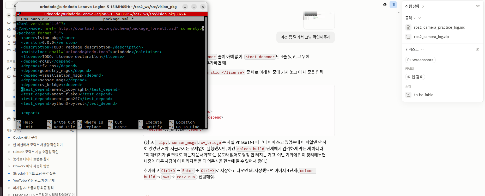
*`package.xml`의 `<license>` 아래에 6개 `<depend>` 줄 추가 완료.*

### 겪은 것 — alias 순서 실수 (에러는 아니었음)

`sws`를 `humble`보다 먼저 실행 → `ros2` 자체가 `command not found`. 원인: `ros2` 명령어는 `/opt/ros/humble/setup.bash`(`humble` alias)를 소싱해야 PATH에 등록됨. `sws`는 워크스페이스 패키지 위치만 추가하는 거라 그 전에 기본 ROS2가 켜져 있어야 의미가 있음. 다만 터미널 안에서 `source`는 누적되기 때문에 순서가 꼬여도 이후 `humble`을 실행하면 결과적으로 둘 다 반영됨 — 그래도 항상 `humble` → `sws` 순서를 지킬 것.

### 실행 확인

```bash
cd ~/ros2_ws
colcon build --symlink-install
sws
ros2 run vision_pkg fake_tf_marker
```
→ 터미널에 아무 출력 없이 멈춘 것처럼 보임(정상 — `print()`가 코드에 없고 `rclpy.spin()`이 조용히 타이머 콜백만 반복 실행 중).

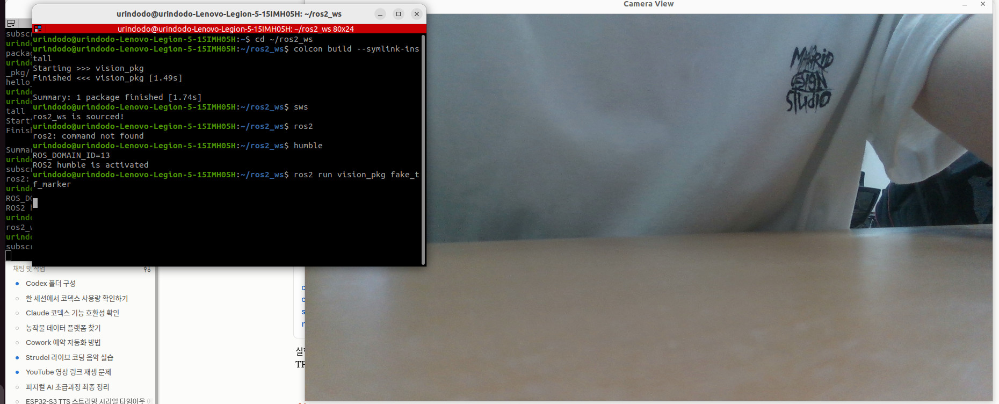
*`colcon build` 성공 → `sws` → (실수로 humble 먼저 안 켜서 `ros2: command not found`) → `humble` → `ros2 run vision_pkg fake_tf_marker` 실행. 옆의 Camera View는 이전에 켜둔 image_subscriber 창.*

**검증 1 — `ros2 node list`**: `/fake_tf_marker` 노드가 목록에 뜨는 것으로 실행 확인.

**검증 2 — `ros2 run tf2_ros tf2_echo camera_link red_object`**:
```
Translation: [0.100, 0.000, 0.500]
Rotation: in Quaternion (xyzw) [0.000, 0.000, 0.000, 1.000]
```
→ 우리가 하드코딩한 값과 정확히 일치. (시작 시 잠깐 뜨는 `Invalid frame ID "camera_link" ... frame does not exist` 메시지는 TF 버퍼에 데이터가 도착하기 전 순간의 워밍업 안내이며 에러 아님.)

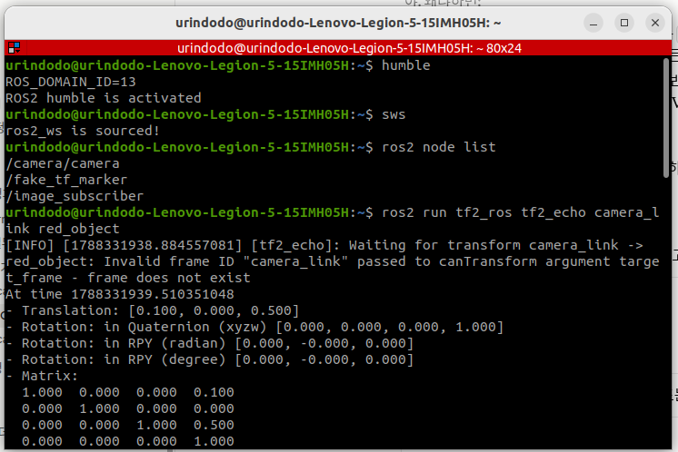
*Translation [0.100, 0.000, 0.500]이 하드코딩값과 정확히 일치함을 확인.*

**검증 3 — RViz**: Fixed Frame `camera_link`, `Add` → TF, `Add` → Marker(`red_object_marker`) 추가. TF 축(camera_link 원점 → red_object) + 빨간 SPHERE Marker가 화면에 표시됨. TF 표시를 잠깐 꺼서 Marker(빨간 점)만 단독으로도 확인함.

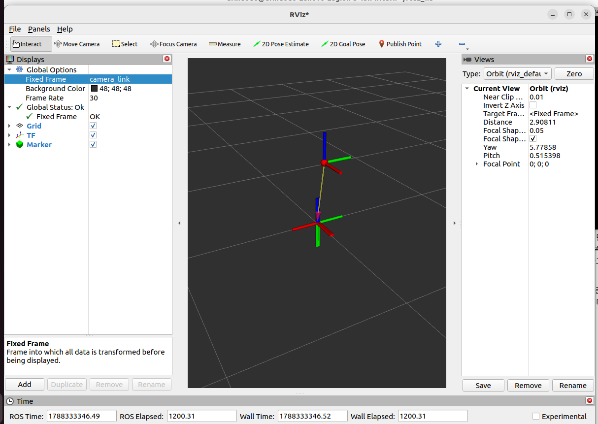
*TF 축 2개(camera_link, red_object)와 그 사이를 잇는 노란 선. 빨간 Marker는 red_object 축과 겹쳐서 잘 안 보임.*

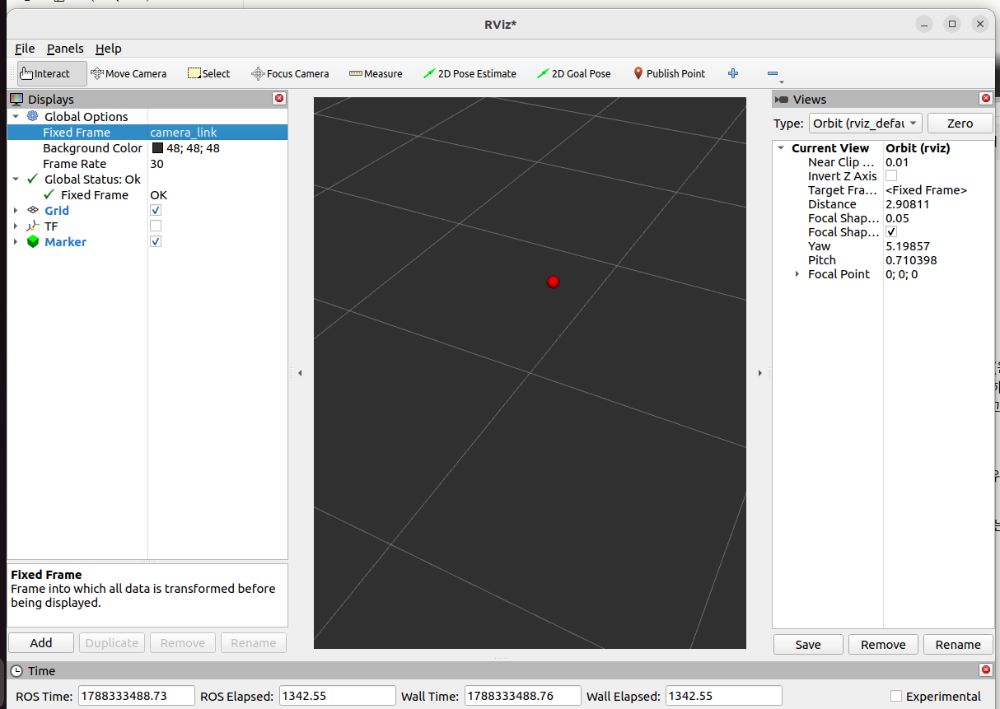
*TF 체크박스를 끄니 빨간 SPHERE Marker만 단독으로 보임 — Marker publish 정상 확인.*

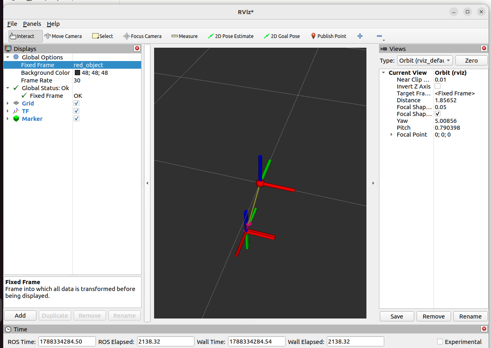
*Fixed Frame을 camera_link 대신 red_object로 바꾸면, red_object가 화면 중심(원점)이 되고 camera_link가 반대로 이동한 것처럼 보임 — Fixed Frame이 "어떤 좌표계를 기준(원점)으로 삼을지" 고르는 설정임을 확인.*

**Phase D-2 통과 기준 — 충족 확인**: RViz에 고정 위치(카메라 앞 50cm)의 빨간 구슬 + `red_object` TF Frame이 보인다.

### `ros2 node list`에서 낯선 노드 확인

```
/camera/camera
/fake_tf_marker
/rviz
/tf2_echo
/transform_listener_impl_5c743805fab0
/transform_listener_impl_5c8175079f50
```

- `/rviz` — `rviz2` 프로그램 자체가 내부적으로 자신을 노드로 등록.
- `/tf2_echo` — 검증 2에서 실행해둔 `tf2_echo` 명령이 그 자체로 하나의 노드.
- `/transform_listener_impl_*` — 사용자가 직접 켠 게 아니라, TF를 구독하는 프로그램(`rviz`, `tf2_echo` 각각)이 내부적으로 자동 생성하는 숨은 도우미 노드. 부모 프로그램이 꺼지면 같이 사라짐.

### 이해한 개념

- **TF(좌표계 변환)란**: 하드웨어/부품마다 자기만의 원점(좌표계)이 있고, 그 원점들 사이의 상대적 위치·회전 관계를 시스템 전체에 계속 방송(broadcast)해서 "한 부품의 시점에서 본 값"을 "다른 부품의 시점에서 본 값"으로 바꿔주는 것. `camera_link → red_object`는 "camera_link 원점 기준으로 red_object가 이만큼 떨어져 있다"는 관계 하나를 등록하는 것.
- **TF vs Topic**: Topic은 데이터 스트림(영상, depth 등)을 흘려보내는 일반 통신. TF는 좌표계 관계만 전문으로 다루는 특수 체계(내부적으로는 `/tf` 토픽을 쓰지만, 전용 도구·메시지 타입으로 좌표 변환 계산을 쉽게 해줌).
- **`create_timer(0.1, self.publish_all)`**: "0.1초마다 지정한 함수를 자동 반복 실행"하는 타이머. 구독 콜백(메시지 도착 시 호출)과 달리, 구독 대상이 없을 때 "시간 간격"으로 반복시키는 방법.
- **Quaternion `[0,0,0,1]`**: "회전 없음"을 나타내는 기본값. RPY(도 단위) `[0,0,0]`과 같은 의미를 다른 표현 방식으로 보여준 것 — 계산엔 Quaternion이, 사람이 직관적으로 보기엔 RPY가 편함.
- **`package.xml`의 `<depend>`**: "이 패키지가 어떤 다른 패키지에 의존하는지" 문서화하는 선언. 없어도 `colcon build`가 당장 막지는 않지만(엄격한 검사는 아님), 의존성을 명확히 남겨두는 관례.
- **Marker가 고정값인데도 계속 publish하는 이유**: (1) TF는 최근 수신 데이터만 유효로 취급하는 설계라, 계속 방송하지 않으면 몇 초 뒤 "낡은 정보"로 취급되어 무시됨. (2) 실전에서는 물체가 움직이므로 좌표가 매 프레임 바뀔 수 있음 — 지금은 값만 고정했을 뿐, 코드 구조 자체는 이미 실전(Phase E)과 동일하게 "매 순간 최신 좌표를 반복 발행"하는 형태로 짜둔 것. `ros2 topic hz /red_object_marker`로 실측 시 `average rate ≈ 9.999`(=10Hz)로 `create_timer(0.1, ...)`와 정확히 일치 확인.
- **Node vs Topic**: Node는 실행 중인 프로그램 하나(예: `fake_tf_marker`). Topic은 노드들이 데이터를 주고받는 이름 붙은 통로. 하나의 노드가 여러 토픽에 동시에 publish할 수 있고(우리 노드도 `/tf`와 `/red_object_marker` 두 곳에 동시 발행), 여러 노드가 같은 토픽을 구독할 수도 있음. `ros2 node list`는 "누가 실행 중인지"만 보여주고, 토픽 발행 여부/빈도는 `ros2 topic list` / `ros2 topic hz`로 따로 확인해야 함.

---

## 10. Phase E-1 — 빨간 물체 2D 검출 (9/2 추가)

> 계획서 실험 4에 해당. 카메라 영상에서 빨간 물체를 찾아 화면 픽셀 좌표 (u,v)를 뽑아낸다.

### 코드 (`vision_pkg/vision_pkg/red_detector.py`)

```python
import rclpy
from rclpy.node import Node
from sensor_msgs.msg import Image
from cv_bridge import CvBridge
import cv2
import numpy as np


class RedDetector(Node):
    def __init__(self):
        super().__init__('red_detector')
        self.bridge = CvBridge()
        self.subscription = self.create_subscription(
            Image,
            '/camera/camera/color/image_raw',
            self.image_callback,
            10
        )

    def image_callback(self, msg):
        cv_image = self.bridge.imgmsg_to_cv2(msg, desired_encoding='bgr8')

        # BGR -> HSV (조명 변화에 안정적인 색 표현으로 변환)
        hsv_image = cv2.cvtColor(cv_image, cv2.COLOR_BGR2HSV)

        # 빨간색 범위 두 개 (Hue가 0 근처와 180 근처 양쪽에 걸쳐 있음)
        lower_red1 = np.array([0, 120, 70]);   upper_red1 = np.array([10, 255, 255])
        lower_red2 = np.array([170, 120, 70]); upper_red2 = np.array([180, 255, 255])
        mask1 = cv2.inRange(hsv_image, lower_red1, upper_red1)
        mask2 = cv2.inRange(hsv_image, lower_red2, upper_red2)
        mask = cv2.bitwise_or(mask1, mask2)

        contours, _ = cv2.findContours(mask, cv2.RETR_EXTERNAL, cv2.CHAIN_APPROX_SIMPLE)

        if contours:
            largest = max(contours, key=cv2.contourArea)
            if cv2.contourArea(largest) > 500:
                x, y, w, h = cv2.boundingRect(largest)
                u = x + w // 2
                v = y + h // 2
                self.get_logger().info(f'Red object center: (u={u}, v={v})')
                cv2.rectangle(cv_image, (x, y), (x + w, y + h), (0, 255, 0), 2)
                cv2.circle(cv_image, (u, v), 5, (255, 0, 0), -1)

        cv2.imshow('Red Detection', cv_image)
        cv2.waitKey(1)


def main(args=None):
    rclpy.init(args=args)
    node = RedDetector()
    try:
        rclpy.spin(node)
    except KeyboardInterrupt:
        pass
    finally:
        cv2.destroyAllWindows()
        node.destroy_node()
        rclpy.shutdown()


if __name__ == '__main__':
    main()
```

`setup.py` 등록: `'red_detector = vision_pkg.red_detector:main',`

### 실행 확인

```bash
cd ~/ros2_ws
colcon build --symlink-install
sws
ros2 run vision_pkg red_detector
```

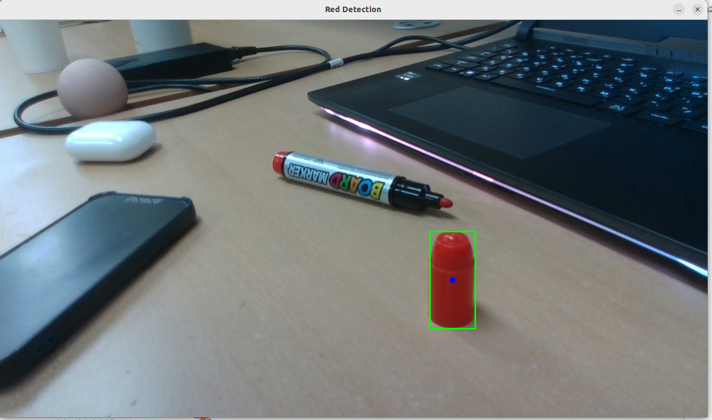
*빨간 마커 뚜껑에 초록 사각형 + 파란 중심점이 정확히 표시됨. 물체를 움직이면 실시간으로 따라옴.*

**Phase E-1 통과 기준 — 충족 확인**: 물체를 움직이면 중심점과 (u,v)가 따라 변한다.

### 겪은 것 / 한계

- **여러 개의 빨간 물체가 있으면 가장 큰 것 하나만 검출됨**: `max(contours, key=cv2.contourArea)`로 의도적으로 그렇게 설계함(과제 요구사항은 "가장 눈에 띄는 물체 하나"). 여러 개를 다 잡고 싶으면 `for contour in contours:`로 순회하며 일정 크기 이상을 전부 처리하도록 바꾸면 됨.
- **주황색도 일부 검출됨**: HSV에서 빨강(H≈0)과 주황(H≈10~20)이 인접해 있어서, 넉넉하게 잡은 Hue 범위(0~10)가 주황 일부까지 걸침. 실제 물체로 테스트하며 H 범위를 좁히거나 S/V 하한을 조정하는 미세 조정(캘리브레이션)이 필요할 수 있음 — 지금 단계는 "잘 따라다니는지"가 목표라 튜닝은 보류.

### 이해한 개념

- **HSV가 조명에 강한 이유**: BGR은 조명이 바뀌면 B, G, R 세 값이 한꺼번에 다 바뀌어서 "빨간색"의 기준 범위를 잡기 어려움. HSV는 색상(H, 무슨 색)과 밝기(V, 얼마나 밝은지)를 분리해서 저장하기 때문에, 조명이 바뀌어도 H값은 거의 그대로 유지됨 — 그래서 H값만 좁은 범위로 필터링하면 조명 변화에 안정적으로 색을 검출할 수 있음.
- **`cv2.inRange()` vs `cv2.threshold()`**: `threshold()`는 1채널·단일 경계값 기준 이진화(문서 스캔 흑백화 등에 적합). `inRange()`는 여러 채널(H, S, V)에 대해 각각 하한~상한 "범위" 조건을 동시에 검사하는 함수라, 색상 검출처럼 다채널 범위 조건이 필요한 경우에 적합.
- **이건 "라벨링"(딥러닝 객체 검출)과는 다름**: 우리 방식은 미리 정해둔 HSV 범위에 들어오면 무조건 "빨간 물체"로 판단하는 **규칙 기반(rule-based)** 방식. 반면 YOLO 같은 딥러닝 객체 검출은 사람이 미리 라벨링해둔 대량의 데이터로 학습시킨 모델이 판단하는 방식. 결과 화면(사각형+표시)은 비슷해 보이지만 원리가 다름 — 규칙 기반은 빠르고 간단하지만 조건이 안 맞으면(예: 주황색 오탐) 바로 틀릴 수 있고, 학습 기반은 유연하지만 데이터·시간이 필요함.

---

## 11. Phase E-2 — 빨간 물체 3D 좌표 계산 (9/2 추가)

> 계획서 실험 5에 해당. (u,v) + Depth값 + Camera Intrinsics(fx,fy,cx,cy)로 실제 3D 좌표 (X,Y,Z)를 계산한다.

### 코드 (`vision_pkg/vision_pkg/red_3d_position.py`)

```python
import rclpy
from rclpy.node import Node
from sensor_msgs.msg import Image, CameraInfo
from cv_bridge import CvBridge
import cv2
import numpy as np


class Red3DPosition(Node):
    def __init__(self):
        super().__init__('red_3d_position')
        self.bridge = CvBridge()

        self.latest_depth = None   # 가장 최근 depth 영상을 저장해둘 자리
        self.fx = self.fy = self.cx = self.cy = None  # 카메라 렌즈 고유값

        self.color_sub = self.create_subscription(
            Image, '/camera/camera/color/image_raw', self.color_callback, 10)
        self.depth_sub = self.create_subscription(
            Image, '/camera/camera/aligned_depth_to_color/image_raw', self.depth_callback, 10)
        self.info_sub = self.create_subscription(
            CameraInfo, '/camera/camera/aligned_depth_to_color/camera_info', self.info_callback, 10)

    def info_callback(self, msg):
        # K = [fx, 0, cx, 0, fy, cy, 0, 0, 1]
        self.fx, self.fy, self.cx, self.cy = msg.k[0], msg.k[4], msg.k[2], msg.k[5]

    def depth_callback(self, msg):
        self.latest_depth = self.bridge.imgmsg_to_cv2(msg, desired_encoding='passthrough')

    def color_callback(self, msg):
        if self.latest_depth is None or self.fx is None:
            return

        cv_image = self.bridge.imgmsg_to_cv2(msg, desired_encoding='bgr8')
        hsv_image = cv2.cvtColor(cv_image, cv2.COLOR_BGR2HSV)

        lower_red1 = np.array([0, 120, 70]); upper_red1 = np.array([10, 255, 255])
        lower_red2 = np.array([170, 120, 70]); upper_red2 = np.array([180, 255, 255])
        mask = cv2.bitwise_or(
            cv2.inRange(hsv_image, lower_red1, upper_red1),
            cv2.inRange(hsv_image, lower_red2, upper_red2)
        )

        contours, _ = cv2.findContours(mask, cv2.RETR_EXTERNAL, cv2.CHAIN_APPROX_SIMPLE)
        if not contours:
            return
        largest = max(contours, key=cv2.contourArea)
        if cv2.contourArea(largest) < 500:
            return

        x, y, w, h = cv2.boundingRect(largest)
        u, v = x + w // 2, y + h // 2

        # 중심 한 픽셀만 쓰지 않고 5x5 영역의 유효값 median 사용 (노이즈 방지)
        region = self.latest_depth[max(0, v-2):v+3, max(0, u-2):u+3]
        valid = region[region > 0]
        if valid.size == 0:
            return
        Z = np.median(valid) * 0.001  # mm -> m

        X = (u - self.cx) * Z / self.fx
        Y = (v - self.cy) * Z / self.fy

        self.get_logger().info(f'Red object 3D position: X={X:.3f}, Y={Y:.3f}, Z={Z:.3f} (m)')

        cv2.rectangle(cv_image, (x, y), (x + w, y + h), (0, 255, 0), 2)
        cv2.circle(cv_image, (u, v), 5, (255, 0, 0), -1)
        cv2.imshow('Red 3D Detection', cv_image)
        cv2.waitKey(1)


def main(args=None):
    rclpy.init(args=args)
    node = Red3DPosition()
    try:
        rclpy.spin(node)
    except KeyboardInterrupt:
        pass
    finally:
        cv2.destroyAllWindows()
        node.destroy_node()
        rclpy.shutdown()


if __name__ == '__main__':
    main()
```

`setup.py` 등록: `'red_3d_position = vision_pkg.red_3d_position:main',`

### 실행 확인

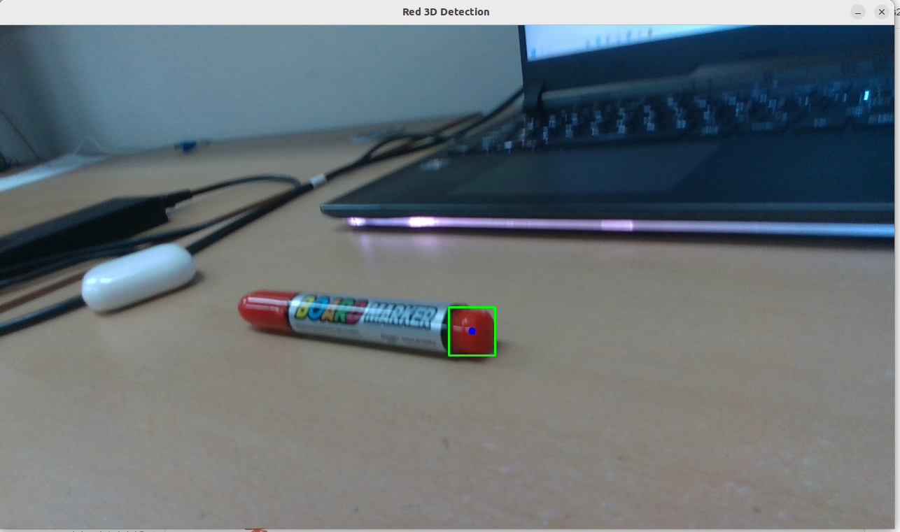
*RealSense 카메라 launch 로그(왼쪽)와 X,Y,Z 실시간 출력(오른쪽). 마커가 정지된 상태라 값도 안정적으로 유지됨(X≈0.018, Y≈0.006, Z≈0.215m).*

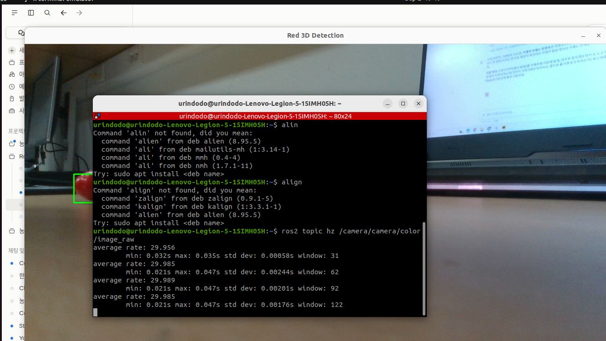
*다른 빨간 물체(사과)로도 정상 검출. `ros2 topic hz /camera/camera/color/image_raw` 결과 average rate ≈ 29.96~29.99Hz로 카메라 원본 데이터는 안정적임을 확인 — 화면(imshow) 지연은 카메라가 아니라 노드의 계산 부하 때문임을 구분.*

**Phase E-2 통과 기준 — 충족 확인**: 물체를 움직이면 X, Y, Z가 물리적으로 말이 되게 변한다.

### 겪은 것 — 실행 화면 지연

**증상**: `red_detector`(2D만)보다 `red_3d_position`(2D+depth+계산)에서 화면이 더 버벅임.

**원인**: 매 프레임 처리량이 늘어남(HSV 변환 + 마스크 + 윤곽선 + depth ROI 자르기 + median 계산 + 좌표 계산 + 로그 + 그리기 + imshow). 컴퓨터 부하가 늘면 콜백 처리가 카메라 FPS(30Hz)를 못 따라가서 화면이 밀림.

**확인 방법**: `ros2 topic hz /camera/camera/color/image_raw`로 카메라 원본 발행 속도를 직접 측정 — 여전히 ~30Hz로 정상이면, 문제는 카메라가 아니라 우리 노드의 계산 부하라는 게 증명됨. **화면이 매끄러운지는 과제 통과 기준이 아니고, 터미널에 찍히는 X,Y,Z 숫자가 정확한지가 진짜 기준.**

### 이해한 개념

- **build vs run과 카메라 launch 필요 시점**: `colcon build`는 코드 컴파일만 하므로 카메라 데이터가 전혀 필요 없음. `ros2 run`으로 노드를 실행하는 시점엔 구독 중인 토픽에 실제로 데이터가 오고 있어야(=카메라 launch가 켜져 있어야) 콜백이 동작함. 카메라가 꺼져 있으면 노드는 에러 없이 그냥 조용히 대기만 함.
- **RViz는 검출을 대신해주지 않음**: RViz는 이미 계산되어 토픽으로 publish된 데이터(Image, PointCloud2, Marker, TF)를 화면에 그려주기만 하는 도구. "이 영상에서 빨간 물체를 찾아라", "이 픽셀의 depth를 읽어 3D로 계산하라" 같은 기능은 RViz에도 ROS2 기본 제공에도 없음 — 이건 전부 우리가 직접 짜야 하는 로직이며, 이번 과제의 핵심.
- **토픽을 나눠서 보내는 이유**: color/depth/CameraInfo는 데이터 형태가 다르고(영상 vs 숫자), 필요한 프로그램만 필요한 토픽을 구독하게 하려고 각각 별도 토픽으로 publish됨. 하나로 합쳐 보내면 불필요한 데이터까지 항상 같이 받아야 해서 비효율적.
- **토픽 이름의 `/` 구분**: `/camera/camera/color/image_raw`처럼 슬래시로 나뉘어 폴더처럼 보이지만 실제 파일 경로가 아니라 ROS 커뮤니티의 "계층적 이름 관례"일 뿐. 이 이름 자체가 **토픽**이고, 그 토픽이 담는 데이터 형식이 **메시지 타입**(`sensor_msgs/msg/Image`, `sensor_msgs/msg/CameraInfo` 등).
- **color/depth 동기화**: 이 코드는 엄밀한 동기화를 하지 않음 — `self.latest_depth`에 "가장 최근 depth"를 저장해두고, color 콜백 시점에 그걸 그대로 사용(최대 1프레임, 약 33ms 오차 가능). 물체가 느리게 움직이는 우리 과제 수준에선 무시 가능한 오차. 정밀한 동기화가 필요하면 `message_filters.ApproximateTimeSynchronizer`를 사용 — 이건 프레임 횟수가 아니라 각 메시지의 `header.stamp`(타임스탬프) 차이가 허용 오차 이내인 것끼리 짝지어주는 방식.
- **QoS(Quality of Service)**: `create_subscription(msg_type, topic, callback, 10)`의 마지막 인자 `10`은 단순 "큐 사이즈"가 아니라 QoS 설정의 단축 표기. QoS는 통신 품질을 결정하는 여러 옵션 묶음 — (1) **Reliability**: `RELIABLE`(메시지 재전송까지 해서 반드시 전달) vs `BEST_EFFORT`(놓치면 넘어감, 대신 빠름). 카메라 영상처럼 계속 쏟아지는 데이터는 보통 `BEST_EFFORT`가 적합, 로봇 정지 명령 같은 중요 신호는 `RELIABLE` 필요. (2) **History/Depth**: 처리 못 한 메시지를 몇 개까지 대기열에 쌓아둘지(정수 `10`이 바로 이 값). (3) **Durability**: 새 구독자가 과거 메시지까지 받을 수 있는지. 정수 하나만 넘기면 depth만 그 값으로, 나머지는 기본값(Reliability=RELIABLE 등)으로 채워짐. 실전에선 `rclpy.qos.QoSProfile(...)` 객체로 세밀하게 설정 가능 — 특히 실시간 센서 스트림에서 `RELIABLE`로 인한 재전송 대기가 체감 지연의 원인이 될 수 있어, 지연 문제가 계속되면 `BEST_EFFORT` 전환을 시도해볼 만함.

---

## 12. Phase E-3 — 가짜 좌표 → 진짜 좌표로 TF/Marker 교체 (9/2 완료)

> 계획서 실험 6에 해당. Phase D-2(TF+Marker 발행 로직)와 Phase E-2(진짜 3D 좌표 계산 로직)를 합쳐서, 하드코딩했던 `(0.1, 0.0, 0.5)` 자리에 실시간 계산값을 넣는다. 계획서 최종 핵심 제출물(제출물 6).

### 코드 (`vision_pkg/vision_pkg/red_object_tf.py`)

`red_3d_position.py`의 계산 로직(HSV 마스크 → contour → boundingRect → depth ROI median → X,Y,Z 공식)은 그대로 두고, `fake_tf_marker.py`의 TF/Marker 발행 로직을 가져와 하드코딩 값 대신 계산된 X,Y,Z를 사용하도록 결합. 핵심 변경점은 parent frame을 `camera_link`가 아니라 **`camera_color_optical_frame`**으로 바꾼 것 — 계산한 XYZ가 그 좌표계 기준이기 때문.

```python
import rclpy
from rclpy.node import Node
from sensor_msgs.msg import Image, CameraInfo
from cv_bridge import CvBridge
from geometry_msgs.msg import TransformStamped
from tf2_ros import TransformBroadcaster
from visualization_msgs.msg import Marker
import cv2
import numpy as np


class RedObjectTF(Node):
    def __init__(self):
        super().__init__('red_object_tf')
        self.bridge = CvBridge()
        self.latest_depth = None
        self.fx = self.fy = self.cx = self.cy = None
        self.parent_frame = 'camera_color_optical_frame'  # 계산한 XYZ의 기준 좌표계

        self.tf_broadcaster = TransformBroadcaster(self)
        self.marker_publisher = self.create_publisher(Marker, 'red_object_marker', 10)

        self.color_sub = self.create_subscription(
            Image, '/camera/camera/color/image_raw', self.color_callback, 10)
        self.depth_sub = self.create_subscription(
            Image, '/camera/camera/aligned_depth_to_color/image_raw', self.depth_callback, 10)
        self.info_sub = self.create_subscription(
            CameraInfo, '/camera/camera/aligned_depth_to_color/camera_info', self.info_callback, 10)

    def info_callback(self, msg):
        self.fx, self.fy, self.cx, self.cy = msg.k[0], msg.k[4], msg.k[2], msg.k[5]

    def depth_callback(self, msg):
        self.latest_depth = self.bridge.imgmsg_to_cv2(msg, desired_encoding='passthrough')

    def color_callback(self, msg):
        if self.latest_depth is None or self.fx is None:
            return
        cv_image = self.bridge.imgmsg_to_cv2(msg, desired_encoding='bgr8')
        hsv_image = cv2.cvtColor(cv_image, cv2.COLOR_BGR2HSV)
        lower_red1 = np.array([0, 120, 70]); upper_red1 = np.array([10, 255, 255])
        lower_red2 = np.array([170, 120, 70]); upper_red2 = np.array([180, 255, 255])
        mask = cv2.bitwise_or(cv2.inRange(hsv_image, lower_red1, upper_red1),
                               cv2.inRange(hsv_image, lower_red2, upper_red2))
        contours, _ = cv2.findContours(mask, cv2.RETR_EXTERNAL, cv2.CHAIN_APPROX_SIMPLE)
        if not contours:
            return
        largest = max(contours, key=cv2.contourArea)
        if cv2.contourArea(largest) < 500:
            return
        x, y, w, h = cv2.boundingRect(largest)
        u, v = x + w // 2, y + h // 2
        region = self.latest_depth[max(0, v-2):v+3, max(0, u-2):u+3]
        valid = region[region > 0]
        if valid.size == 0:
            return
        Z = np.median(valid) * 0.001
        X = (u - self.cx) * Z / self.fx
        Y = (v - self.cy) * Z / self.fy

        now = self.get_clock().now().to_msg()

        t = TransformStamped()
        t.header.stamp = now
        t.header.frame_id = self.parent_frame
        t.child_frame_id = 'red_object'
        t.transform.translation.x, t.transform.translation.y, t.transform.translation.z = X, Y, Z
        t.transform.rotation.w = 1.0  # 빨간 공은 방향 정의 불가 → identity
        self.tf_broadcaster.sendTransform(t)

        marker = Marker()
        marker.header.stamp = now
        marker.header.frame_id = self.parent_frame
        marker.ns = 'red_object'
        marker.id = 0
        marker.type = Marker.SPHERE
        marker.action = Marker.ADD
        marker.pose.position.x, marker.pose.position.y, marker.pose.position.z = X, Y, Z
        marker.pose.orientation.w = 1.0
        marker.scale.x = marker.scale.y = marker.scale.z = 0.05
        marker.color.r = 1.0
        marker.color.a = 1.0
        self.marker_publisher.publish(marker)

        self.get_logger().info(f'X={X:.3f}, Y={Y:.3f}, Z={Z:.3f} (m)')
        cv2.rectangle(cv_image, (x, y), (x + w, y + h), (0, 255, 0), 2)
        cv2.circle(cv_image, (u, v), 5, (255, 0, 0), -1)
        cv2.imshow('Red Object TF', cv_image)
        cv2.waitKey(1)


def main(args=None):
    rclpy.init(args=args)
    node = RedObjectTF()
    try:
        rclpy.spin(node)
    except KeyboardInterrupt:
        pass
    finally:
        cv2.destroyAllWindows()
        node.destroy_node()
        rclpy.shutdown()


if __name__ == '__main__':
    main()
```

`setup.py` 등록: `'red_object_tf = vision_pkg.red_object_tf:main',`

### 전 코드와의 차이 — 명확히 정리

`red_3d_position.py`(E-2)는 계산한 X,Y,Z를 **`get_logger().info()`(터미널)와 `cv2.imshow()`(내 화면)에만** 남겼음 — 이건 이 프로그램 혼자만 아는 값. `red_object_tf.py`(E-3)는 여기에 **TF broadcast + Marker publish 두 줄만 추가**해서, 이 값을 ROS2 시스템 전체에 "공식적으로 방송"함 — RViz를 포함한 어떤 노드든 `red_object` TF나 `/red_object_marker` 토픽을 구독해서 이 값을 받아 쓸 수 있게 됨. 계산 로직 자체는 한 글자도 안 바뀜.

### 실행 및 검증

```bash
cd ~/ros2_ws
colcon build --symlink-install
sws
ros2 run vision_pkg red_object_tf
```

**검증 1 — RViz**: Fixed Frame `camera_color_optical_frame`, `Add` → TF, `Add` → Marker(`red_object_marker`), `Add` → PointCloud2(`/camera/camera/depth/color/points`, Topic 직접 선택 필요) 추가. 실물(빨간 마커)을 움직이며 RViz에서 빨간 구슬 + TF 축이 실시간으로 따라오는지 영상으로 확인.

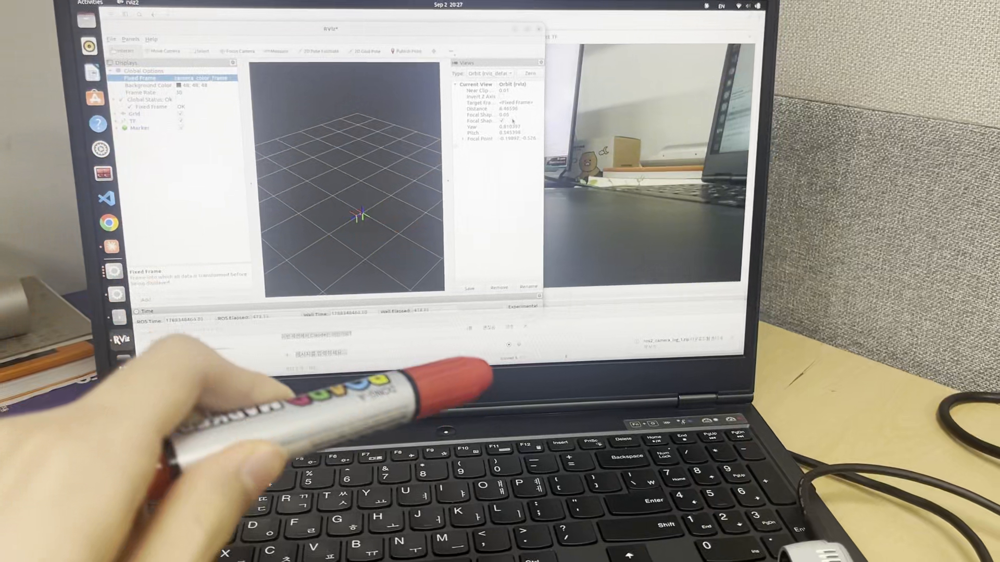
*red_object_tf 노드 실행 후 RViz 초기 상태(카메라 시점 창과 나란히 배치).*

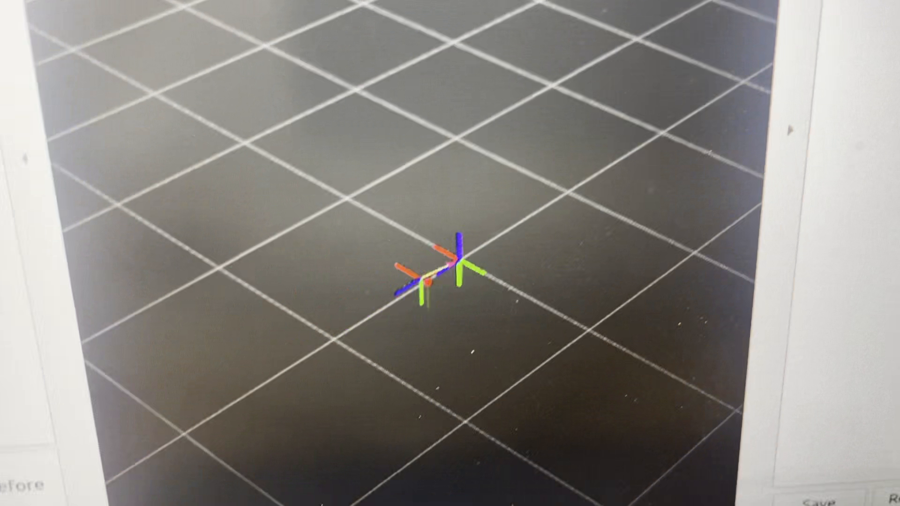
*camera_color_frame(카메라 자체)와 red_object(빨간 마커 위치) 두 TF 축이 노란 선으로 연결되어 표시됨. 빨간 점(Marker)도 같은 위치에 겹쳐 보임.*

**Phase E-3 통과 기준 — 충족 확인**: 실물(빨간 마커)을 움직이면 RViz 빨간 구슬이 실시간으로 따라온다. → **계획서 제출물 6(실험 6) 완성.**

### 겪은 것 — PointCloud2 "Status: Error"

**증상**: `points` 토픽은 `ros2 topic list`에 정상적으로 존재하는데도, RViz에 PointCloud2를 `Add`했더니 `Status: Error`.

**원인**: Displays 패널에서 PointCloud2를 추가만 하고 **`Topic` 항목을 아직 선택하지 않은 상태**였음. TF/Marker는 우리가 만든 토픽이 하나뿐이라 자동으로 잡혔지만, PointCloud2는 후보가 여러 개일 수 있어 직접 골라줘야 함.

**해결**: `Topic` 필드 클릭 → `/camera/camera/depth/color/points` 선택 → 정상적으로 점군 표시됨(손으로 든 마커 실루엣이 점들로 나타남).

### 이해한 개념

- **RViz의 Add = 우리 코드의 create_subscription()과 동일한 원리**: RViz는 기본적으로 아무것도 안 그리는 빈 캔버스. `Add`로 디스플레이 종류(TF, Marker, PointCloud2 등)를 추가하는 건, 우리가 파이썬 코드에서 `self.create_subscription(...)`으로 토픽을 구독 선언했던 것과 똑같은 일을 GUI 클릭으로 하는 것. 명시적으로 구독 설정을 해줘야만 데이터가 화면에 나타남.
- **Fixed Frame의 존재 이유**: 시스템엔 여러 좌표계(camera_link, camera_color_frame, camera_color_optical_frame, red_object 등)가 TF로 서로 상대 관계만 연결돼 있음. RViz가 이 전부를 하나의 3D 화면에 그리려면 "이 좌표계를 화면 중심(원점)으로 삼겠다"는 기준을 하나 정해야 하는데 그게 Fixed Frame. 지정한 이름이 TF 트리에 존재하지 않으면 계산 기준이 없어 에러가 남(Phase B에서 겪었던 에러와 동일 원인).
- **`camera_color_frame` vs `camera_color_optical_frame`이 같은 자리에서 다르게 보이는 이유**: 둘은 물리적으로 같은 위치(컬러 렌즈)지만 축 방향 규약이 다름 — 일반 규약(REP-103, X=앞·Y=왼쪽·Z=위) vs 광학 규약(X=오른쪽·Y=아래·Z=앞). 위치가 떠 있는 게 아니라 화살표 방향만 90도가량 돌아가 있는 것. D435i는 컬러 렌즈, 스테레오 IR 렌즈 2개, IMU 등 여러 센서가 물리적으로 조금씩 다른 위치에 있어서, 카메라 드라이버가 공장 출하 시 측정된 고정값(static transform)으로 이 모든 프레임들을 방송함 — 여러 좌표축 다발이 흩어져 보이는 건 정상.
- **실제 좌표와 RViz 화면 방향이 다르게 느껴지는 이유**: optical 규약에서 실생활의 "위쪽"은 Z축이 아니라 -Y축이라, RViz의 자유 시점(Orbit) 카메라가 우연히 다른 각도를 보고 있으면 눈에 익은 방향과 다르게 보임. 이건 시점(뷰 각도) 문제일 뿐 데이터 계산 오류가 아님 — 마우스로 화면을 돌리면 원하는 각도로 맞출 수 있음. 판단 기준은 "점군/마커가 물체의 실제 형태와 움직임을 반영하는가"임.
- **PointCloud2 Topic을 직접 선택해야 하는 이유**: TF/Marker와 달리 PointCloud2 데이터를 낼 수 있는 토픽 후보가 여러 개일 수 있어서, RViz가 자동으로 고르지 않고 사용자가 명시적으로 지정해야 함.

---

## 13. Phase F — ArUco 마커 6DoF Pose 추정 (9/3 완료)

### 목표

Phase E는 빨간 물체의 **위치(XYZ, 3DoF)**만 구했음 — 공은 회전 개념이 없는 물체라서. 이번엔 **위치 + 회전(6DoF)**을 구해야 하는 상황(로봇팔이 납작한 보드를 집으려면 몇 도 기울어져 있는지도 알아야 그리퍼를 맞춰 접근 가능)을 위해, 인쇄된 ArUco 마커(ID 0)를 이용해 depth 센서 없이 컬러 이미지만으로 6DoF를 계산.

### 마커 실측

검은 사각형 한 변 길이를 자로 측정 → **약 4inch(≈0.1016m)**로 확정. 정확도가 아쉬우면 나중에 코드의 `MARKER_LENGTH_M` 한 줄만 수정하면 되는 구조라, 일단 이 값으로 실행하며 감을 잡기로 함.

### 코드 — `aruco_board_tf.py`

```python
import rclpy
from rclpy.node import Node
from sensor_msgs.msg import Image, CameraInfo
from cv_bridge import CvBridge
import cv2
import numpy as np
import tf2_ros
from geometry_msgs.msg import TransformStamped

# 마커의 검은 사각형 한 변 길이 (미터 단위)
# 4inch ≈ 0.1016m로 일단 설정 — 나중에 더 정확히 재면 이 줄만 바꾸면 됩니다.
MARKER_LENGTH_M = 0.1016


class ArucoBoardTF(Node):
    def __init__(self):
        super().__init__('aruco_board_tf')
        self.bridge = CvBridge()

        # camera_info가 도착하기 전엔 계산 불가하므로 None으로 시작
        self.camera_matrix = None
        self.dist_coeffs = None

        # OpenCV 4.5.4용 구 API (4.7 이상이면 ArucoDetector 클래스로 바뀜)
        self.aruco_dict = cv2.aruco.Dictionary_get(cv2.aruco.DICT_4X4_50)
        self.aruco_params = cv2.aruco.DetectorParameters_create()

        self.br = tf2_ros.TransformBroadcaster(self)

        self.create_subscription(
            CameraInfo, '/camera/camera/color/camera_info',
            self.camera_info_callback, 10)
        self.create_subscription(
            Image, '/camera/camera/color/image_raw',
            self.image_callback, 10)

    def camera_info_callback(self, msg):
        # 한 번만 저장하면 충분 (카메라 렌즈 특성은 안 변하니까)
        if self.camera_matrix is None:
            self.camera_matrix = np.array(msg.k).reshape(3, 3)
            self.dist_coeffs = np.array(msg.d)
            self.get_logger().info('camera_info 수신 완료, 캘리브레이션 값 저장됨')

    def image_callback(self, msg):
        if self.camera_matrix is None:
            return  # 아직 camera_info 못 받았으면 계산 불가

        cv_image = self.bridge.imgmsg_to_cv2(msg, desired_encoding='bgr8')
        gray = cv2.cvtColor(cv_image, cv2.COLOR_BGR2GRAY)

        corners, ids, _ = cv2.aruco.detectMarkers(
            gray, self.aruco_dict, parameters=self.aruco_params)

        if ids is not None:
            rvecs, tvecs, _ = cv2.aruco.estimatePoseSingleMarkers(
                corners, MARKER_LENGTH_M, self.camera_matrix, self.dist_coeffs)

            for i in range(len(ids)):
                rvec = rvecs[i][0]
                tvec = tvecs[i][0]

                cv2.aruco.drawDetectedMarkers(cv_image, corners, ids)
                cv2.drawFrameAxes(cv_image, self.camera_matrix, self.dist_coeffs,
                                   rvec, tvec, MARKER_LENGTH_M * 0.5)

                self.publish_tf(rvec, tvec, msg.header, ids[i][0])

        cv2.imshow('Aruco Detection', cv_image)
        cv2.waitKey(1)

    def publish_tf(self, rvec, tvec, header, marker_id):
        rot_mat, _ = cv2.Rodrigues(rvec)
        quat = self.rotation_matrix_to_quaternion(rot_mat)

        t = TransformStamped()
        t.header.stamp = header.stamp
        t.header.frame_id = 'camera_color_optical_frame'
        t.child_frame_id = f'board_frame_{marker_id}'

        t.transform.translation.x = float(tvec[0])
        t.transform.translation.y = float(tvec[1])
        t.transform.translation.z = float(tvec[2])

        t.transform.rotation.x = quat[0]
        t.transform.rotation.y = quat[1]
        t.transform.rotation.z = quat[2]
        t.transform.rotation.w = quat[3]

        self.br.sendTransform(t)

    def rotation_matrix_to_quaternion(self, R):
        # (회전행렬 → 쿼터니언 변환 공식, 표준 알고리즘 — 이번엔 상세 이해는 보류)
        tr = R[0, 0] + R[1, 1] + R[2, 2]
        if tr > 0:
            S = np.sqrt(tr + 1.0) * 2
            w = 0.25 * S
            x = (R[2, 1] - R[1, 2]) / S
            y = (R[0, 2] - R[2, 0]) / S
            z = (R[1, 0] - R[0, 1]) / S
        elif (R[0, 0] > R[1, 1]) and (R[0, 0] > R[2, 2]):
            S = np.sqrt(1.0 + R[0, 0] - R[1, 1] - R[2, 2]) * 2
            w = (R[2, 1] - R[1, 2]) / S
            x = 0.25 * S
            y = (R[0, 1] + R[1, 0]) / S
            z = (R[0, 2] + R[2, 0]) / S
        elif R[1, 1] > R[2, 2]:
            S = np.sqrt(1.0 + R[1, 1] - R[0, 0] - R[2, 2]) * 2
            w = (R[0, 2] - R[2, 0]) / S
            x = (R[0, 1] + R[1, 0]) / S
            y = 0.25 * S
            z = (R[1, 2] + R[2, 1]) / S
        else:
            S = np.sqrt(1.0 + R[2, 2] - R[0, 0] - R[1, 1]) * 2
            w = (R[1, 0] - R[0, 1]) / S
            x = (R[0, 2] + R[2, 0]) / S
            y = (R[1, 2] + R[2, 1]) / S
            z = 0.25 * S
        return [x, y, z, w]


def main(args=None):
    rclpy.init(args=args)
    node = ArucoBoardTF()
    rclpy.spin(node)
    node.destroy_node()
    rclpy.shutdown()


if __name__ == '__main__':
    main()
```

`setup.py` 등록: `'aruco_board_tf = vision_pkg.aruco_board_tf:main',`
`package.xml`: 새로 추가할 라이브러리 없음 (`cv_bridge`, `tf2_ros`, `geometry_msgs`, `sensor_msgs`는 Phase D-2에서 이미 등록됨).

> **코드 이해 메모**: 이번 Phase는 코드 한 줄 한 줄의 수식(solvePnP 내부 알고리즘, 회전행렬→쿼터니언 변환 공식)을 다 파고들기보다, "정해진 수학 공식을 가져다 쓰는 것"으로 보고 **원리·목적 이해에 집중**하기로 함. 상세 코드 이해는 다음 기회로 보류.

### 실행 및 검증

**터미널 순서**: 터미널1(`humble`→`ros_domain`→카메라 launch) → 터미널2(`humble`→`ros_domain`→`sws`→`ros2 run vision_pkg aruco_board_tf`) → 터미널3(확인용: `ros2 node list`, `ros2 run tf2_ros tf2_echo camera_color_optical_frame board_frame_0`, 필요시 `rviz2`).

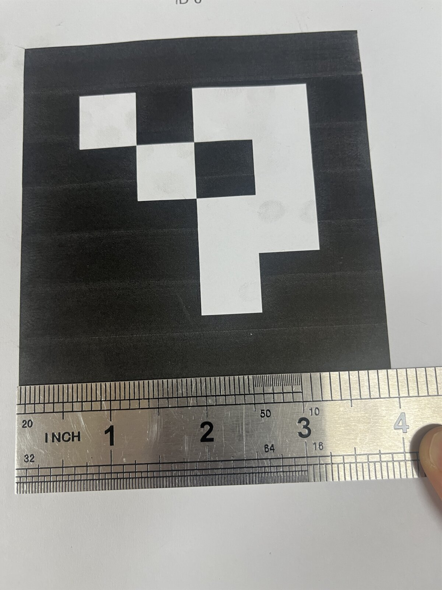
*ArUco 마커(ID 0)의 검은 사각형 한 변을 자로 측정. 약 4inch로 확인, `MARKER_LENGTH_M`에 반영.*

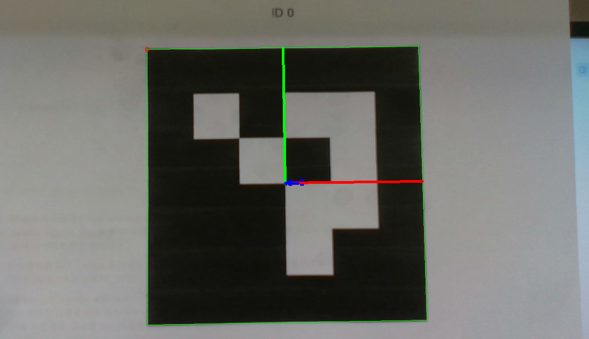
*정면에 가깝게 놓았을 때 초록 테두리(검출된 마커 윤곽) + RGB 좌표축(빨강=X, 초록=Y, 파랑=Z)이 정상적으로 그려짐. 화면 상단에 "ID 0" 표시.*

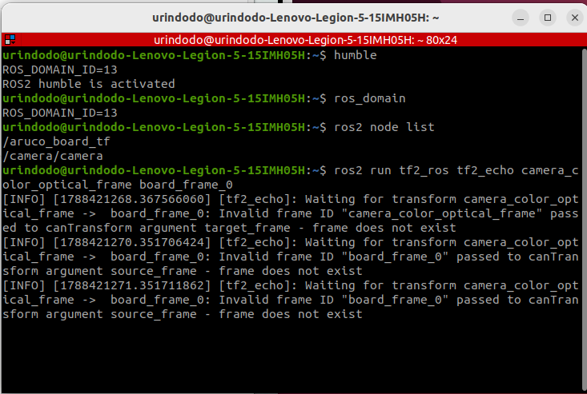
*마커가 카메라 앞에 없던 순간에 tf2_echo를 실행해서 "frame does not exist" 에러 발생. 코드 자체 버그가 아니라, 우리 노드가 마커 검출 시에만 TF를 발행하기 때문에 마커가 없으면 TF도 없는 게 정상.*

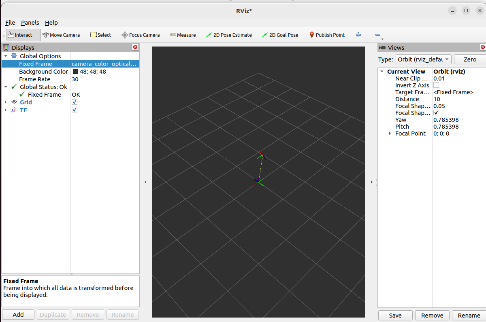
*Fixed Frame을 camera_color_optical_frame으로 지정하고 TF Display를 Add한 초기 상태.*

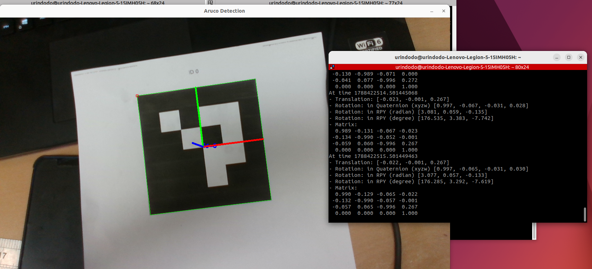
*마커를 살짝 기울인 채 검출 + tf2_echo 실행. Translation [-0.022, -0.001, 0.267](카메라로부터 26.7cm 거리), RPY(degree) [176.285, 3.292, -7.619](180도 기준 Roll은 마커가 카메라를 정면으로 보는 ArUco 좌표 규약, 실제 기울기는 Pitch 3.3°·Yaw -7.6°) 확인. 90도 회전시켜도 좌표축이 따라 도는 것을 영상으로 확인 → **6DoF 실시간 추종 검증 완료.**

### 겪은 것 — 회전이 심하면 인식 실패

**원인**: 마커가 카메라와 거의 평행(스치는 각도)에 가까워지면, 화면에 찍히는 모양이 정사각형에서 심하게 눌린 형태로 찌그러짐. ① 사각형 윤곽 검출 자체가 실패하거나 ② 내부 흑백 격자를 읽을 픽셀 수가 부족해져 ID 판독이 안 됨. "안 보여서"가 아니라 "보이는 형태·해상도가 무너져서 알고리즘이 못 읽는 것" — 기하학적 한계.

### 이해한 개념

- **ArUco의 목적**: Phase E(위치만, 3DoF)와 달리 회전까지 포함한 6DoF가 필요할 때(로봇팔이 기울어진 물체에 그리퍼를 맞춰 접근해야 할 때) 사용. 마커의 알려진 실제 크기(4inch)와 화면에 찍힌 크기·형태를 비교하는 `solvePnP`(Perspective-n-Point) 알고리즘으로 위치+회전을 동시에 역산.
- **내부 흑백 패턴의 역할**: ① Dictionary 기반 고유 ID 식별, ② 마커가 90/180/270도 돌아가 있어도 "몇 도 돌았는지"를 구분하게 해주는 비대칭 패턴(순수 정사각형 테두리만 있으면 회전 대칭이라 방향 구분 불가).
- **평면 하나로 3D 회전 전체를 알 수 있는 이유**: 평면의 방향을 정하려면 법선 방향(2자유도) + 평면 내 회전(1자유도) = 총 3자유도가 필요한데, 이게 Roll/Pitch/Yaw 3개와 정확히 일치. 즉 평면 하나(마커)의 방향만 알아도 그 물체의 3D 회전 전체를 빠짐없이 알 수 있음 — "보이는 면만 본다"는 게 정보 부족이 아니라 수학적으로 충분한 정보임.
- **다중 시점(스테레오) vs 단일 시점+기준 크기**: 둘 다 "2D 이미지엔 원래 없는 깊이 정보를 어떻게 복구하나"에 대한 서로 다른 해법. D435i의 depth는 양안(스테레오 IR) 방식(ToF 아님)으로 다중 시점을 씀. ArUco는 카메라 한 대(단일 시점)로, "실제 크기를 미리 안다"는 정보를 depth 대신 넣어서 유사삼각형 비례식(`실제크기:화면크기 = fx:거리`)을 매 프레임 새로 풀어서 거리를 구함. "한 거리에서만 찍어도 계산된다"는 건 맞지만, 그 비례식은 고정 저장되는 게 아니라 매 프레임 처음부터 다시 계산됨(가까워지거나 멀어져도 매번 정확).
- **camera_info와 카메라 자체 캘리브레이션**: `camera_info_callback`이 저장하는 fx, fy, cx, cy, 왜곡계수는 D435i가 공장 출하 시 이미 측정해 카메라 내부에 저장해둔 값 — 우리가 새로 계산/보정하는 게 아니라 그 값을 토픽으로 받아서 재사용하는 것. 일반적인 정밀도 요구 수준에서는 이 공장값으로 충분해서 별도 캘리브레이션 과정이 불필요함(산업 현장의 mm급 정밀 작업에서는 체커보드로 재보정하기도 함).
- **tf2_echo 출력값 해석**: Translation(m 단위, camera_color_optical_frame 기준 XYZ) / Quaternion(xyzw, 계산용) / RPY degree(사람이 읽기 직관적 — Roll이 180도 근처인 건 ArUco 좌표 규약상 마커가 카메라를 정면으로 볼 때의 정상값, 실제 기울기는 180도에서 벗어난 정도) / 4x4 Matrix(Translation+Rotation을 하나로 합친 표현, 새 정보는 아님).
- **드론 착륙 마커의 진짜 용도**: 거리(z)보다 GPS로는 안 되는 센티미터급 수평 위치(x,y) 정밀 보정이 핵심. 회전(Yaw)은 정밀 도킹(충전 접점 등)이 필요할 때 추가로 활용.
- **범용 물체엔 ArUco를 안 씀**: ArUco는 "마커를 미리 붙여둘 수 있는 통제된 상황"(캘리브레이션, 고정 픽스처, 도킹 패드)에만 실용적. 마커 없는 임의 물체는 depth 센서(위치만, 3DoF)나 딥러닝 기반 6D Pose Estimation(물체의 3D 형태를 미리 학습, 마커 없이도 6DoF 추론, 계산량은 큼)을 사용.
- **로봇팔-카메라 Hand-Eye Calibration**: 그리퍼에 마커를 붙이고 로봇을 여러 자세로 움직이며 "로봇이 스스로 아는 그리퍼 위치(엔코더+기구학)"와 "카메라가 본 마커 위치"를 여러 쌍 수집 → 이를 풀어서 "camera_frame → robot_base_frame"이라는 **고정된 하나의 변환값**을 역산. 한 번 구해서 저장하면 그 이후엔 마커도, 재계산도 필요 없음(로봇 관절 자체의 움직임은 원래 로봇이 엔코더로 실시간 추적하는 별개의 문제).
- **정적 TF vs 동적 TF**: 물리적으로 안 움직이는 관계(카메라-로봇 베이스, camera_link-camera_color_optical_frame)는 한 번 측정해서 저장하면 센서 없이 평생 재사용. 계속 움직이는 대상(로봇 관절, board_frame, red_object)은 매 순간 다시 측정해야 함 — 이 구분이 TF 트리 설계의 핵심 원리.
- **종합 비교표**:

| 상황 | 방법 | 얻는 것 |
|---|---|---|
| 정적 하드웨어 관계 | 한 번 캘리브레이션(ArUco 등) 후 저장 | 6DoF, 이후 센서 불필요 |
| 동적 + 마커 붙일 수 있음 | ArUco 계속 추적 | 6DoF, 매 프레임 |
| 동적 + 마커 못 붙임(임의 물체) | 딥러닝 6D pose | 6DoF, 매 프레임, 계산량 큼 |
| 동적 + 위치만 필요 | Depth 센서 | 위치만(3DoF), 계산량 가벼움 |

**Phase F 통과 기준 — 충족 확인**: 마커를 기울이거나 90도 회전시켜도 RViz에서 `board_frame_0` 좌표축이 실시간으로 따라 움직임을 영상으로 확인. → **6DoF Pose 추정 완성.**

---

## 14. Phase G — Launch 파일로 전체 통합 (9/3 완료)

### 목표

그동안 터미널 2~3개를 따로 켜서(`humble`→`ros_domain`→카메라 launch, `humble`→`ros_domain`→`sws`→각 노드 `ros2 run`) 시스템을 실행했는데, 이걸 `vision.launch.py` 파일 하나로 묶어서 **터미널 1개에서 한 방에 전체 시스템이 뜨게** 만드는 단계. 동시에 `aruco_board_tf.py`의 `MARKER_LENGTH_M` 하드코딩 상수를 ROS2 **Parameter**로 빼서, 코드/재빌드 없이 실행 시점에 값을 바꿀 수 있게 함.

### 코드 변경 — `aruco_board_tf.py`

모듈 레벨 상수 `MARKER_LENGTH_M = 0.1016` 삭제 → `__init__` 안에서:
```python
self.declare_parameter('marker_length', 0.1016)
self.marker_length = self.get_parameter('marker_length').value
self.get_logger().info(f'marker_length = {self.marker_length} m')
```
이후 `estimatePoseSingleMarkers`, `drawFrameAxes` 호출부의 `MARKER_LENGTH_M`을 전부 `self.marker_length`로 교체.

### 새 파일 — `launch/vision.launch.py`

```python
import os
from launch import LaunchDescription
from launch.actions import IncludeLaunchDescription, DeclareLaunchArgument
from launch.launch_description_sources import PythonLaunchDescriptionSource
from launch.substitutions import LaunchConfiguration
from launch_ros.actions import Node
from ament_index_python.packages import get_package_share_directory


def generate_launch_description():
    marker_length_arg = DeclareLaunchArgument(
        'marker_length',
        default_value='0.1016',
        description='ArUco 마커 검은 사각형 한 변 길이 (m)'
    )

    realsense_launch = IncludeLaunchDescription(
        PythonLaunchDescriptionSource(
            os.path.join(
                get_package_share_directory('realsense2_camera'),
                'launch', 'rs_launch.py')
        ),
        launch_arguments={
            'align_depth.enable': 'true',
            'pointcloud.enable': 'true',
        }.items()
    )

    red_object_tf_node = Node(
        package='vision_pkg',
        executable='red_object_tf',
        name='red_object_tf',
        output='screen',
    )

    aruco_board_tf_node = Node(
        package='vision_pkg',
        executable='aruco_board_tf',
        name='aruco_board_tf',
        output='screen',
        parameters=[{'marker_length': LaunchConfiguration('marker_length')}],
    )

    return LaunchDescription([
        marker_length_arg,
        realsense_launch,
        red_object_tf_node,
        aruco_board_tf_node,
    ])
```

### 등록 작업

- `setup.py`: 맨 위에 `import os`, `from glob import glob` 추가 + `data_files`에
  ```python
  (os.path.join('share', package_name, 'launch'), glob('launch/*.launch.py')),
  ```
- `package.xml`: `<license>` 아래에
  ```xml
  <exec_depend>launch</exec_depend>
  <exec_depend>launch_ros</exec_depend>
  <exec_depend>realsense2_camera</exec_depend>
  ```

### 실행

```bash
cd ~/ros2_ws
colcon build --symlink-install
humble
ros_domain
sws
ros2 launch vision_pkg vision.launch.py
```

`Red Object TF`, `Aruco Detection` 창 2개가 동시에 뜨고, 다른 터미널(`humble`→`ros_domain`)에서 `ros2 node list` 했을 때 `/camera/camera`, `/red_object_tf`, `/aruco_board_tf` 세 개가 모두 잡히는 것으로 최종 확인.

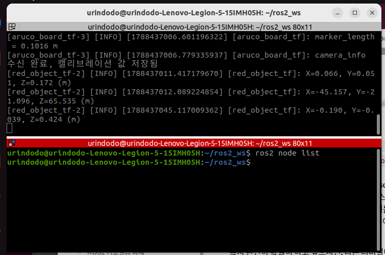
*`colcon build`를 워크스페이스 최상위(`~/ros2_ws`)가 아니라 `~/ros2_ws/src/vision_pkg/vision_pkg`에서 실행해 "0 packages finished"로 끝나버림 → launch 파일이 install에 복사 안 돼서 `ros2 launch`가 파일을 못 찾는 에러로 이어짐.*

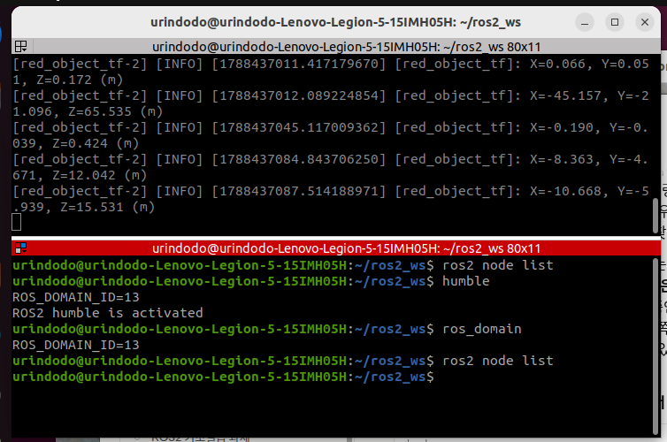
*두 터미널 모두 ROS_DOMAIN_ID=13으로 확인됐는데도 `ros2 node list`가 빈 결과. 원인은 launch를 실행한 터미널 자체가 `ros_domain` 없이(기본 도메인 0번으로) 켜져 있었기 때문 — 실행 중인 터미널의 이력 자체에 도메인 설정 누락이 있었음.*

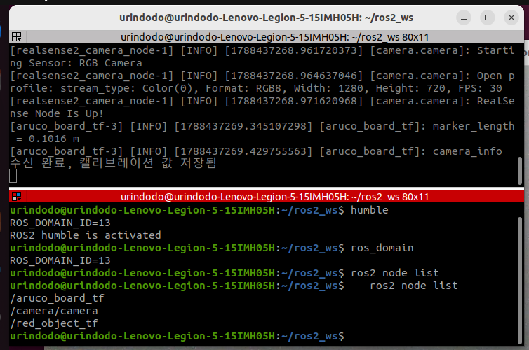
*`/aruco_board_tf`, `/camera/camera`, `/red_object_tf` 세 노드가 모두 `ros2 node list`에 정상적으로 잡힘. Phase G 통과 기준 충족.*

### 겪은 문제 2가지

**1) `colcon build` 실행 위치 문제**: `colcon build`는 항상 워크스페이스 최상위(`~/ros2_ws`, 그 아래 `src/` 폴더가 있는 위치)에서 실행해야 함. 패키지 내부 깊은 경로(`~/ros2_ws/src/vision_pkg/vision_pkg`)에서 실행하면 `src/`를 못 찾아 "0 packages finished"로 즉시 끝나버리고, 아무것도 빌드/설치되지 않음.

**2) `setup.py`에 `import os` 누락**: `data_files`에 `os.path.join(...)`을 쓰면서 파일 맨 위에 `import os`를 빠뜨려서 `NameError: name 'os' is not defined`로 빌드 실패. `from glob import glob`만으론 부족하고 `os`도 별도로 import해야 함.

**3) launch 터미널의 ROS_DOMAIN_ID 불일치**: `ros2 launch`를 실행한 터미널이 `ros_domain`을 거치지 않고(기본 도메인 0번으로) 켜져 있으면, `ros_domain`으로 13번을 맞춘 다른 터미널에서는 그 노드들이 전혀 안 보임. 두 터미널 모두 같은 `ROS_DOMAIN_ID`를 명시적으로 설정해야 서로를 인식함 — 실제로 잘 동작 중인 노드도 "안 보인다"고 착각하기 쉬운 함정.

### 이해한 개념

- **하드코딩 상수 vs ROS2 Parameter**: 상수는 코드 안에 값이 박혀있어 바꾸려면 파일 수정+재빌드가 필요. `declare_parameter`로 선언하면 기본값은 유지하면서, 실행 시점(`ros2 launch ... marker_length:=0.05`)에 코드를 안 건드리고 값을 주입할 수 있음. 단, `aruco_dict`(사전 종류)처럼 아직 Parameter화 안 한 값은 여전히 코드 수정이 필요 — 이번엔 크기만 Parameter로 뺐음.
- **`src/`와 `install/` 폴더의 역할 차이**: `src/`는 우리가 직접 코드를 작성하는 원본 위치. `install/`은 `colcon build`가 그 코드를 실행 가능한 형태로 복사/정리해두는 곳. `ros2 run`/`ros2 launch`는 항상 `install/`만 보기 때문에, `src/`에 파일을 새로 만들어도 `colcon build`(그리고 `setup.py`의 `data_files` 등록)를 거치지 않으면 "존재하지 않는 파일" 취급됨.
- **`colcon build`는 워크스페이스 최상위에서 실행해야 하는 이유**: `src/` 폴더를 상대 경로로 찾기 때문에, 그 폴더가 보이는 위치(`~/ros2_ws`)에서 실행해야만 패키지들을 인식함.
- **ROS_DOMAIN_ID의 격리 원리**: `ros2 node list` 같은 탐색 명령은 같은 도메인 번호를 쓰는 노드들끼리만 서로 발견 가능. 프로세스가 실제로 정상 작동 중이어도(로그가 계속 찍혀도), 도메인 번호가 다르면 다른 터미널에서는 완전히 안 보이는 것처럼 느껴짐 — 오작동이 아니라 격리 설정 문제.

**Phase G 통과 기준 — 충족 확인**: 터미널 1개에서 `ros2 launch vision_pkg vision.launch.py` 한 방으로 카메라+빨간 물체 추적+ArUco 6DoF 추적 전체 시스템이 뜨고, `ros2 node list`로 세 노드 모두 확인됨. → **계획서 제출물 1~8 전체 완성.**
