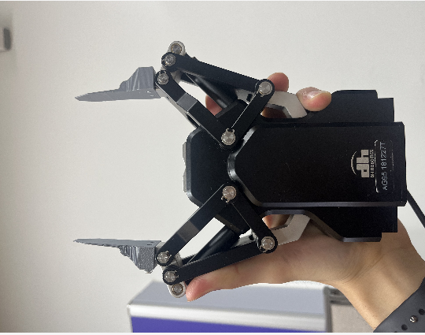
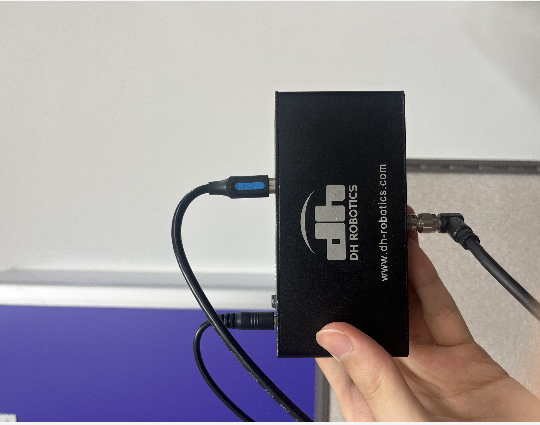
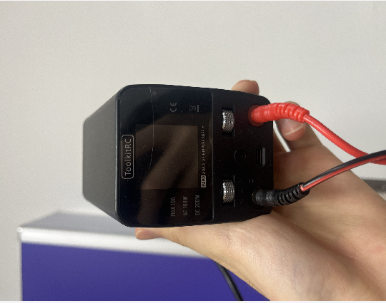
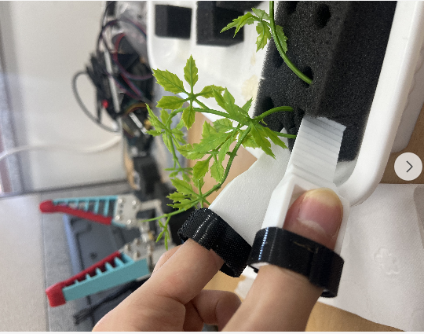

# 수경재배 모종 이식 로봇 — 진행 계획

> [`problem-definition.md`](./problem-definition.md)의 문제를 **시험 순서**로 풀어놓은 문서다.
> 계획은 바뀐다. 바뀔 때마다 **§1 변경 이력에 먼저 한 줄** 적고 고친다 (§2 규칙).
>
> - **현재 버전: v1** (2026-09-22)
> - 단계별 체크리스트는 이 문서의 단계 ID(P0, P1 …)와 시험 ID(P1-1 …)를 가리킨다

---

## 1. 변경 이력 ← 계획이 바뀌면 여기부터

| 버전 | 날짜 | 무엇이 바뀌었나 | 왜 (계기) | 영향 단계 |
|---|---|---|---|---|
| v1 | 2026-09-22 | 최초 작성 — P0~P5, 대기 목록 W1~W7 | 받은 자료(사진 11장·설명·농장 영상)로 문제 정의 | 전체 |

> 적는 예: `| v2 | 2026-09-26 | P3에 손끝 설계 B안 추가, P3-4 보류 | P2-2 결과: 뜯을 때 트레이를 눌러줘야 함 | P3 |`

## 2. 계획을 바꾸는 규칙

1. **먼저 기록** — 고치기 전에 §1에 한 줄 적고 버전을 +1 한다. 계기는 셋 중 하나로 쓴다: 시험 결과(시험 ID) / 선배·교수 요구 / 내 판단
2. **ID는 다시 쓰지 않는다** — 단계 ID와 시험 ID는 체크리스트가 가리키는 주소다. 중간에 끼워 넣는 단계도 새 번호(P6, P7 …)를 받고, 실제 순서는 §3의 **선행** 칸으로 나타낸다
3. **지우지 않는다** — 안 하게 된 단계·시험은 상태를 `취소` 또는 `보류`로 바꾸고 사유를 적는다
4. **정해진 것은 §5에** — 시험으로 변수가 정해지면 §5 결정 표에 날짜와 근거(시험 ID)를 적는다. 결정을 뒤집을 때도 원래 줄을 지우지 않고 새 줄을 추가한다
5. **새 계획은 §6에서 꺼낸다** — 로봇 장착, CV 같은 계획은 §6 대기 목록에 있다. 시작할 때 새 단계 ID를 받아 §3·§4로 옮긴다
6. **문제가 바뀌면 문제 정의부터** — 대상·장비·성공 기준이 바뀌면 `problem-definition.md`를 먼저 고친다
7. **커밋 메시지에 버전** — 예: `plan: v2 — P3 손끝 설계 B안 추가 (P2-2 결과)`

---

## 3. 단계 한눈에

```
P0 기준 실측 ────┐
P1 받은 장비 구동 ─┼──→ P3 엔드이펙터 비교 ⇄ P4 접근·삽입 모의 ──→ P5 물 조건 ──→ (§6 대기: 로봇 장착·CV)
P2 사람 손 시험 ──┘
```

| ID | 단계 | 푸는 문제 | 선행 | 상태 |
|---|---|---|---|---|
| P0 | 기준 실측·관찰 | 전체 (숫자 확보) | — | 예정 · P1과 병행 가능 |
| **P1** | **받은 장비 구동 — AG-95 그리퍼** | C 파지 준비 | — | 예정 · **1단계** |
| P2 | 사람 손 시험 — 분리·파지 방식 찾기 (마른 상태) | B 분리, C 파지 | — | 진행 중 · 손가락 캡 시험 1회 |
| P3 | 엔드이펙터 후보 비교 (마른 상태) | C 파지, B 분리 | P1, P2 | 예정 |
| P4 | 접근·삽입 모의 — 그리퍼를 손에 들고 (마른 상태) | D 접근, E 삽입 | P0, P3 | 예정 |
| P5 | 물 조건 재시험 | F 물 | P4 | 예정 |

- 상태 값: `예정` / `진행 중` / `완료` / `보류` / `취소`
- **P0~P5는 로봇팔 없이 할 수 있는 단계다.** 로봇 시간은 로봇이 해야 할 일이 정해진 뒤에 쓴다
- **P3 ⇄ P4는 오갈 수 있다.** P4에서 막히면 P3로 돌아가 손끝을 바꾼다 (돌아갈 때 §1에 기록)

### 문제별로 빠진 곳이 없는지

| 문제 | P0 | P1 | P2 | P3 | P4 | P5 | 대기 |
|---|---|---|---|---|---|---|---|
| A 인식 | 관찰 | | | | | | W5, W6 |
| B 분리 | 관찰 | | ● | ● | | ● | |
| C 파지 | | 준비 | ● | ● | | ● | |
| D 접근·이동 | 턱 실측 | | 감 잡기 | | ● | ● | W4 |
| E 삽입 | 구멍 실측 | | | | ● | ● | W2, W3 |
| F 물 | 물 높이 | | | | | ● | |

→ **A 인식(CV)은 일부러 대기 목록에 뒀다.** 무엇을 인식해야 하는지가 P2~P4 결과로 정해지기 때문이다.

---

## 4. 단계별 내용

### P0 · 기준 실측·관찰

- **목적** — 문제 정의의 ❓ 숫자를 채운다. 뒤 단계의 판정 기준이 이 숫자에서 나온다
- **선행** — 없음. P1·P2와 동시에 해도 된다

| 시험 ID | 할 일 | 판정 (무엇이 확인되면 끝인가) |
|---|---|---|
| P0-1 | 스펀지 칸 크기·간격, 트레이 칸 수·두께 실측 | 수치와 사진이 기록됨. 제품 표기(250 mm · 25 mm)와 대조 |
| P0-2 | 목표 판 구멍 크기·판 두께 실측 | 삽입 여유(구멍 − 스펀지)가 계산됨 |
| P0-3 | 칸끼리 이어진 방식 관찰 (칼집 유무, 이어진 깊이) | 사진과 설명이 기록됨 |
| P0-4 | 이식할 때 모종의 높이·잎 퍼짐·뿌리 길이, 물 높이 | 대표 모종 몇 개의 수치가 기록됨 |
| P0-5 | 트레이 틀 가장자리 턱 높이·폭 | 수치가 기록됨 |

- **산출물** — 채운 수치를 `problem-definition.md` §8에 반영 (문제 정의 변경 이력에도 한 줄)

### P1 · 받은 장비 구동 — AG-95 그리퍼 (1단계)

| AG-95 | DH 제어 박스 | ToolkitRC 전원 |
|---|---|---|
|  |  |  |

- **목적** — PC에서 그리퍼를 명령으로 움직이고 상태를 읽을 수 있게 만든다. P3·P4에서 이 제어를 그대로 쓴다
- **선행** — 없음
- **근거 자료** — AG-95 사양: 24 V DC ± 10 %, 최대 1.5 A, Modbus RTU (RS-485). 통신 설정·레지스터는 매뉴얼의 Modbus-RTU 절로 확인한다
- ⚠️ **안전** — 손끝이 칼날이다. 닫기 명령을 보낼 때 손가락을 손끝 사이에 두지 않는다

| 시험 ID | 할 일 | 판정 |
|---|---|---|
| P1-1 | ToolkitRC 출력 전압을 멀티미터로 먼저 잰다 (허용 21.6 ~ 26.4 V). 극성 확인 후에만 연결 | 측정 전압이 기록됨 |
| P1-2 | 제어 박스를 노트북에 USB로 연결하고 장치 인식 확인 (💡 리눅스에서는 보통 `/dev/ttyUSB*`) | 장치 이름이 기록됨 |
| P1-3 | 매뉴얼의 통신 설정(주소·속도)으로 초기화 명령 | 그리퍼가 초기화 동작을 하고 "초기화 완료" 상태가 읽힘 |
| P1-4 | 위치(열기·닫기·중간), 힘, 속도 명령과 상태 읽기(도착 / 물체 잡음) | 명령값과 읽은 값이 표로 기록됨 |
| P1-5 | 위 동작을 파이썬 스크립트로 저장 | 스크립트 한 번 실행으로 열기 → 닫기 → 상태 출력 |
| P1-6 | 떼어낸 마른 스펀지 조각을 가장 약한 힘으로 잡아보기 | 눌림·변형·모종 손상이 사진으로 기록됨 (💡 최소 45 N이 폼에 과한지 확인) |

- **정하는 것** — 그리퍼 힘을 폼에 쓸 수 있는 범위 (→ §5)

### P2 · 사람 손 시험 — 분리·파지 방식 찾기 (마른 상태)



- **목적** — 로봇 없이 가장 싸게 "어떻게 떼고, 어디를 잡고, 뜯는 동안 무엇이 버텨야 하나"를 찾는다. 이 결과가 엔드이펙터 설계의 요구사항이 된다
- **왜 먼저** — 기존 칼날 손끝은 뜯을 때 붙잡아 주지 못한다. 무엇을 만들어야 할지 모르는 채 설계부터 하면 추측으로 만들게 된다
- **이미 한 것** — 3D 프린팅 손가락 캡으로 뽑기 시험 (위 사진). 결과를 P2-0으로 기록한다

| 시험 ID | 할 일 | 판정 |
|---|---|---|
| P2-0 | 손가락 캡 시험 결과 정리 (무엇이 됐고 무엇이 안 됐나) | 사진과 설명이 기록됨 |
| P2-1 | 떼는 방식 비교 — 위로 당기기 / 옆으로 비틀기 / 칼로 자른 뒤 들기 | 방식마다 성공 여부, 힘 방향, 옆 칸·뿌리 상태가 기록됨 |
| P2-2 | 뜯는 동안의 역할 나누기 — 스펀지만 잡으면 되나, 트레이나 옆 칸을 눌러줘야 하나 | 엔드이펙터가 해야 할 동작 목록이 나옴 |
| P2-3 | 잡는 위치 — 스펀지 옆면 / 윗면 가장자리 | 위치마다 잎·줄기 간섭이 기록됨 |
| P2-4 | 1칸씩 vs 여러 칸 묶음 (농장은 "3개씩") | 장단점이 기록됨 |
| P2-5 | 진입 공간 감 잡기 — 손가락(캡)이 칸 사이와 가장자리 턱 옆에 들어가나, 수직·사선 어느 쪽이 편한가 | 칸 위치별 메모와 사진 |

- **끝나는 조건** — 분리·파지 방식 후보 1~3개, 그리고 후보마다 엔드이펙터에 필요한 것(잡는 폭, 힘, 동작 순서)
- **정하는 것** — 분리 방식, 잡는 위치, 1칸/묶음의 초안 (→ §5)

### P3 · 엔드이펙터 후보 비교 (마른 상태)

- **목적** — 같은 기준으로 후보를 비교해서 다음 단계에 쓸 엔드이펙터를 고른다
- **선행** — P1 (그리퍼 제어), P2 (요구사항)
- **후보**
  1. AG-95 + 기존 칼날 손끝
  2. AG-95 + 3D 프린팅 손끝 (P2 요구사항 반영)
  3. 2번 + 보조 구조 (예: 누르개 — P2-2 결과에 따라)
  4. 로봇 핸드 — **1~3번이 기준에 못 미칠 때만**
- **공통 평가표** — 모든 후보를 같은 표로 잰다: 분리 성공 (n회 중), 모종 손상 (없음 / 가벼움 / 심함), 옆 칸 간섭, 흔들어도 안 떨어지나, 놓을 때 딸려 나오나

| 시험 ID | 할 일 | 판정 |
|---|---|---|
| P3-1 | 평가표와 시험 방법 확정 (시험 횟수, 그리퍼를 손에 드나 지그에 고정하나) | 평가표 양식이 정해짐 |
| P3-2 | 후보 1 시험 | 평가표 한 줄 |
| P3-3 | 후보 2 — 설계 → 출력 → 시험 반복. 버전마다 파일명·사진·결과를 남김 | 버전별 평가표 줄 |
| P3-4 | 후보 3 시험 (P2-2에서 필요하다고 나온 경우만) | 평가표 한 줄 또는 `취소`(사유) |
| P3-5 | 로봇 핸드 필요성 판정 | 평가표를 근거로 한 판정이 기록됨 |

- **끝나는 조건** — 평가표가 채워지고, 다음 단계에 쓸 후보 1~2개를 표를 근거로 고름
- **정하는 것** — 엔드이펙터, 힘 설정 (→ §5)

### P4 · 접근·삽입 모의 — 그리퍼를 손에 들고 (마른 상태)

- **목적** — 로봇에 달기 전에, 고른 엔드이펙터로 들어가고 · 빼고 · 꽂는 동작이 되는지 확인한다
- **선행** — P0 (턱·구멍 수치), P3 (엔드이펙터)

| 시험 ID | 할 일 | 판정 |
|---|---|---|
| P4-1 | 수직 진입 — 안쪽 칸 / 가장자리 칸 / 모서리 칸 | 칸 위치별 가능 여부 |
| P4-2 | 사선 진입 — 각도 몇 가지 (각도 후보는 P2-5 감으로 정함) | 각도별 모종 보호 효과와 턱·옆 칸 간섭 |
| P4-3 | 순서 효과 — 한 칸을 뺀 뒤 옆 칸이 쉬워지나, 어느 칸부터 시작하나 | 시작 칸별 비교 |
| P4-4 | 삽입 — 목표 구멍에 꽂고 놓기 | 끝까지 들어가나, 똑바로 서나, 딸려 나오나, 뿌리가 통과하나 |
| P4-5 | 이동 중 옆 칸 간섭 | 잎·스펀지를 치는지 기록 |

- **끝나는 조건** — 칸 위치별 접근 규칙 표와 삽입 방법
- **정하는 것** — 접근 각도, 작업 순서(초안), 삽입 방법 (→ §5)

### P5 · 물 조건 재시험

- **목적** — 실제 조건(물)에서도 앞 단계의 방법이 되는지 확인한다
- **선행** — P4

| 시험 ID | 할 일 | 판정 |
|---|---|---|
| P5-1 | 물을 충분히 먹인 스펀지로 P3 상위 후보·P4 방법 재시험 | 성공 기준(문제 정의 §5) 대비 결과 |
| P5-2 | 물에 잠긴 트레이로 같은 시험 (실제 조건) | 같은 기준으로 결과 |
| P5-3 | 물 때문에 달라진 점 정리 → 앞 단계로 돌아갈지 판단 | 돌아가면 §1에 기록 |

- **끝나는 조건** — 물 조건에서 성공 기준을 만족하는 방법 확인. 안 되면 원인과 다음 시도가 기록됨

---

## 5. 결정 표 — 시험으로 정할 것

정해지면 결정·근거 칸을 채운다. 뒤집을 때는 원래 줄을 두고 새 줄을 추가한다.

| 변수 | 후보 | 정하는 단계 | 결정 | 근거 (날짜 · 시험 ID) |
|---|---|---|---|---|
| 분리 방식 | 당겨 찢기 / 자른 뒤 들기 / 비틀기 | P2 | — | — |
| 잡는 위치 | 옆면 / 윗면 가장자리 | P2 | — | — |
| 한 번에 옮기는 수 | 1칸 / 묶음 | P2 | — | — |
| 그리퍼 힘 | 45 N부터 | P1, P3 | — | — |
| 엔드이펙터 | 칼날 / 3D 손끝 / 보조 구조 / 로봇 핸드 | P3 (P5에서 재확인) | — | — |
| 접근 각도 | 수직 / 사선 — 칸 위치별 | P4 | — | — |
| 작업 순서 | 가장자리부터 / 안쪽부터 / 열 단위 | P4 (W4에서 확정) | — | — |
| 삽입 방법 | 수직 / 기울여 넣은 뒤 세우기 | P4 | — | — |
| 물 조건 대응 | — | P5 | — | — |
| 동작 방식 | 정해진 좌표 반복 / 칸마다 판단 | W4 · W5 | — | — |

---

## 6. 대기 목록 — 아직 단계 번호를 받지 않은 계획

시작할 때 새 단계 ID(P6 …)를 받아 §3·§4로 옮기고 §1에 기록한다.

| ID | 계획 | 언제 꺼내나 | 메모 |
|---|---|---|---|
| W1 | UR10e에 그리퍼 장착 (기계 어댑터 · 전원·통신 연결) | P3에서 엔드이펙터가 정해지면 | 공구 플랜지 ISO 9409-1-50-4-M6. 공구 커넥터(24 V · 최대 2 A · RS-485)로 AG-95를 돌릴 수 있는지 확인 |
| W2 | 정해진 좌표로 한 칸 → 한 구멍 옮기기 | W1 다음 | 수직 진입부터 |
| W3 | 삽입 정확도·반복성 | W2 다음 | 반복 정밀도(± 0.05 mm)와 절대 정확도는 다르다 → 티칭·보정 |
| W4 | 순서·각도 전략을 로봇으로 (여러 칸) | W2가 되면 | P4 결과를 로봇 동작으로 옮김 |
| W5 | CV — 칸 상태·모종 인식 | 칸마다 판단이 필요하다고 정해지면 (P4 결과) | 잎이 옆 칸을 가림 |
| W6 | CV — 목표 판·구멍 위치 인식 | 연속 작업 전 | 판의 흑백 패턴(마커로 보임) 활용 여부 ❓ |
| W7 | 한 트레이 연속 작업 | 위가 다 되면 | 성공률·작업 시간 목표는 선배와 정함 |

---

## 7. 이 순서로 정한 이유

- **싼 시험부터** — 사람 손 → 그리퍼를 손에 들고 → 로봇 순서다. 뒤로 갈수록 준비가 크고, 앞에서 막히면 뒤는 할 필요가 없다
- **마른 상태를 먼저, 물은 마지막에 한 번에** — 📄 주인 결정. 변수를 하나씩 늘려야 무엇 때문에 실패했는지 가려낼 수 있다
- **받은 장비 구동(P1)을 1단계로** — 📄 주인 판단. 다른 단계에 기대지 않아서 바로 시작할 수 있고, P3부터 필요하다
- **로봇 장착과 CV는 대기** — 로봇이 "무엇을" 해야 하는지(떼는 법, 각도, 순서)가 P2~P4에서 정해진다. 지금 짜면 추측으로 짜게 된다
- **검토했지만 고르지 않은 순서**
  - 로봇부터 연결 — 연결 문제는 일찍 드러나지만, 엔드이펙터가 정해지지 않아 장착을 다시 하게 된다
  - CV부터 — 무엇을 인식해야 하는지(칸마다 판단이 필요한지)를 아직 모른다

## 8. 기록

- 시험 결과는 날짜별 기록(`practice-log.md`, 저장소 규칙)에 **시험 ID를 붙여** 남긴다 (예: `P1-3 초기화 — 통과`)
- 단계별 체크리스트는 다음 작업에서 단계마다 따로 만든다
