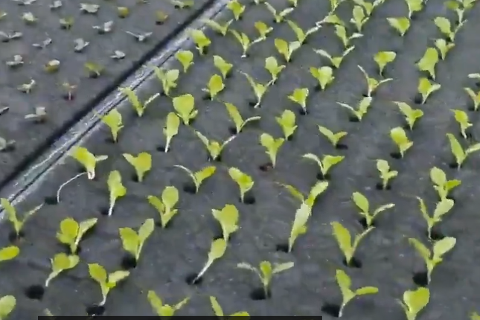
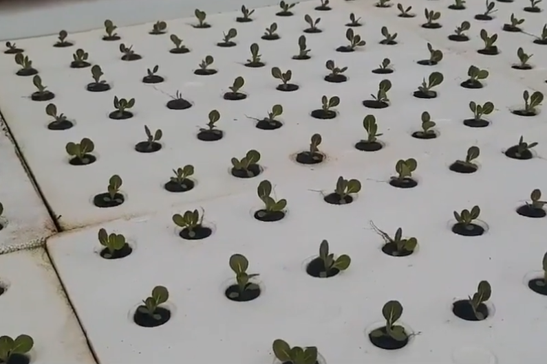
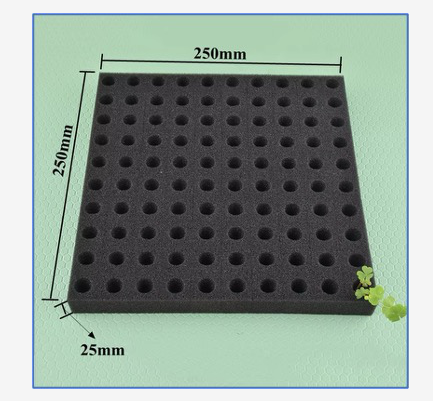
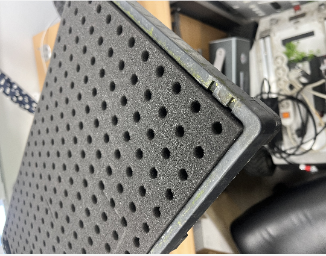
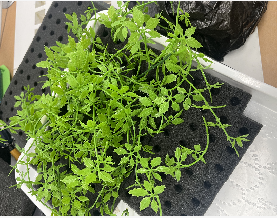
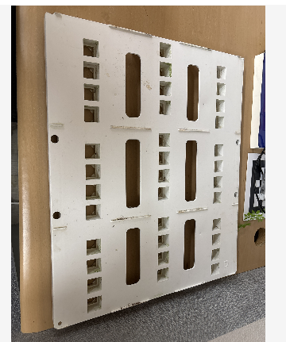
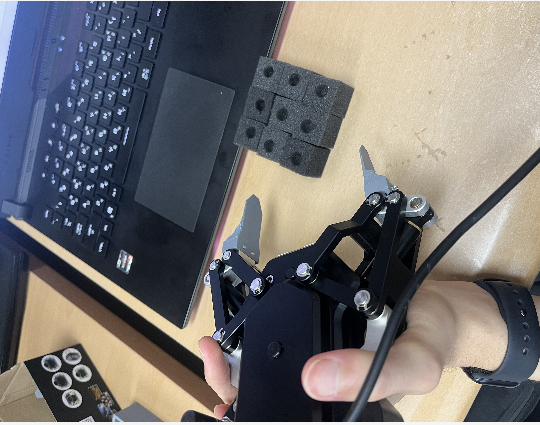

# 수경재배 모종 이식 로봇 — 문제 정의

> 이 문서는 **무엇을 풀어야 하는가**를 정한다. 어떤 순서로 시험하며 풀지는 [`plan.md`](./plan.md)에 있다.
> 문제 자체가 바뀌면(대상·장비·성공 기준이 바뀌면) 이 문서를 고치고 맨 아래 **변경 이력**에 한 줄 남긴다.
>
> - 작성: 2026-09-22
> - 근거: 주인이 준 사진 11장과 설명, 수경재배 농장 영상 전사(서유채농장 스펀지 파종 소개)
> - 표기: ✅ 공식 자료로 확인 · 📄 주인 설명이나 받은 자료에 적힌 것 · 💡 사진·계산에서 추정 · ❓ 미확인(실측·확인 필요)

## 한 문장 정의

> **UR10e 로봇팔로, 수경재배 스펀지 트레이에서 모종이 자란 스펀지 한 칸을 떼어내고, 모종을 다치지 않게 옮겨, 목표 판의 구멍에 정확히 꽂는다.**

---

## 1. 배경 — 수경재배 흐름에서 이 작업의 자리

```
파종 → 발아(발아실) → [뜯기 → 베드 판 구멍에 꽂기] → 성장·판 이동 → 수확 → 빈자리에 새 모종
                        └──── 로봇이 맡을 부분 ────┘
```

📄 농장 영상에서 설명한 흐름:

- **파종·발아** — 씨앗을 스펀지에 파종한다. 씨앗이 충분히 젖어 껍질이 깨져야 싹이 난다. 발아실의 **온도와 습도**가 발아율을 좌우하고, 싹이 튼 뒤에는 햇빛 대신 **조명**이 중요하다.
- **뜯어서 옮기기(정식)** — 싹과 뿌리가 잘 자란 스펀지를 **조각대로 뜯어**("한 3개씩") 재배 베드로 옮긴다.
- **베드 순환** — 베드 앞쪽에 들어온 새싹은 자라면서 뒤로 밀려간다. 끝에서 수확하면 빈자리가 생기고, 스티로폼 판을 밀어 앞쪽 빈자리에 새 모종을 다시 꽂는다.

💡 **로봇이 맡는 일은 "뜯기 + 꽂기"다.** 발아 관리와 판 이동은 이 과제의 범위 밖이다. 하지만 발아가 어떻게 됐는지(모종 크기, 뿌리 길이)가 이 작업의 난이도를 정한다.

| 발아 후 — 스펀지에서 올라온 새싹 | 정식 후 — 흰 판 구멍에 꽂힌 스펀지 모종 |
|---|---|
|  |  |
| 수경재배 현장 참고 사진 (주인 제공) | 💡 목표 판(§2-3)이 하는 역할이 이 판과 같다 |

### 선배 시뮬레이션 프로그램과 무엇이 다른가

- 📄 선배의 TransplantingRobot 프로그램 UI는 **트레이 수직 위에서 내려와 집어가는** 흐름이다.
- 여기서는 **살아 있는 수경재배 모종**을 옮긴다. 잎·줄기·뿌리를 지켜야 하고, 물이 있고, 트레이 가장자리가 막혀 있다. 그래서 그 흐름을 그대로 쓸 수 없고, **동작을 시험으로 정해야 한다** (§4).

---

## 2. 다루는 물체

### 2-1. 스펀지 트레이 — 옮길 것이 있는 곳

| 제품 규격 (사진 표기) | 실제 트레이 — 가장자리가 틀로 막혀 있다 |
|---|---|
|  |  |

- 📄 크기 250 × 250 mm, 두께 25 mm (사진 표기)
- 💡 원형 구멍이 10 × 10으로 보인다 → 칸 간격 약 25 mm. 칸마다 가운데 구멍에 모종이 자란다 (§3-2의 떼어낸 조각 사진 참고)
- 📄 **칸끼리 붙어 있다** → 한 칸만 떼어내는 동작이 필요하다
- 📄 트레이 틀의 **가장자리가 막혀 있다** → 바깥쪽 칸은 옆에서 비스듬히 들어갈 공간이 없다
- ❓ 실제로 쓰는 트레이의 칸 수·칸 크기 (오른쪽 사진은 왼쪽보다 칸이 촘촘해 보인다), 칸끼리 이어진 방식(칼집이 있는지, 완전히 한 덩어리인지)

### 2-2. 모종



*트레이에서 자란 모종. 이만큼 자라면 잎이 옆 칸을 덮는다.*

- 📄 **이식할 때의 모종은 크지 않다** (주인이 직접 확인) → 수직으로 내려가서 작업해도 될 가능성이 있다
- 💡 위 사진처럼 자라면 잎이 옆 칸까지 덮어서 그리퍼가 들어갈 길과 카메라 시야를 막는다 → **언제(어느 생육 단계에서) 옮기느냐**가 난이도를 크게 바꾼다
- 📄 뿌리가 스펀지 밖으로 자란다 (농장 영상: "뿌리도 되게 잘 나왔고") → 뜯을 때 끊기거나 엉킬 수 있고, 꽂을 때 구멍을 통과해야 한다 ❓
- 📄 실제 작업은 수경재배라 **물에 잠겨 있다** → 💡 젖은 스펀지는 무게·강도·미끄러운 정도가 마른 스펀지와 다르다

### 2-3. 목표 판 — 옮길 곳



- 💡 흰 판에 사각 구멍이 세로 4개씩 묶여 **3열 × 3줄 = 36개**, 그 사이에 **긴 슬롯 6개**가 있다 (사진에서 셈)
- 💡 §1의 농장 베드 판과 같은 역할이다 — 구멍 하나에 스펀지 한 칸을 꽂는다
- ❓ 구멍 크기와 판 두께 → **삽입 여유 = 구멍 폭 − 스펀지 폭**. 이 값이 "정확히 넣기"에 허용되는 위치 오차다
- ❓ 긴 슬롯의 용도(여러 칸을 묶어 꽂는 자리인지), 판 오른쪽 가장자리에 보이는 흑백 패턴(마커로 보임)의 용도

---

## 3. 쓰는 장비

### 3-1. 로봇팔 — UR10e

✅ 제조사 기술 사양 (Universal Robots UR10e Tech Sheet)

| 항목 | 값 |
|---|---|
| 가반하중 | 12.5 kg |
| 도달 거리 | 1300 mm |
| 자유도 | 6축 (회전 관절 6개) |
| 반복 정밀도 (ISO 9283) | ± 0.05 mm |
| 공구 플랜지 | EN ISO-9409-1-50-4-M6 |
| 공구 커넥터 | M8 8핀 · 전원 12/24 V, 최대 2 A(2핀) · RS-485 통신 |

💡 반복 정밀도는 **같은 자리로 다시 돌아가는** 능력이다. 처음 가보는 좌표를 맞히는 절대 정확도와는 다르다. 그래서 "구멍에 정확히 꽂기"는 티칭이나 보정과 함께 확인해야 한다.

### 3-2. 그리퍼 — DH Robotics AG-95 (새로 받은 장비)

| AG-95 본체 — 손끝이 칼날 모양 | 떼어낸 스펀지 조각과 크기 비교 |
|---|---|
|  |  |
| **DH 제어 박스** — PC와 그리퍼를 잇는다 | **ToolkitRC 전원 장치** — 라벨: MAX 10A · AC 100W · DC 200W |
|  |  |

✅ AG-95 공개 사양 (Trossen Robotics 문서)

| 항목 | 값 |
|---|---|
| 파지력 | 45 ~ 160 N |
| 스트로크 | 95 mm |
| 권장 물체 무게 | 3 kg |
| 반복 위치 정밀도 | ± 0.03 mm |
| 열기 / 닫기 | 0.7 s / 0.7 s |
| 전원 | 24 V DC ± 10 %, 정격 0.8 A, 최대 1.5 A |
| 통신 | Modbus RTU (RS-485), 디지털 I/O |
| 무게 · 방진방수 | 1 kg · IP54 |

- 📄 손끝이 칼날 모양이라 스펀지를 **자르는** 데 맞춰져 있다. 그래서 **모종을 잡아 뜯을 때 붙잡아 주지는 못한다** (주인 설명)
- 💡 가장 약한 힘이 45 N이다. 부드러운 폼이나 모종 줄기에는 셀 수 있으니, 힘 설정과 손끝 모양으로 조절해야 한다
- ❓ ToolkitRC 장치로 24 V를 내는 설정 방법, 제어 박스의 통신 설정(주소·속도)
- 💡 나중에 로봇에 달 때 UR10e 공구 커넥터(24 V · 최대 2 A · RS-485)로 전원과 통신을 받을 수 있는 범위다 (AG-95 최대 1.5 A) → 실제로 되는지 확인 필요

### 3-3. 바꿔 볼 수 있는 것


*3D 프린팅 손가락 캡을 끼우고 모종 스펀지를 직접 뽑아보는 시험 (주인이 이미 해본 것)*

- **3D 프린팅 손끝·그리퍼** — 📄 손가락 캡으로 뜯는 동작을 이미 시험해봤다 (위 사진)
- **연구실에 있는 다른 부품·엔드이펙터**
- **로봇 핸드** — 📄 마지막 후보. 선배 의견은 "손이 너무 커서 어려울 것". 다른 방법이 안 되면 시험해본다
- 헷갈리지 않게: 이 문서에서 **"사람 손"**은 수동 시험을, **"로봇 핸드"**는 엔드이펙터 후보를 뜻한다

---

## 4. 풀어야 할 문제 — 여섯 갈래

| 기호 | 문제 | 무엇이 어려운가 | 관련 사진 |
|---|---|---|---|
| **A** | **인식** — 어느 칸에 옮길 모종이 있고, 모종과 목표 구멍이 정확히 어디인가 | 잎이 옆 칸을 가린다. 젖은 표면은 반사가 달라진다 | §2-2, §2-3 |
| **B** | **분리** — 붙어 있는 칸 하나만 떼어낸다 | 자를지 찢을지 정해야 한다. 뿌리가 엉킬 수 있다. 옆 칸을 망가뜨리면 안 된다 | §2-1, §3-2 |
| **C** | **파지** — 스펀지를 잡되 모종은 다치지 않게, 뜯는 동안 버틴다 | 기존 칼날 손끝은 뜯을 때 붙잡지 못한다. 가장 약한 힘도 45 N | §3-2, §3-3 |
| **D** | **접근·이동** — 목표 칸까지 들어가고 빠져나온다 | 사선 진입이 모종 보호에 유리하지만, 사선이면 가장자리부터 시작해야 하는데 가장자리가 막혀 있다. 모종이 작으면 수직도 가능하다 | §2-1, §2-2 |
| **E** | **삽입** — 목표 구멍에 정확히, 똑바로 꽂고 놓는다 | 삽입 여유가 얼마인지 모른다(❓). 놓을 때 스펀지가 딸려 나올 수 있다. 뿌리가 구멍을 지나가야 한다 | §2-3, §1 |
| **F** | **물** — 마른 상태, 젖은 상태, 물에 잠긴 상태 모두에서 A~E가 돼야 한다 | 무게·강도·미끄러운 정도가 바뀐다 | §2-2 |

### 4-1. 동작이 고정되지 않을 수 있다

📄 주인 판단: 매 동작을 고정된 절차로 가기보다 **상황에 따라 유동적으로** 가야 할 수 있다.

- 칸마다 들어가는 각도, 잡는 방법, 순서가 달라질 수 있다.
- 💡 한 칸을 빼면 그 옆 칸은 빈 쪽으로 비스듬히 들어갈 수 있게 된다. 그래서 **첫 칸이 가장 어렵고, 순서가 뒤 칸들의 난이도를 바꾼다.**
- 💡 칸마다 다르게 움직이려면 그 칸의 상태(모종이 있는지, 크기, 잎이 어느 쪽으로 퍼졌는지, 옆 칸이 비었는지)를 알아야 한다. 즉 **인식(A)이 접근(D)의 입력**이 된다. 로봇 제어와 비전은 여기서 만난다.

---

## 5. 성공 기준 — 모종 한 칸 기준

| # | 기준 | 판정 방법 |
|---|---|---|
| 1 | **분리** — 목표 칸 하나만 떨어지고 옆 칸은 트레이에 그대로 있다 | 눈으로 확인 |
| 2 | **모종 보호** — 줄기가 꺾이거나 잎이 찢기지 않는다 | 작업 전·후 사진 비교 (손상 없음 / 가벼움 / 심함) |
| 3 | **뿌리** — 끊김이 적다 | 작업 전·후 관찰 ❓ 허용 정도는 선배와 정한다 |
| 4 | **삽입** — 목표 구멍에 끝까지 들어가고 모종이 위로 선다 | 눈으로 확인 |
| 5 | **놓기** — 그리퍼가 빠질 때 스펀지가 딸려 나오지 않는다 | 눈으로 확인 |
| 6 | **옆 칸 보호** — 옮기는 동안 옆 모종을 치지 않는다 | 눈 또는 영상 |
| 7 | **물 조건** — 물에 젖거나 잠긴 상태에서도 1~6을 만족한다 | 1~6을 같은 방법으로 반복 |

❓ 목표 성공률(예: 10번 중 몇 번)과 한 칸당 작업 시간은 아직 없다. 선배와 정한다.

---

## 6. 아직 정하지 않은 것 — 시험으로 정한다

아래는 **일부러 정하지 않은 것**이다. 정해지는 대로 [`plan.md`](./plan.md) §5 결정 표에 날짜와 근거를 적는다.

| 변수 | 후보 | 관련 문제 |
|---|---|---|
| 분리 방식 | 당겨서 찢기 / 칼로 자른 뒤 들기 / 비틀기 | B |
| 잡는 위치 | 스펀지 옆면 / 윗면 가장자리 | C |
| 한 번에 옮기는 수 | 1칸 / 여러 칸 묶음 (농장은 "3개씩") | B, E |
| 엔드이펙터 | 기존 칼날 손끝 / 3D 프린팅 손끝 / 보조 구조 추가 / 로봇 핸드 | C |
| 그리퍼 힘 | 45 N부터 | C |
| 접근 각도 | 수직 / 사선(각도 미정) — 칸 위치마다 다를 수 있다 | D |
| 작업 순서 | 가장자리부터 / 안쪽부터 / 열 단위 | D |
| 삽입 방법 | 수직으로 꽂기 / 기울여 넣은 뒤 세우기 | E |
| 동작 방식 | 정해진 좌표로 반복 / 칸마다 상태를 보고 판단 | A, D |

---

## 7. 범위

- **지금 다룰 것** — 한 칸을 떼어 옮겨 꽂는 방법 찾기: 분리(B)·파지(C)·접근(D)·삽입(E)·물(F)
- **다음에 붙일 것** — UR10e에 달아서 실제로 움직이기, 연속 작업, 인식(A, CV)
- **범위 밖** — 발아 관리, 베드 판 이동, 수확

---

## 8. 확인·실측할 것

- ❓ 스펀지 칸의 실제 크기·간격, 트레이 칸 수, 칸끼리 이어진 방식
- ❓ 트레이 틀 가장자리 턱의 높이와 폭
- ❓ 목표 판 구멍 크기·판 두께 → 삽입 여유
- ❓ 이식할 때 모종의 높이·잎 퍼짐·뿌리 길이
- ❓ 실제 수경재배 조건에서 물 높이 (트레이가 떠 있는지, 잠겨 있는지)
- ❓ AG-95 제어 박스 통신 설정, ToolkitRC 전원 장치의 24 V 출력 설정
- ❓ 긴 슬롯과 판의 흑백 패턴 용도
- ❓ 목표 성공률·작업 시간 (선배)

---

## 사진 목록

| 파일 | 내용 |
|---|---|
| `images/2026-09-22-farm-sprouts.png` | 수경재배 현장 — 스펀지에서 올라온 새싹 |
| `images/2026-09-22-farm-bed-board.png` | 수경재배 현장 — 흰 판 구멍에 꽂힌 스펀지 모종 |
| `images/2026-09-22-foam-tray-250mm.png` | 스펀지 트레이 제품 규격 (250 × 250 mm, 두께 25 mm) |
| `images/2026-09-22-tray-rim.png` | 틀에 끼운 트레이 — 가장자리 턱 |
| `images/2026-09-22-seedlings-grown.png` | 트레이에서 자란 모종 — 잎이 옆 칸을 덮음 |
| `images/2026-09-22-target-plate.png` | 목표 판 — 사각 구멍 36개, 긴 슬롯 6개 |
| `images/2026-09-22-ag95-gripper.png` | DH Robotics AG-95 그리퍼 |
| `images/2026-09-22-ag95-and-foam-cubes.png` | AG-95와 떼어낸 스펀지 조각 |
| `images/2026-09-22-dh-control-box.png` | DH 제어 박스 |
| `images/2026-09-22-toolkitrc-power.png` | ToolkitRC 전원 장치 |
| `images/2026-09-22-finger-cap-test.png` | 3D 프린팅 손가락 캡으로 뽑기 시험 |

## 참고 자료

- Universal Robots, *UR10e Tech Sheet* — https://www.universal-robots.com/manuals/EN/TechSheets/UR10e_techsheet_pdf_online/UR10e_techsheet_en.pdf
- Trossen Robotics, *DH-Robotics AG-95 Adaptive Parallel Gripper* — https://docs.trossenrobotics.com/dobot_cr_cobots_docs/end_effectors/dh_robotics/ag95.html
- DH Robotics AG-95 매뉴얼 (Modbus-RTU 제어·레지스터 설명) — https://www.manualslib.com/manual/3328197/Dh-Robotics-Technology-Ag-95.html
- 서유채농장 스펀지 파종·정식 소개 영상 전사 (주인 제공)

---

## 변경 이력

| 날짜 | 무엇이 바뀌었나 | 왜 |
|---|---|---|
| 2026-09-22 | 최초 작성 | 주인이 준 사진·설명·농장 영상으로 문제를 처음 정의 |
