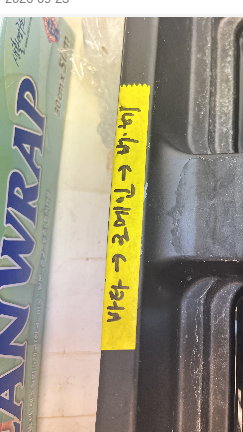
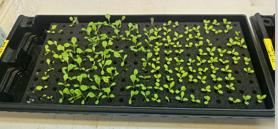
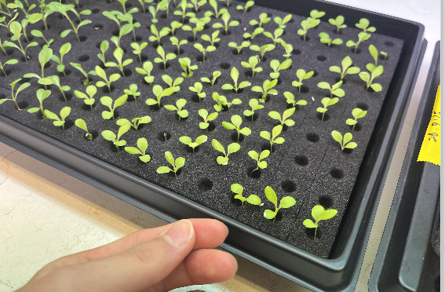
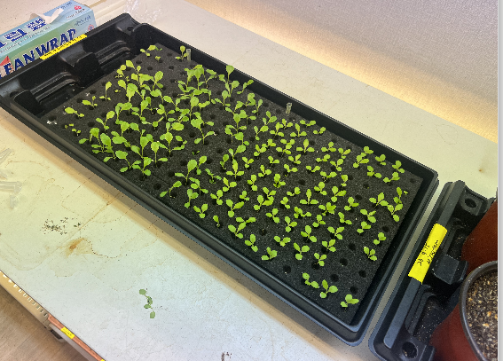

# 시험용 모종 — 수급 현황과 재배 기준

> 실험에 쓸 **실제 모종을 언제, 어떤 상태로 받을 수 있는가**를 정리한 문서다.
> 문제 정의는 [`problem-definition.md`](./problem-definition.md), 시험 순서는 [`plan.md`](./plan.md)에 있다.
>
> - 작성: 2026-09-23
> - 근거: 모종 재배 담당자님과의 대화(주인이 직접 여쭤봄), 시험 판 사진 4장, 담당자님이 받으신 재배 기준 문서
> - 표기: 📄 담당자님 답변이나 문서에 적힌 것 · 💡 사진·계산에서 추정 · ❓ 미확인

---

## 0. 요약 — 선배님께 전달용

- **지금 있는 것**: 시험용으로 **한 판**을 키우는 중이다. 한 판에 **세 품종**을 심었다(라벨 쪽부터 바타 → 로메인 → 배테)
- **상태**: 아직 이식하기에는 작다. 담당자님이 **"언제 필요한지"** 되물으셨다
- **빈칸**: 판에 씨앗은 다 넣었지만 발아율이 100 %가 아니다. **지금 안 난 칸은 앞으로도 안 날 것**이라고 하셨다 → 빈칸은 영구적이다
- **재배 기준 문서**: 발아 2~3일 + 육묘 2~3주 → 💡 **파종 후 약 16~24일**이면 육묘가 끝난다
- **담당자님께 드릴 답**: "언제 필요한가"는 **파종일**과 **우리가 옮길 단계가 어디인지**(§5-1)를 알아야 정해진다 → §6 질문 목록

---

## 1. 상황

| 누가 | 상태 |
|---|---|
| 선배님들 | 실제 모종으로 실험해야 하는데, **어떤 모종을 어느 크기로** 받게 될지 몰랐다 |
| 담당자님 | 받으신 재배 기준 문서(§4)대로 키우는 중이고, 아직 덜 자라서 **언제 필요한지** 물어보셨다 |

→ 양쪽이 서로 필요한 정보(필요한 시점 ↔ 모종 상태)를 기다리고 있었다. 이 문서는 그 사이를 채우려고 만들었다.

## 2. 담당자님 답변

| 여쭌 것 | 📄 답 | 💡 우리 과제에 주는 의미 |
|---|---|---|
| 왜 한 판만 키우셨나 | 일단 **시험 목적**이라서 | 시험 재료가 한 판뿐이다. 망가뜨리는 시험을 하면 금방 떨어진다 |
| 한 판에 세 품종인데 어떻게 구분하나 | 판에 **팁(표시 막대)**이 끼워져 있고, **라벨 붙은 쪽(왼쪽)부터 바타 → 로메인 → 배테** | 품종마다 잎 모양·크기가 달라 **품종도 시험 변수**가 된다 |
| 가장자리는 왜 비어 있나 | 씨앗은 다 넣었지만 **발아율이 100 %가 아니라서** | 빈칸이 생긴다. 로봇은 빈칸을 건너뛰어야 한다 |
| 안 난 칸도 시간이 지나면 발아하나 | 지금 상태로 봐서는 **보통 발아하지 않을 것** | 빈칸은 **영구적**이다 → 인식(A)에서 "빈칸 판별"이 필요하다 |

## 3. 지금 판의 모습

| 라벨 — 품종 순서 | 위에서 본 판 |
|---|---|
|  |  |

| 가까이서 — 가장자리 빈칸 | 전체 — 판 받침과 조명 |
|---|---|
|  |  |

💡 사진에서 보이는 것:
- 검은 플라스틱 판 받침에 스펀지를 깔았다. 흰 팁이 품종 구역을 나눈다
- 떡잎 ~ 본잎이 막 나온 단계로 보인다
- **구역마다 크기가 다르다.** 왼쪽 구역이 크고 오른쪽 구역이 작다 → 품종 차이로 보인다 ❓
- 빈칸이 **가장자리에 몰려 있다** → 가장자리가 더 빨리 마르거나 온도 차이가 커서일 수 있다 (가설 ❓, 발아에는 습도 90~100 %가 필요하다 — §4-2)
- ❓ 이 판의 칸 수·칸 크기가 문제 정의의 250 × 250 mm 트레이와 같은지

## 4. 재배 기준 문서 요약

📄 담당자님이 받으신 문서. 원본 이미지는 공개 저장소에 올리지 않고 **필요한 값만 옮겨 적었다** (문서 공개 여부 ❓).

### 4-1. 대상 작물과 단계별 기간

- 문서의 적용 작물: 카이피라, 버터헤드, 프릴아이스 (**"그 외 엽채류 사용 가능"**)
- ❓ 실제로 심은 품종(바타·로메인·배테)은 문서의 예시 작물과 이름이 다르다. 바타 = 버터헤드인지 확인 필요

| 발아 | 육묘 | 가식 (포트 24개) | 정식 (포트 9개) | 비고 |
|---|---|---|---|---|
| 2~3일 | 2~3주 | 2주 | 21~23일 | 계절별로 차이 존재 |

💡 **파종 → 육묘 끝 = 2~3일 + 14~21일 = 약 16~24일.** 가식까지 더하면 약 30~38일.

### 4-2. 생육 환경

| 생육 단계 | 주간 평균온도 (℃) | 야간 평균온도 (℃) | 평균 습도 (%) | 급액 EC (dS/m) | 급액 pH |
|---|---|---|---|---|---|
| 발아 | 18~20 | 15 | 90~100 | 원수 이용 | 원수 이용 |
| 육묘 | 18~20 | 15 | 60~70 | 1.0 | 5.8 |
| 생육기 (가식) | 20~25 | 15 | 60~70 | 1.2 | 5.8 |
| 생육기 (정식) | 20~25 | 15 | 60~70 | 1.2~1.7 | 5.8 |

- EC: 여름 1.2 dS/m, 겨울 1.7 dS/m
- 광주기 12시간 / 12시간 (명기 / 암기), PPFD 146.7 ± 23.9 μmol·m⁻²·s⁻¹
- 양액 조성표(A액 · B액 · 미량원소)도 있다. 로봇 과제와 직접 관계가 없어 옮기지 않았다

---

## 5. 우리 과제에 주는 의미

### 5-1. "언제 필요한가"에 답하려면 먼저 정할 것

💡 문서의 단계는 **발아 → 육묘 → 가식(포트 24개) → 정식(포트 9개)**다. 로봇이 옮기는 게 어느 사이인지에 따라 필요한 시점과 모종 크기가 달라진다.

| 로봇이 하는 일이 | 필요한 모종 | 파종 후 (💡 문서 기준) |
|---|---|---|
| 육묘 판 → 가식 판 | 육묘가 끝난 모종 | 약 16~24일 |
| 가식 판 → 정식 판 | 가식이 끝난 모종 (더 큼) | 약 30~38일 |

❓ 우리 목표 판(사각 구멍 36개, [`problem-definition.md`](./problem-definition.md) §2-3)이 가식용인지 정식용인지 모른다. 문서의 "포트 24개 / 9개"와도 숫자가 맞지 않는다 → 확인 필요.

### 5-2. plan 단계별로 모종이 필요한 때

| 단계 | 모종 필요? | 메모 |
|---|---|---|
| P1 그리퍼 구동 | 아니오 | 지금 바로 가능 |
| P0 실측 | P0-4만 필요 | 모종 크기·뿌리 길이는 **옮길 시점**의 모종으로 재야 의미가 있다 |
| P2 사람 손 시험 | 일부 | 💡 **발아하지 않은 빈칸은 모종을 해치지 않는 분리(B) 시험 재료**로 지금 쓸 수 있다 (담당자님 허락 필요) |
| P3 · P4 | 예 | 모종 손상을 봐야 한다 |
| P5 물 조건 | 예 | 물이 있는 실제 조건 |

### 5-3. 문제 정의·plan에 반영할 후보 (아직 반영 안 함)

- **품종**을 시험 변수로 추가 — 품종마다 잎 모양·크기가 다르다
- **빈칸은 영구적** — 인식(A)에 "빈칸 판별", 작업 순서(D)에 "빈칸 건너뛰기"
- **시험 재료가 한 판뿐** — 망가뜨리는 시험의 횟수를 미리 정해야 한다
- 💡 **재배 조명**(PPFD 약 147) 아래에서 사진을 찍으면 색이 달라질 수 있다 → CV(W5) 때 고려

---

## 6. 아직 모르는 것 — 담당자님·선배님께 여쭐 것

| # | 질문 | 누구께 | 왜 필요한가 |
|---|---|---|---|
| 1 | 이 판의 **파종일** | 담당자님 | 16~24일 계산의 시작점 |
| 2 | 품종 정식 이름 (바타 · 배테) | 담당자님 | 문서의 작물과 대조 |
| 3 | 로봇이 옮기는 건 **육묘 → 가식**인가, **가식 → 정식**인가 | 선배님 | §5-1 — 필요한 시점이 여기서 갈린다 |
| 4 | 우리 목표 판(36구멍)이 어느 단계용인가 | 선배님 | §5-1 |
| 5 | 추가로 판을 키울 수 있나. 된다면 **시차를 두고**(예: 1주 간격) | 담당자님 | 시험 재료 확보 + 여러 생육 단계 확보 |
| 6 | 빈칸이나 일부 모종을 시험으로 망가뜨려도 되나. 몇 칸까지 | 담당자님 | P2 시험 재료 |
| 7 | 지금 판은 물을 어떻게 주나 (밑에서 받침에 담그나, 위에서 주나) | 담당자님 | 물 조건(F) 시험 설계 |
| 8 | 판의 칸 수·칸 크기 | 직접 실측 | 문제 정의 트레이와 같은지 |

---

## 변경 이력

| 날짜 | 무엇이 바뀌었나 | 왜 |
|---|---|---|
| 2026-09-23 | 최초 작성 | 모종 수급 문의와 담당자님 답변, 재배 기준 문서 정리 |
