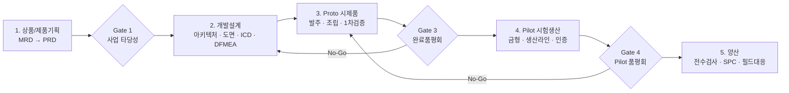

# 로봇 양산 사이클 (APQP) — 현직자 실무 개발 프로세스

- **성격**: 주제별 지식 정리. 날짜 로그가 아니라 **계속 찾아보고 보강하는 레퍼런스**다.
- **출처**: 「현직자가 알려주는 로봇 실무 개발 프로세스 — 로봇 양산 사이클」 교안 14편 + 직무별 수강 가이드 1편 (교안 발행일 2026-08-19)
- **케이스 스터디 대상**: Unitree Go2 사족보행 로봇
- **정리일**: 2026-08-30

> 📌 **이 문서를 쓴 이유**
> 이 저장소는 ROS 2 → 비전센서 → MoveIt → Gazebo 순서로 **기술**을 쌓는 중이다.
> 그런데 이 강의는 기술이 아니라 **"그 기술이 회사 안에서 어느 칸에 들어가는가"** 를 다룬다.
> 내가 짜는 노드 하나, 정의하는 메시지 타입 하나가 실무에서 어떤 문서로 불리고
> 누가 그걸 받아서 무엇을 하는지 — 그 지도를 갖고 있으면 같은 공부를 해도 도착지가 달라진다.
> 그래서 §9에 **내 학습·프로젝트에 실제로 어떻게 적용할지**를 따로 뽑아뒀다.

> 📌 **정확도에 대해**
> 교안 내용을 그대로 옮기지 않고, 필기 오탈자를 바로잡고 외부 공개 자료로 대조했다.
> 확인한 것과 확인 못 한 것은 §11에 구분해서 적었다.

---

## 0. 한 장 요약 — 5단계 게이트 지도



| 단계 | 이름 | 핵심 산출물 | 관문 | 통과 못 하면 |
|---|---|---|---|---|
| 1 | 상품/제품기획 | MRD(상품기획서) → **PRD**(제품기획서) | Gate 1 (Go/No-Go) | 사업 착수 자체가 안 됨 |
| 2 | 개발설계 | 시스템 아키텍처, 3D/2D 도면, BOM, **ICD**, DFMEA | 설계 검토 | 도면을 공장에 못 넘김 |
| 3 | Proto (시제품) | 실물 시제품 + **TR**(시험평가 보고서) | **Gate 3 완료품평회** | 금형 투자 승인 안 남 |
| 4 | Pilot (시험생산) | 금형, 생산라인, **인증서**(CE/UL/KC…) | Gate 4 Pilot 품평회 | 양산 이관 안 됨 |
| 5 | 양산 | 양산 도면, **양산개시결정서**(대표 서명) | Gate 5 대표 승인 | 라인 가동 안 함 |

**한 줄로**: APQP는 "잘 만드는 법"이 아니라 **"틀린 걸 언제 발견하느냐를 앞으로 당기는 법"** 이다.

---

## 1. 왜 로봇 개발자가 양산 프로세스를 알아야 하나

### 상상 vs 현실

취준생이 그리는 로봇 개발은 대체로 **코딩 + 3D 모델링**이다.
실제 현장은 HW와 SW가 맞물리면서 화면 안에서는 안 보이던 변수가 쏟아진다.

- 센서 배선 노이즈
- 부품 간 공차 불일치
- 모터 전원 불안정

→ 로봇 오작동, 시스템 다운.

**결론**: 모니터 밖의 세상(실제 하드웨어와 제조 공정)을 모르면 완성도 있는 로봇을 못 만든다.

> 💭 이건 남 얘기가 아니다. 부트캠프 때 로봇팔이 안 움직여서 GND 공통 문제로 의심했다가,
> 실제 원인은 PCA9685의 **신호용 VCC(3.3V) 핀 자체가 안 꽂혀 있던 것**이었다.
> V+(서보 구동 전원)와 VCC(신호 전원)를 헷갈린 배선 실수 — 코드는 한 줄도 안 틀렸는데
> 로봇은 완전히 죽어 있었다. 교안이 말하는 "모니터 밖의 변수"가 정확히 이거다.

### 기업이 원하는 건 '전사적 시야'

기업은 프로토타입을 만드는 조직이 아니라 **제품을 양산·출시해 수익을 내는 조직**이다.
그래서 단편적으로 코딩·설계만 잘하는 사람보다, **구매·품질·생산기술과 협업할 수 있는 개발자**를 찾는다.

면접에서의 실질적 차이:

| | 기술만 아는 사람 | 프로세스를 아는 사람 |
|---|---|---|
| 통신 규격 질문 | "CAN 써봤습니다" | "제어 주기 요구가 1kHz라 CAN-FD로 갔고, ICD에 패킷 ID랑 타임아웃 예외를 명세했습니다" |
| 실패 경험 질문 | "버그가 있어서 고쳤습니다" | "Proto 조립에서 공차 누적으로 축이 틀어져서, ECO 발행해서 도면 공차를 완화했습니다" |

핵심은 **'실무자의 언어'로 말할 수 있느냐**다. 이 문서는 그 단어장이기도 하다.

---

## 2. APQP란 무엇인가 — Front-loading의 경제학

**APQP** = Advanced Product Quality Planning, **사전 제품 품질 기획**.
신규 개발 단계에서 발생할 수 있는 손실을 **예측하고 예방하는** 체계다.

### 목표 두 가지

- **수익성 극대화**: 품질 불량·재작업 최소화 → 양산 단계의 대형 손실 비용 절감
- **고객 만족**: 목표로 한 기능·성능·신뢰성을 완전히 구현해 시장에 안착

### A사 vs B사 — 기술변경 피크가 어디에 있는가

이 강의 전체에서 가장 중요한 그림 하나를 말로 옮기면 이렇다.

**B사 (APQP 미적용)**

1. **초기 착시**: 기획·설계 단계에서 기술변경이 거의 없다 → 순조로워 보인다
2. **후반 폭발**: Proto·Pilot·양산 직전에 치명적 결함이 연쇄로 터진다
3. **비용 폭증**: 기획 때였다면 문서 한 줄 고칠 일이, 양산 직전엔 금형 재제작이 된다

**A사 (APQP 적용)**

1. **선제 도출**: 기획·설계 초기부터 유관 부서가 붙어 잠재 문제를 미리 캔다
2. **초기 집중 변경**: 초반 기술변경 횟수가 많아 보인다 — 이게 **일하는 중인 상태**다
3. **후반 안정화**: 리스크·손실이 가장 큰 Proto·Pilot·양산에서 설계변경이 급감한다

```
기술변경 발생량

B사   ▁▁▁▂▃▅▇█  ← 뒤로 갈수록 폭발 (비쌈)
A사   ▇█▅▃▂▁▁▁  ← 앞에서 다 털어냄 (쌈)
      기획 설계 Proto Pilot 양산
```

### 핵심 원리 — 변경 비용은 단계마다 자릿수로 뛴다

같은 결함 1건을 고치는 비용:

| 발견 시점 | 고치는 방법 | 대략의 비용 감각 |
|---|---|---|
| 기획 | 사양서 한 줄 수정 | 회의 30분 |
| 설계 | 3D/2D 도면 수정 | 며칠 |
| Proto | 부품 재가공, ECO 발행 | 수십~수백만 원 + 리드타임 |
| Pilot | **금형 수정 또는 폐기 후 재제작** | 수천만~수억 원 + 수개월 |
| 양산/필드 | 라인 정지, 리콜 | 회사 흔들림 |

> ⚠️ 교안은 "수십~수백 배"라고 표현한다. 제조업에서 흔히 인용되는 **"10배 법칙(Rule of Ten)"**
> — 단계를 하나 넘길 때마다 결함 수정 비용이 대략 한 자릿수씩 뛴다 — 과 같은 이야기다.
> 다만 이 배수의 정확한 실증 출처는 확인하지 못했다(§11 참조). **방향은 확실하고, 배수는 감각치**로 받아들이자.

**그래서 APQP의 전략은 하나다: 기술 변경의 피크를 뒤가 아니라 앞으로 당긴다 (Front-loading).**

---

## 3. [1단계] 상품/제품 기획

> **이 단계의 정체**: "엔지니어가 만들고 싶은 로봇"을 지우고
> **"시장이 사줄 로봇"의 정량 스펙**으로 바꾸는 단계.

### 3-1. 상품기획 — 시장에서 MRD까지

#### 역할 분담

| 주체 | 하는 일 |
|---|---|
| 경영진 / 대표이사 | 공략할 시장의 큰 방향성(비전) 제시, 최종 사업 타당성 결정 |
| 영업팀 | 고객 현장 방문·인터뷰로 실제 **페인 포인트**와 요구사항 발굴 |
| 전략/기획팀 | 시장규모·경쟁사·수익성을 종합해 **상품기획서** 작성 |

#### 시장조사 핵심 3요소

1. **시장 규모 및 성장성** — 목표 시장의 현재 규모(**TAM / SAM / SOM**)와 향후 성장률
   - TAM(Total Addressable Market): 이론상 전체 시장
   - SAM(Serviceable Available Market): 우리 제품군이 닿는 시장
   - SOM(Serviceable Obtainable Market): 현실적으로 먹을 수 있는 몫
2. **경쟁사 벤치마킹** — 경쟁 제품의 사양·가격·**단점**을 분석해 차별화 포인트(**USP**) 도출
3. **고객 요구사항 (VOC, Voice of Customer)** — 현장 인터뷰 + 정량 설문으로 필수 기능·성능 수집

#### MRD (Market Requirements Document) 구성

| 항목 | 내용 |
|---|---|
| 타깃 정의 | 목표 시장, 핵심 타깃 고객군 |
| 비즈니스 목표 | 목표 판매 수량, 제품 포지셔닝, 타깃 판매가 |
| 제품 콘셉트 | 핵심 기능 + **초기 목표 사양 초안** (DoF, 이동 속도, IP 등급 등) |
| 자원 계획 | 총 개발 예산(R&D Cost), 목표 제조원가(Target BOM Cost), 마일스톤 |
| 사업 타당성 | **ROI 검토 및 착수 Go/No-Go 최종 의사결정** |

> 💡 MRD를 "서류 작업"으로 얕보면 프로젝트 전체가 흔들린다.
> 여기서 나온 **기준서**가 이후 모든 단계의 판단 근거가 되기 때문이다.

### 3-2. 제품기획 — 요구사항에서 PRD까지

상품기획서가 나오면 **개발 PM**이 선임된다.

#### 개발 PM의 역할 (일정 관리가 아니다)

- **프로젝트 총괄**: 개발 일정(**WBS**), R&D 예산 집행, 기술·공정 리스크 관리
- **크로스 펑셔널 조율**: 기구 · 전자 · SW · 구매 · 품질 · 생기팀 사이의 **커뮤니케이션 허브**
- **인터페이스 통합**: 부서별로 **서로 상충하는** 요구사항과 제약조건을 조율해 **하나의 공식 기준 문서**로 통합

> 마지막 항목이 핵심이다. 요구사항은 원래 서로 싸운다.
> "가벼워야 한다"(기구) vs "배터리 커야 한다"(전자) vs "원가 낮춰야 한다"(구매).
> PM은 이걸 **하나의 숫자로 못 박는** 사람이다.

#### 요구사항 취합 3갈래

| 출처 | 내용 |
|---|---|
| 고객/시장 | 영업·기획팀이 전달한 VOC (주행 환경, 등판력, 탑재 하중, 배터리 운용 시간 등) |
| 법규/인증 | 수출 목표 국가별 필수 규격 (CE, UL, KC, FCC, 기능안전 ISO 13849 등) |
| 제조/원가 | 목표 제조원가(Target BOM Cost), 조립 공수 단축, 부품 표준화, 조달 안정성 |

#### 목표 사양 (Target Specs) — Unitree Go2 예시

| 항목 | 목표 사양 | 비고 |
|---|---|---|
| 자유도 (DoF) | 12 DoF (다리 4개 × 3축) | 관절형 액추에이터 구성 |
| 주행 환경 | 야외 비포장 · 경사로 주행 가능 | 험지 및 계단 극복 |
| 방수/방진 | IP54 이상 | 야외 생활 방수·방진 구조 |
| 최대 속도 | 3.5 m/s 이상 | 동급 경쟁 모델 대비 우위 |
| 배터리 지속 | 1시간 이상 (연속 보행) | 교체형 배터리 팩 |
| 탑재 하중 | 정적 5 kg 이상 | 센서/모듈 확장 브라켓 고려 |
| 기능 안전 | PL-d / Cat.3 만족 | HW 비상정지(E-Stop) 회로 탑재 |

> 🔍 **실제 공개 사양과 대조해봤다** (§11-2에 상세)
> 목표 사양은 **최저 합격선**이지 최종 성능이 아니다. 실제 출시된 Go2는 페이로드가
> 목표치(5kg)보다 높은 ≈7~8kg다. "목표 사양 = 이보다 못하면 Fail"이라는 뜻으로 읽어야 한다.

#### 왜 목표 사양을 정량화해야 하나 — 이게 APQP의 심장

1. **설계 표류(Scope Creep) 방지** — 사양이 고정 안 되면 Proto·Pilot에서 설계변경이 반복되고 일정이 무너진다
2. **측정 가능한 검증 기준 수립** — APQP의 핵심은 **후속 단계에서 객관적으로 Pass/Fail을 판정할 수 있는 정량 기준을 조기에 확정**하는 것

> 💡 "빠르게 걷는 로봇"은 검증할 수 없다. **"3.5 m/s 이상"** 은 검증할 수 있다.
> 이 차이가 이후 모든 단계의 갈림길이 된다.
> — 이건 소프트웨어의 **테스트 가능한 요구사항**과 정확히 같은 사상이다.

#### PRD (Product Requirements Document) 구성

개발 PM이 주관하며, **Gate 1 통과를 위한 최종 핵심 산출물**이다.

| 항목 | 내용 |
|---|---|
| 제품 콘셉트 및 아키텍처 | 시스템 개요도, 주요 사용 시나리오(Use Case), 기본 형상 |
| 분야별 상세 사양서 | 기구 · 전자 · SW(HLC/LLC) 세부 기술 사양 및 인터페이스 조건 |
| 인증·안전 로드맵 | 국가별 필수 인증 취득 계획, 기능 안전 기준 |
| 개발 마일스톤 (WBS) | Proto 제작 → Pilot 검증 → 양산 이관까지 세부 일정 |
| 원가·자원 계획 | 목표 BOM 단가, **롱 리드타임 자재 조달 전략**, 투입 공수, R&D 예산 |
| 리스크 관리 계획 | 기술 난제·핵심 부품 수급 이슈의 사전 대응책(Contingency Plan) |

---

## 4. [2단계] 개발설계

> **이 단계의 정체**: 정성적 요구("튼튼했으면")를 **정량 스펙과 구조**로 바꾸고,
> 그걸 **다른 사람이 만들 수 있는 문서**로 내보내는 단계.

### 4-1. 시스템 아키텍처 수립

#### 설계 입력값 (Design Input)

PRD의 목표 사양이 그대로 **HW·SW 설계의 입력값**이 된다.
입력이 명확하고 정량적일수록 개발 표류가 줄고, 후반 설계변경(ECO) 횟수가 최소화된다.

#### 하드웨어(HW) 아키텍처

| 영역 | 내용 |
|---|---|
| 기구 구조 | 메인 프레임 강성 설계, 관절 액추에이터·감속기 배치, **무게중심(CoM) 최적화**, 실링/가스켓 기반 방수·방진 |
| 전자 회로 | 전원 분배 네트워크(**PDN**), 제어보드·모터 드라이버 PCB 아트워크, 하네스 경로 최적화, **EMC/EMI 노이즈 차폐** |
| HW 인터페이스 표준화 | 기구 ↔ 회로 ↔ 센서 간 **물리적 체결 규격 + 전기적 커넥터/핀맵을 사전 정의** |

#### 소프트웨어(SW) 아키텍처 — HLC / LLC 분리

로봇 제어기를 두 층으로 나누는 것이 표준 구조다.

| 층 | 역할 | 요구 특성 |
|---|---|---|
| **HLC** (High-Level Controller, 상위제어기) | 자율주행(SLAM), 실시간 경로계획, 비전·LiDAR 인지, AI 추론 | 연산량 크고 주기는 느림 (10~100 Hz) |
| **LLC** (Low-Level Controller, 하위제어기) | 12축 관절 모터 실시간 제어(토크/위치/속도), IMU·접지센서 고속 수신, **E-Stop 로직** | 연산은 단순, **주기가 생명** (1 kHz / 1 ms) |

**통신 프로토콜 선정** — 제어 주기와 대역폭 요구에 맞춰 확정:
EtherCAT, CAN / CAN-FD, RS-485, Ethernet 등.

> 💡 **왜 나누나**: 성격이 다르기 때문이다.
> SLAM 연산이 잠깐 느려지는 건 괜찮지만, 관절 제어 루프가 1ms를 놓치면 로봇이 넘어진다.
> **"놓치면 안 되는 일"과 "느려도 되는 일"을 물리적으로 분리**하는 것이 이 구조의 본질이다.
>
> 부트캠프 때 만든 로봇팔이 정확히 이 구조였다 — PC 파이썬(STT→LLM→동작 선택)이 HLC,
> ESP32-S3(PCA9685로 서보 실시간 구동)가 LLC, 그 사이 시리얼 프로토콜이 ICD였다.
> 그땐 이름을 몰랐을 뿐이다.

#### DFMEA — 설계 리스크 사전 검토

**DFMEA** (Design Failure Mode and Effects Analysis, 설계 고장 형태 및 영향 분석)

설계 단계에서 발생 가능한 기구·전자·SW 결함 요소를 **미리 도출**하고,
세 가지를 정량 평가해 **RPN**(Risk Priority Number, 위험 우선순위)이 높은 항목부터 선제 개선한다.

| 지표 | 뜻 | 질문 |
|---|---|---|
| **S** (Severity, 심각도) | 터졌을 때 얼마나 큰가 | 로봇이 멈추나? 사람이 다치나? |
| **O** (Occurrence, 발생도) | 얼마나 자주 터지나 | 100대 중 몇 대? |
| **D** (Detection, 검출도) | 얼마나 안 잡히나 | 조립 중에 보이나, 고객 손에서 터지나? |

**RPN = S × O × D** → 높은 것부터 잡는다.

> ⚠️ **D(검출도)가 가장 자주 과소평가된다.** "설마 그건 조립할 때 보이겠지" 하는 항목이
> 실제로는 완제품 조립 후에야 드러나는 경우가 많다.
>
> 내 배선 사고를 DFMEA로 써보면 이렇게 된다:
> - 고장 모드: PCA9685 신호용 VCC 미연결
> - S: **높음** — 로봇 전체 무반응 (시스템 다운)
> - O: **높음** — V+와 VCC 이름이 비슷해 초보자가 반드시 헷갈림
> - D: **나쁨(검출 어려움)** — 증상이 "대화는 되는데 몸만 안 움직임"으로 나타나 GND 문제로 오진했다
> → RPN 높음 → **대책: 배선 체크리스트에 "VCC와 V+를 각각 따로 확인" 항목을 못 박는다**

**예방 품질의 가치**: 개발설계에서 결함 1건을 선제 조치하는 것이,
양산 단계의 금형 재제작·라인 정지·리콜이라는 막대한 손실을 막는 핵심 장치다.

### 4-2. 3D 모델링과 CAE 검증

#### 3D CAD 상세 설계

SolidWorks 등으로 메인 바디 프레임, 액추에이터 하우징, 링크 기구, 전장품 장착 브라켓을 설계한다.

**현업 엔지니어가 반드시 보는 4가지 검토 항목**

| 항목 | 확인 내용 |
|---|---|
| **동적 기구 간섭** | 12축 관절의 최대 가동범위(**ROM**) 안에서 부품 충돌, 내부 하네스 **씹힘·당김** 여부 |
| **무게중심(CoM) 최적화** | 로봇 동역학과 보행 균형 제어에 맞는 질량 분포 |
| **방수·방진(IP54) 구조** | 접합부 실링 가스켓, **O-Ring** 규격 선정, 케이블 글랜드 방수 |
| **제조/조립성 (DFM/DFA)** | 볼트 체결 **공구 진입 공간(Tool Clearance)**, 작업자 조립 동선 사전 확보 |

> 💡 마지막 항목이 초심자가 가장 많이 놓친다. 3D에서는 볼트가 예쁘게 들어가지만,
> **실물에서는 드라이버가 들어갈 공간이 없어서** 조립이 안 된다.

#### CAE 시뮬레이션 — 깎기 전에 가상으로 부순다

3D 모델링이 끝났다고 바로 부품을 깎지 않는다. 실물 가공 전에 가상 환경에서 검증한다.

| 해석 | 무엇을 보나 |
|---|---|
| **구조/응력 해석 (FEA)** | 착지·낙하 충격 하중 시 프레임의 **응력 집중부**와 파손 취약부 보강 |
| **구동계 피로/내구 해석** | 최대 모터 토크·반복 충격 조건에서 감속기 기어치, 조인트 샤프트의 **피로 한계** |
| **열 해석 (Thermal)** | 밀폐 하우징 내부 모터 발열, HLC/LLC 보드의 **방열 유로(히트싱크)** |

**효과 (Front-loading)**: Proto 단계의 금속 가공 재작업 비용과 개발 리드타임을 크게 줄인다.

> 💡 소프트웨어로 치면 **실제 배포 전에 돌리는 테스트**다.
> "일단 만들어보고 부서지면 고치자"와 "부서질 곳을 계산해서 미리 보강하자"의 차이.

### 4-3. SW 실시간 제어 설계

기구 설계가 도는 동안 SW 개발자도 놀지 않는다.

1. **통신 인터페이스 명세화**
   HLC ↔ LLC 간 통신 패킷 구조(Payload), 프로토콜, 통신 대역폭을 문서로 못 박는다.

2. **실시간 제어 스케줄링 (Real-time Task Architecture)**
   - LLC 초고속 루프 (예: **1 kHz / 1 ms**): 12개 관절 모터 토크/위치 제어, 엔코더·IMU 피드백
   - HLC 고차원 루프 (예: **10~100 Hz**): LiDAR/카메라 SLAM, 경로계획, AI 자세 추론

3. **예외 처리 및 페일세이프 (Fail-Safe)**
   - 통신 지연(Latency)·패킷 유실 시 **즉각 안전 감속 + 제어된 비상 착지(Controlled Fall)** 시퀀스
   - 센서 노이즈/특이값(Outlier) 인입 방지 필터링, **E-Stop 연동 안전 인터록** 사전 설계

> 💡 **핵심**: "통신이 끊기면 어떻게 되나"를 **설계 시점에 정해두는 것**이다.
> 정해두지 않으면 로봇은 마지막 명령을 계속 실행하거나(폭주) 그냥 쓰러진다.
> 이건 나중에 붙이는 기능이 아니라 **처음부터 있어야 하는 구조**다.

### 4-4. 도면 배포와 기술문서 작성 — 마지막 골든타임

> ⚠️ **주니어가 가장 크게 착각하는 지점**
> "3D 모델링 끝났고 코드도 도는데, 2D 도면 치고 문서 쓰는 건 행정업무 아닌가?"
> → **아니다.** APQP 관점에서 여기가 **양산 실패 비용을 사전에 막을 수 있는 마지막 골든타임**이다.

현장에서는 3D 파일이나 소스코드만으로 로봇을 만들 수 없다.
가공 공장과 유관 부서가 각자 일할 수 있도록 **표준 기술문서**를 만들어 배포해야 한다.

#### 핵심 기술문서 체계

| 분야 | 문서 | 주요 내용 | 산출 목적 |
|---|---|---|---|
| 공통 | **사양서** (Spec Sheet) | 목표 성능, 전기/기계적 한계, 환경 시험 기준 | 개발·검증의 절대 기준 |
| 공통 | **DFMEA** | 잠재 고장 모드, 위험도 평가, 사전 대책 | HW/SW 결함 사전 차단 |
| 기구 | **2D 부품/조립 도면** | 치수, 정밀 가공공차(**GD&T**), 재질, 표면처리 | 협력사 가공 불량 방지 |
| 기구/전자 | **BOM** (자재명세서) | 품번, 규격, 소요량, 제조사, 단가 | 자재 발주, 수급 관리, **제조원가 계산** |
| 제조 | **조립 지시서 (SOP)** | 하네스 연결 순서, 조립 방향, **볼트 체결 토크** | 조립 누락·작업 오류 방지 |
| SW/자율주행 | **ICD** (인터페이스 제어 문서) | 제어기 간 통신 패킷 구조, 프로토콜, 입출력 포맷 | 상위(SLAM) ↔ 하위(모터제어) 연동 표준화 |
| SW/자율주행 | **센서 캘리브레이션 지시서** | 카메라/LiDAR/IMU 좌표계 변환 및 정렬 기준 | 인지 오차 최소화, 장착 표준화 |
| SW/제어 | **SW 사양서 · 상태천이도(FSM)** | 주행 모드별 상태 전이, Fail-Safe 로직 | 제어 흐름 명세화, 시스템 다운 방지 |

#### SW/자율주행 특화 문서 3종 — 자세히

**① ICD (Interface Control Document)**

- 카메라·LiDAR·IMU·초음파 센서와 HLC 간 통신 프로토콜(CAN, EtherCAT, Ethernet, **ROS Topic** 등) 정의
- **패킷 ID**, 데이터 전송 주기(Hz), 데이터 단위(**Scale/Offset**), **타임아웃 예외 처리** 명세

**② 센서 캘리브레이션 & 설치 가이드**

- 센서 간 상대 위치/각도(**Extrinsic Parameter**), 렌즈 왜곡 보정(**Intrinsic Parameter**) 기준
- 조립 라인에서 카메라와 LiDAR가 틀어지지 않게 **물리적 기준점 + 공차 가이드** 제공

**③ Fail-Safe & 예외 처리 명세서**

- 센서 데이터 왜곡(안개/역광), 통신 패킷 드롭, 센서 단선 시 **단계별** 안전 조치 정의
- 예: LiDAR 데이터 유실 감지 → 카메라 기반 저속 안전 주행 → 장애물 미확인 시 즉각 E-Stop

#### 왜 여기가 골든타임인가

- **Proto 단계 방지**: 센서 핀맵 불일치로 인한 보드 재제작, 통신 주기 지연으로 인한 보행 실패
- **양산/필드 단계 방지**: 센서 정렬 불량으로 인한 자율주행 오작동, 현장 리콜

그리고 실무 감각 하나 — **2D 도면을 그리다 보면 3D에서 놓친 게 보인다.**
아직 아무것도 안 깎았으니, **여기가 가장 싼 수정 지점**이다.

---

## 5. [3단계] Proto (시제품)

> **이 단계의 정체**: 도면 위의 로봇을 처음으로 **물리 세계에 꺼내는** 단계.
> 시간과 노력이 가장 많이 든다. 그리고 **문제가 쏟아지는 게 정상**이다.

### 5-1. 부품 발주부터 입고 검사까지

#### 구매 요청 및 협력사 선정

1. **설계 데이터 이관**: 개발팀이 확정된 BOM + 2D 도면/사양서를 구매팀에 정식 출도
2. **견적 및 발주(PO)**: 구매팀이 복수 협력사에 견적 의뢰(**RFQ**) → 단가·납기 검토 → 최종 공급사 선정

**협력사 선정 3기준** (가격만 보지 않는다)

| 기준 | 내용 |
|---|---|
| 납기 준수 능력 | Proto 일정에 맞춘 샘플 납품 가능 여부 |
| 기술/가공 역량 | 도면상 정밀 공차 및 기하공차(GD&T) 가공 구현력 |
| 품질 이력 및 단가 | 프로토타입 단가 적합성 + **과거 품질 결함 이력** |

#### 크리티컬 패스 (Critical Path) 기반 납기 관리

수백 가지 부품 중 **핵심 부품 단 1개**만 지연돼도 전체 Proto 조립·검증이 **전면 중단**된다.

- 기구 가공품: CNC 밀링/선반 등 **긴 가공 리드타임** 집중 모니터링
- 전자/전장품: 메인 IPC, 모터 드라이버, LiDAR 등 **반도체 수급** 사전 확보
- **납기 추적 시트**를 구매-개발이 공유하고, 지연 예상 부품은 **미리 대체 업체를 알아둔다**

> 💡 소프트웨어의 의존성 관리와 똑같다. 빌드가 안 되는 이유가
> 패키지 하나 때문인 것과 정확히 같은 구조 — 다만 여기선 그 하나가 **6주짜리 리드타임**이다.

#### IQC (Incoming Quality Control, 수입/입고 검사)

품질팀 주관으로, 입고된 부품이 **출도된 도면과 검사 기준서를 만족하는지** 정밀 검증한다.

| 대상 | 검사 방법 |
|---|---|
| 기구 가공품 (치수/공차) | **3차원 측정기(CMM)**, 버니어 캘리퍼스로 주요 공차부 정밀 측정 |
| 기구 가공품 (외관) | 표면 거칠기, 아노다이징/도금 불량, **버(Burr)**, 스크래치 |
| 전자/센서 부품 | LiDAR·카메라·IMU, 모터 드라이버에 **전원 인가 + 기본 핑(Ping) 통신** 확인 |

**불합격(NC) 처리**: 부적합 부품 **즉시 격리(Red Tag)** → 원인 분석 보고서(**NCR**) 발행 → 협력사 긴급 재가공/교환 요청.

#### 개발·구매·품질 3자 협업 — 탓하기가 아니라 원인 규명

불량이 나오면 업체를 탓하고 끝내지 않고, 3사가 모여 원인을 **공동 분석**한다.

- **가공성 문제인가?** → 도면 공차가 지나치게 타이트해 가공 불가 → **도면 공차 완화**
- **협력사 공정 문제인가?** → 가공 툴 마모, 작업자 실수 → **가공 조건 개선 요구**

> ⚠️ **IQC를 건너뛰면?**
> 불량 부품이 조립실로 그냥 들어가고, **로봇을 다 조립한 뒤에야** 관절 축이 안 맞는 걸 발견한다.
> 그때는 원인이 부품인지 조립인지 설계인지 알 수 없어서, 찾는 데만 며칠이 날아간다.
> **입구에서 거르는 비용 ≪ 완성품 분해하는 비용.**

### 5-2. 조립 계획과 3대 실무 이슈

#### 조립 계획 수립

무작정 조립하면 안 된다. 로봇은 **순서가 꼬이면 다 분해**해야 한다.

- 기구·전자·SW 엔지니어가 **협의해서** 단계별 조립 순서와 방법을 사전 정의
- **서브 어셈블리**(관절 모듈, 배터리 팩) 단위로 먼저 조립하고 단품 동작 검증 → 그다음 메인 프레임 결합
- 볼트 규격별 **적정 조임 토크(N·m)**, 나사 고정제(Loctite 등) 도포 기준 준수
- 조립 공구 진입 공간과 작업자 동선 사전 파악

#### 현장에서 반드시 마주하는 3대 이슈

| 이슈 | 무엇이 일어나나 |
|---|---|
| **공차 누적 (Tolerance Stack-up)** | 개별 부품은 다 합격인데, **여러 개가 결합되면서 오차가 쌓여** 축 틀어짐·결합 불량·간섭 발생 |
| **하네스 및 배선 간섭** | 3D CAD에서 유연하게 그려진 케이블이 실물에서는 **곡률 반경 부족**, 기구물 씹힘, ROM 내 당김·단선 |
| **기구-전장 인터페이스 불일치** | 제어보드 커넥터 방향 간섭, 기구 장착 홀 위치 오차, 방열판-전장품 밀착 불량 |

> 💡 **공차 누적**은 직관에 반해서 특히 중요하다.
> 부품 5개가 각각 ±0.1mm 안에 들어와도(전부 Pass), 최악의 경우 누적 ±0.5mm가 된다.
> **"각 부품이 합격"과 "조립체가 합격"은 다른 명제다.**

### 5-3. SW 통합 (Bring-up)과 1차 검증

HW 조립이 끝나면 SW팀에 인계해 실제 제어 코드를 올린다.

1. **시스템 브링업 & 전원/통신 점검**
   - HLC OS 환경 구축, 모터 드라이버(LLC) 펌웨어 포팅
   - **CAN / EtherCAT 패킷 송수신** 정상 확인, E-Stop 회로 연동 확인
2. **센서 데이터 취득 및 기본 기능 검증**
   - IMU, 관절 엔코더, LiDAR, 카메라 데이터가 HLC로 정상 수신되는지 + 캘리브레이션
   - 관절별 단축 구동(**Zero Position 정렬**, ROM 확인) → 다리 전체 연동 모션
3. **1차 성능/제어 알고리즘 검증**
   - 시뮬레이션(**Gazebo, Isaac Sim**)에서 개발한 보행 알고리즘(**Gait Control**)을 실물에 탑재
   - 평지 보행, 속도 제어, 균형 제어, 페이로드 장착 등 초기 목표 성능 **정량 평가**
4. **HW-SW 연계 결함 도출**
   - 통신 지연, 센서 노이즈 인입, 모터 발열, 토크 부족 — **실물에서만 드러나는 복합 결함**

> 💡 3번이 이 저장소 로드맵과 직접 이어진다.
> **Gazebo에서 검증하고 실물에 올린다** — 이게 시뮬레이터를 배우는 실무적 이유다.

### 5-4. 결함 처리와 설계변경 (ECO)

| 단계 | 내용 |
|---|---|
| 1. 결함 식별·트래킹 | 조립 간섭, SW 구동 오류를 **이슈 리스트에 실시간 등록** |
| 2. 원인 분석 | 기구·전자·SW·품질팀 **합동** 규명 |
| 3. 설계변경 통보 (**ECO**) | 도면·회로·ICD를 공식 수정하고 ECO 발행으로 **변경 이력 관리** |
| 4. 긴급 개조·재제작 | 현장 가공 수정 또는 긴급 재발주, SW 패치 후 재조립·재테스트 |
| 5. 재발 방지 피드백 | 결함·수정 이력을 기술문서로 남겨 **Pilot 금형 투자 전에 100% 반영** |

**ECO** = Engineering Change Order (설계변경 지시). **"고쳤다"가 아니라 "고친 걸 문서에 반영하고 이력을 남겼다"** 가 핵심이다.

> 💡 git의 커밋 이력과 정확히 같은 사상이다.
> 뭘 왜 바꿨는지가 남아야, 나중에 "이건 왜 이렇게 돼 있지?"에 답할 수 있다.

### 5-5. Proto의 핵심 교훈

- **실패가 아니라 검증의 장**: Proto에서 결함이 쏟아지는 건 자연스럽다. **숨은 결함을 조기에 드러내는 것이 이 단계의 목적**이다.
- **Fail Fast**: 빠르게 발견하고, 정량적으로 기록하고, ECO로 공식 해결한다.
- **APQP 효과**: 1~2단계를 충실히 했다면 여기서 나오는 이슈가 **통제 가능한 범위** 안에 있다.

### 5-6. 목표 성능 검증과 완료품평회 (Gate 3)

#### 시험평가 (Unitree Go2 예시)

| 시험 항목 | 측정 방법 | 정량 합격 기준 | 담당 |
|---|---|---|---|
| 최대 속도 | 직선 10m 구간 최고 속도 | 3.5 m/s 이상 | SW/제어 |
| 야외 험지 주행 | 비포장·경사로 실제 보행 | **넘어짐 없이 50m 연속 주행** | SW/기구 |
| 배터리 지속 | 평지 정속 보행 연속 방전 | 1회 완충 시 1시간 이상 | 전자 |
| 방수·방진 (IP54) | 환경 신뢰성 챔버 분무·분진 | 침수 및 내부 전장 쇼트 없음 | 품질/기구 |
| 탑재 하중 | 최대 하중 장착 후 보행·선회 | 5kg 탑재 시 정상 보행 제어 | SW/기구 |
| 비상 정지 | HW 스위치 + SW 원격 트리거 | **트리거 후 0.5초 이내 완전 정지** (PL-d) | 전자/SW |

> 🔑 1단계에서 못 박은 목표 사양이 **여기서 그대로 Pass/Fail 기준이 된다.**
> 기획 때 "빠른 로봇"이라고 썼으면 여기서 아무것도 판정할 수 없다.

#### 완료품평회 진행

1. **시험평가 보고서(TR) 발행** — 개발팀 + 품질팀이 정량 데이터와 **미결 이슈 리스트(Open Issue List)**를 종합 보고
2. **다부서 합동 심의 (Cross-Functional Sign-off)**
   - 경영진/기획: 목표 사양 달성 여부, 제품 상품성
   - 구매/생기: 단품 가공성, 부품 수급 안정성, **금형/설비 투자 타당성**
   - 품질: 신뢰성 시험 데이터, 잔여 결함의 심각도(RPN) 최종 평가
3. **Gate 3 의사결정**

| 판정 | 의미 |
|---|---|
| **Pass (Go)** | 목표 사양 만족 + 핵심 리스크 해소 → Pilot 대규모 투자 승인 |
| **Conditional Pass** | 경미한 결함의 ECO 조치를 전제로 기한 내 조건부 Pilot 병행 승인 |
| **Fail (No-Go)** | 중대 결함 → 원인 분석 → 설계 수정 → **Proto 재제작/재시험** |

#### 완료품평회의 본질

- **Gatekeeper 역할**: 개발팀 내부의 주관("이 정도면 됐다")을 **배제**하고, 전사 합의로 다음 단계 리스크 전파를 차단
- **투자 리스크의 마지노선**: Pilot은 수천만~수억 원대 금형·설비 투자가 집행되는 시점
- **최종 방어선**: 금형을 파기 전에, 모든 구조적 결함을 **실물 데이터로** 검증하고 거르는 관문

> ⚠️ **일정이 급하다고 우겨서 넘어가면?** 뒤에서 다 엎어야 할 수 있다.
> 여기서 통하는 건 "될 것 같다"가 아니라 **데이터**다.

---

## 6. [4단계] Pilot (시험생산)

> **이 단계의 정체**: "엔지니어가 한 대 만드는 것"에서 **"공장이 수천 대 만드는 것"** 으로 스케일이 바뀐다.
> 그리고 **되돌리기가 극도로 비싸진다.**

### 6-1. 금형 투자 — 되돌릴 수 없는 결정

#### 가공 방식의 전환

| | Proto | Pilot 이후 |
|---|---|---|
| 공법 | CNC 절삭, 3D 프린팅 (소량 시가공) | **플라스틱 사출, 알루미늄 다이캐스팅, 프레스 성형** |
| 개당 단가 | 비쌈 | 쌈 |
| 초기 투자 | 거의 없음 | **금형 1세트 수천만~수억 원 + 수개월 리드타임** |
| 설계 수정 | 도면 고쳐서 다시 깎으면 됨 | **금형 수정, 한계 초과 시 폐기 후 재제작** |

> 🔑 **이것이 Proto에서 실물 검증을 끝내고 설계를 고정(Design Freeze)해야 하는 가장 결정적인 이유다.**
> APQP 전체가 이 한 지점을 위해 설계돼 있다고 봐도 된다.

### 6-2. 생산기술(생기)팀의 역할

R&D가 설계한 제품을 **공장에서 균일한 품질로 빠르고 안전하게** 조립할 수 있도록 제조 공정과 인프라를 설계한다.

| 항목 | 내용 |
|---|---|
| **공정 설계 · 택트 타임 최적화** | 서브 조립~최종 조립 공정을 세분화하고 **병목 구간 해소**로 사이클 타임 단축 |
| **전용 조립 지그(Jig) · 검사 설비** | 정렬 지그, 토크 체결 보조 장치, 완제품 구동 테스트용 **EOL(End-of-Line) 검사기** |
| **실수 방지 (포카요케, Poka-Yoke)** | 오조립(역방향·누락) 시 **다음 공정으로 못 넘어가게** 물리적 스토퍼 + 센서 인터록 |
| **라인 레이아웃 · 작업 표준(SOP)** | 설비 배치, 작업자 동선 최적화, 양산용 표준 작업 지도서 |

> 💡 **포카요케**가 이 단계의 백미다. "조심해서 조립하세요"는 대책이 아니다.
> **"거꾸로 꽂으면 물리적으로 안 들어가게 만든다"** 가 대책이다.
> — 소프트웨어의 **타입 시스템**과 정확히 같은 사상이다. 잘못된 상태를 **표현 불가능하게** 만드는 것.
>
> 이건 내가 이미 쓰고 있던 원칙이기도 하다: **"버그를 감시하는 것보다 버그가 불가능한 구조"**.
> 제조업이 훨씬 먼저 도달한 결론이었다.

이 단계가 부실하면 **생산 단가가 올라간다.**

### 6-3. Pilot 도면 확정 (Design Freeze)

- Proto에서 발행된 **ECO 사항과 품질 개선점이 100% 반영된 최종 도면**을 출도
- 이 도면을 기준으로 사출/다이캐스팅 금형 제작 착수, 양산 원부자재 수급 계약
- **이후 설계변경은 양산 일정 지연 + 금형 손실로 직결**되므로, 치명적 결함이 아닌 한 엄격히 제한(Freeze)

### 6-4. 글로벌 인증 취득

> 공장에서 시험 소량 생산까지 했어도, **법적으로 인정받지 못하면 한 대도 못 판다.**

| 인증 | 지역 | 주요 검증 내용 |
|---|---|---|
| **EMC** (전자파 적합성) | 전 세계 공통 | 전자파 방출(EMI) + 외부 노이즈 내성(EMS) — 주변 기기 간섭·오작동 방지 |
| **CE** | 유럽 | 안전(MD) · 전자파(EMC) · 무선(RED) · 유해물질(RoHS) 통합 인증 |
| **UL / FCC** | 북미 | 전기 안전(UL) + 무선 통신 규격(FCC) |
| **KC** | 한국 | 방송통신기자재 적합성 평가 + 전기용품 안전 인증 |
| **기능 안전 (ISO 13849)** | 전 세계 공통 | E-Stop, 안전 센서 등 안전 제어 시스템의 **PL 등급** 인증 |
| **ISO 9001** | 전 세계 공통 | 제품이 아니라 **조직의 품질관리·개발·제조 프로세스** 국제 표준 |

> ⚠️ **ISO 9001은 성격이 다르다.** 위의 다섯 개는 *제품*을 검사하지만,
> ISO 9001은 *회사가 일하는 방식*을 인증한다. 같은 줄에 나열되지만 대상이 다르다.
> (필기에는 이게 뭉뚱그려져 있었다 — §11 참조)

#### 복합 로봇 시스템의 인증 복잡성 (Go2 예시)

- **무선 통신 복합체**: 5G, Wi-Fi, Bluetooth가 동시 구동 → **주파수 간섭 및 RF 적합성 시험 항목이 방대**
- **고전압·고용량 리튬이온 배터리**: 안전성 검증 외에 항공/해상 운송용 **UN 38.3**, 셀/팩 안전 인증(**IEC 62133** 등) 필수
- **환경 신뢰성·기능 안전**: IP54 실물 챔버 테스트 + E-Stop 안전 제어 무결성(PL-d 이상) 실측

#### 인증 취득 절차와 리드타임

1. **사전 준비(Pre-test)**: 자체 신뢰성 시험 + 사전 전자파 디버깅
2. **공인 시험 접수**: 국가별 지정 기관(**TÜV, SGS, KTL** 등)에 시료·기술문서 제출
3. **규격 시험 진행**: 환경·전자파·전기안전 시험 — **수 주~수 개월**, 크리티컬 패스 관리 필수
4. **인증 획득 / 부적합 개선**: 불합격 시 회로(EMI 필터링) 및 기구 보완 후 긴급 재시험

### 6-5. Pilot 완료품평회 (Gate 4)

양산 라인 가동 승인 전, 모든 기술적·제조적 리스크를 최종 검증한다.

- **대외 규격**: 목표 국가별 필수 인증 취득 완료 여부
- **양산성 검증**: 금형 사출품 치수 정밀도, 조립 공수(택트 타임), 포카요케 동작
- **품질 지표**: Pilot 생산 물량의 **초기 수율**, 환경 신뢰성 시험 결과

> APQP를 제대로 거친 회사는 이 시점에 **거의 바꿀 게 없다.** 그게 이 프로세스의 성적표다.

---

## 7. [5단계] 양산

### 7-1. 양산 도면 최종 확정 + 대표이사 승인 (Gate 5)

**양산 도면 최종 확정 (Final Design Release)**
Pilot의 양산성 검증·금형 수정·신뢰성 시험 결과가 100% 반영된 최종 도면과 공식 BOM을 확정한다.
이후 모든 수정은 **전사 심의를 거치는 엄격한 ECO/ECN 절차 없이는 불가능**하다.

**대표이사 양산 승인 절차**

| 단계 | 내용 |
|---|---|
| 1. 양산 준비 보고 (**PSR**) | 개발·품질·생기·구매가 Pilot 종합 결과(품질 지표, 공정 수율, 인증 현황)를 경영진에 보고 |
| 2. 경영 목표 최종 검토 | 대표이사·임원진이 **품질(Q) · 일정(D) · 목표 원가(C)** 달성 여부 검토 |
| 3. 양산개시 승인 | 이상 없으면 **'양산개시결정서'에 대표이사 공식 서명** |
| 4. 전사 양산 전환 | 라인 풀가동, 양산 1호기 생산 개시, 대량 부품 정식 발주(PO) |

### 7-2. R&D에서 사업(Business)으로의 전환

| 구간 | 재무적 성격 |
|---|---|
| 기획 ~ Pilot | 지속적인 R&D 투자, **비용이 나가기만 하는** 단계 |
| 양산 개시 이후 | 제품이 시장에 출하되어 **실질적 매출과 영업이익이 발생하는** 사업 단계 |

**경영 리스크의 분기점**: 회사의 대규모 자본과 생산 자원이 집중 투입되는 시점이라,
양산개시결정은 단순 보고가 아니라 **회사의 사활이 걸린 핵심 경영 의사결정**이다.

### 7-3. APQP의 성적표

- **설계 안정화**: APQP를 충실히 거친 조직은 이 시점의 **ECO 발생 횟수가 0에 수렴**한다
- **예방 품질의 완성**: 인증·금형 안정화·공정 최적화·협력사 품질관리가 사전 완비되어 **라인 중단 없는 초기 양산(Ramp-up)** 달성

### 7-4. 완제품 조립, 시운전, 품질 모니터링

#### 전수 검사 및 에이징/시운전 (Run-in / Aging Test)

양산 라인에서 조립된 **모든** 로봇은 출하 전 **100% 시운전 검증**을 거친다.
극한 환경을 모사해 **초기 고장(Infant Mortality)** 을 걸러내는 과정이다.

Go2 점검 항목 예시:

- **연속 주행 부하 테스트**: 30분 이상 연속 보행·모션 구동
- **열·전기적 특성 모니터링**: 12개 관절 모터의 실시간 소비 전류, 발열 온도, **통신 에러율**
- **센서 및 안전 인터록**: LiDAR/카메라 인지 반응 속도, HW E-Stop 즉각 작동 여부 전수 검사
- **부적합품 조치**: 규정치 초과 시 즉시 라인 격리 + NCR 발행

#### 양산 품질 모니터링

- **통계적 공정 관리 (SPC)**: 라인 가동과 동시에 실시간 수율·불량률(**PPM** 단위) 상시 트래킹
- **이상 징후 패턴 감지**: 특정 부품 **로트(Lot)** 나 특정 공정(토크 체결, 케이블 결합)에 불량이 몰리는지 조기 탐지
- **라인 정지(Line Stop)**: 중대 불량 패턴 감지 시 즉시 홀드 → 원인 분석 → 대책 → 개선 검증 → 재가동

#### 필드 클레임 대응 — 마지막 방어선

1. **피드백 루프 가동**: 출하 후 고객 현장의 오작동·고장 접수 시 즉각 대응
2. **원인 규명 및 리워크**: 불량품 회수 후 품질·개발팀 합동 분해 분석
3. **재발 방지 이관**
   - 공정 문제 → **SOP 수정 + 포카요케 강화**
   - 설계/SW 결함 → **긴급 SW OTA 패치** 또는 ECO를 통한 후속 양산 적용

---

## 8. 이 강의에서 뽑아낸 원리 3개

교안 요약을 넘어서, **다른 데도 그대로 쓰이는 원리**로 압축하면 이렇다.

### 원리 1 — 수정 비용은 시간이 갈수록 자릿수로 뛴다

그래서 **"언제 발견했는가"가 "얼마나 잘 고쳤는가"보다 중요하다.**
APQP의 모든 장치(DFMEA, CAE, IQC, 게이트 리뷰)는 결국 **발견 시점을 앞으로 당기는 도구**다.

### 원리 2 — 게이트는 '주관을 배제하는 장치'다

개발자는 자기가 만든 것에 관대하다. "이 정도면 됐다"는 판단이 가장 위험하다.
그래서 **품질·구매·생기가 각자의 관점에서 보는 합동 심의**를 만들고,
통과 기준을 **1단계에서 미리 숫자로 못 박아둔다.**
→ **판정 기준을 만드는 시점과 판정하는 시점을 분리한 것**이 핵심 설계다.

### 원리 3 — 문서는 행정이 아니라 '인터페이스 계약'이다

BOM은 구매팀과의 계약, 2D 도면은 가공 협력사와의 계약, SOP는 작업자와의 계약,
**ICD는 HLC팀과 LLC팀 사이의 계약**이다.
계약이 없으면 각자 자기 머릿속 가정대로 만들고, **통합하는 날 터진다.**

> 💭 이 세 번째가 내가 이미 쓰고 있던 원칙과 정확히 겹친다.
> 층 사이 접점(스키마)을 먼저 고정하고 각자 만들기 — **계약 우선**.
> 제조업에서는 그걸 ICD라고 부르고, 60년쯤 먼저 하고 있었다.

---

## 9. 내 학습·프로젝트에 어떻게 적용할 것인가

> 여기가 이 문서를 이 저장소에 넣은 진짜 이유다.

### 9-1. APQP 단계 ↔ 내 상황 매핑

| APQP | 원래 의미 | 개인 프로젝트(로봇팔)로 축소하면 |
|---|---|---|
| 1. 기획 | MRD/PRD, 목표 사양 확정 | **"무엇을 몇 초 안에 몇 mm 오차로 할 것인가"를 숫자로 적기** |
| 2. 개발설계 | 아키텍처, 도면, ICD, DFMEA | **노드 구성도 + 메시지/토픽 정의 + 실패 모드 표** |
| 3. Proto | 실물 제작, bring-up, 성능검증 | **Gazebo 검증 → 실물 구동 → 목표 숫자 대조** |
| 4. Pilot | 금형, 라인, 인증 | 개인 프로젝트엔 **직접 대응 없음** — 굳이 대면 "다른 사람도 재현 가능한가" |
| 5. 양산 | 전수검사, SPC, 필드대응 | 역시 **대응 없음** — 굳이 대면 "장시간 돌려도 안 죽는가" |

> ⚠️ 솔직하게: **4~5단계는 1인 프로젝트에 억지로 끼워 맞출 필요가 없다.**
> 이 강의에서 개인이 실제로 가져올 수 있는 건 **1~3단계와 게이트 사고방식**이다.
> 나머지는 "회사는 이렇게 돌아간다"는 지도로 갖고 있으면 된다.

### 9-2. ROS 2가 APQP의 어느 칸에 들어가는가

지금 배우는 ROS 2 개념이 실무 문서로는 이렇게 불린다.

| 내가 배우는 것 | 실무 문서/개념 | 대응 관계 |
|---|---|---|
| `.msg` / `.srv` / `.action` 정의 | **ICD** | 패킷 구조 정의와 정확히 같은 역할 |
| 토픽 이름 · 타입 · 발행 주기(Hz) | ICD의 전송 주기·데이터 포맷 | Day8에서 `topic pub`으로 주기 지정한 그것 |
| `ROS_DOMAIN_ID` | 통신 네트워크 분리 규격 | 같은 망에서 다른 로봇과 섞이지 않게 |
| 노드 분리 (인지 / 계획 / 제어) | **HLC / LLC 아키텍처** | "느려도 되는 일"과 "놓치면 안 되는 일"의 분리 |
| lifecycle / watchdog / E-Stop 토픽 | **Fail-Safe 명세서** | 통신 끊겼을 때의 동작을 미리 정해두는 것 |
| Gazebo 시뮬레이션 | **CAE + Proto 1차 검증** | 실물 부수기 전에 가상에서 검증 |
| MoveIt 경로계획 | HLC의 Motion Planning | 자율주행 직무의 Path Finding에 해당 |

> 💡 **이 표가 이 문서의 실용적 핵심이다.**
> 앞으로 ROS 2 노드를 짤 때 "이건 ICD를 쓰는 중"이라고 의식하면,
> 같은 코드를 짜도 남는 게 달라진다.

### 9-3. 지금 당장 해볼 수 있는 것 3가지

**① 로봇팔 프로젝트의 "목표 사양표"를 먼저 쓴다**

코드를 짜기 전에 표부터. 예시 형식(숫자는 내가 정해야 함):

| 항목 | 목표 사양 | 검증 방법 |
|---|---|---|
| 자유도 | ? DoF | 관절 개수 |
| 반복 정밀도 | ± ? mm | 같은 목표점 10회 반복 후 편차 측정 |
| 제어 주기 | ? Hz | 실제 루프 타이밍 로깅 |
| 명령 → 동작 지연 | ? ms 이내 | 타임스탬프 차이 |
| 연속 구동 | ? 분 이상 무정지 | 실제 돌려보고 측정 |
| 비상 정지 | 트리거 후 ? ms 이내 정지 | 실측 |

→ **이게 있으면 "완성"이 판정 가능해진다.** 없으면 영원히 "좀 더 하면 될 것 같은데"에 머문다.

**② 실패 모드 표(간이 DFMEA)를 만든다**

부트캠프 배선 사고가 좋은 씨앗이다. 형식:

| 고장 모드 | 증상 | S | O | D | 대책 |
|---|---|---|---|---|---|
| PCA9685 VCC 미연결 | 대화는 되는데 몸만 무반응 | 상 | 상 | 하(오진하기 쉬움) | 배선 체크리스트에 VCC/V+ 개별 확인 항목 |
| V+를 ESP32 5V에 오결선 | 서보 구동 순간 ESP32 리셋 | 상 | 중 | 중 | 전원은 분리, GND는 공통 — 회로도에 명시 |
| 시리얼 포트 점유 | 업로드 시 "port is busy" | 하 | 상 | 상 | 업로드 전 스크립트 종료 절차 |

→ **D(검출도)를 적는 게 핵심이다.** "증상만 보고 원인을 오해하기 쉬운 것"이 가장 위험한 항목이다.

**③ 게이트를 스스로 만든다**

혼자 하니까 심의할 부서가 없다. 대신 **"다음 단계로 넘어가는 조건"을 미리 글로 적고,
그 조건을 만족했는지 판정할 때는 새 조건을 추가하지 않는다.**
→ 이 저장소의 `docs/ros2-r2r-checklist.md` 체크박스가 이미 그 역할을 하고 있다.
체크박스를 **"봤다"가 아니라 "직접 돌려서 확인했다"** 로 운영하면 그게 Gate다.

### 9-4. 진로 관점 — 직무별 학부 과목 가이드

별도 자료로 받은 「로봇 개발 직무별 수강 추천」 정리.

| 대분류 | 직무 | 추천 학부 과목 | 채용공고(JD) 핵심 키워드 |
|---|---|---|---|
| **HW** | 기구설계 | 정역학, 동역학, 고체(재료)역학, 기구학, 기계요소설계, CAD/3D 모델링 | 로봇 구조 설계, 액추에이터 배치, 링크 매커니즘, 강성·경량화 |
| **HW** | 검증/해석 | 유한요소법(FEM/FEA), 진동공학, 신뢰성공학, 열역학 | 응력/변형 해석, 진동 감쇄, 가혹 조건 시험, 수명·신뢰성 검증 |
| **HW** | 회로설계 | 회로이론, 전자회로, 디지털논리회로, 전력전자공학, 신호 및 시스템 | 모터 드라이버 회로, 전원 분배(PDU), PCB 아트워크, 센서 신호 처리 |
| **SW** | 임베디드 | 마이크로프로세서 응용, 임베디드 시스템, 컴퓨터 구조, 자료구조, OS, RTOS | 펌웨어 개발, 모터 제어(FOC), 통신 프로토콜(CAN·EtherCAT), 드라이버 이식 |
| **SW** | 제어 | 자동제어(고전/현대), 로봇공학, 기구학, 선형대수학, 최적화 이론 | 정/역기구학, 전신제어(WBC), 힘 제어, 모션 플래닝, 궤적 최적화 |
| **SW** | 자율주행 (인지/판단) | 컴퓨터비전/영상처리, 주행알고리즘, 확률과통계, 선형대수학 | SLAM, Localization, Path Finding, 장애물 회피 (**※ ROS/ROS2 필수**) |
| **SW** | AI/학습 (Physical AI) | 기계학습/딥러닝, 강화학습, 최적화 기법, 로봇 학습 | Sim-to-Real, 모방학습, 로봇 파운데이션 모델(VLA/RFM), 양팔 조작 AI |

#### 직무 공통 기본기

**수학**

- **선형대수학** — 기구학, SLAM, AI, 제어 전 분야에서 회전 변환·상태 방정식을 다룰 때 필수
- **확률과 통계** — 센서 노이즈 필터링(칼만 필터, 파티클 필터), AI 학습의 수학 베이스

**프로그래밍**

- **C/C++** — 임베디드(펌웨어), 실시간 제어(RTOS), SLAM. **실시간성 확보와 메모리 관리** 때문
- **Python** — AI/학습 주력, 비전 프로토타이핑, 데이터 처리

**ROS & 시뮬레이터**

대부분의 대학 커리큘럼에 ROS 과목이 없거나 이론 위주다.
→ **대외활동·프로젝트·캡스톤으로 직접 로봇을 돌려보며 체득할 것**을 권장.

> 💭 **내 위치 점검**
> - 지금 가는 길(ROS 2 → 비전센서 → MoveIt → Gazebo)은 **자율주행(인지/판단)** 과 **제어** 직무에 정면으로 걸린다.
> - Day10에서 정리한 RL·모방학습·VLA는 **AI/학습(Physical AI)** 직무 쪽이다.
> - 이 저장소 자체가 "대외활동·프로젝트로 체득하라"는 권고에 대한 답이 되고 있다.
> - **보강 후보**: 선형대수학·확률과통계(둘 다 공통 기본기로 중복 등장), 그리고 C++
>   (지금 파이썬 위주인데, 제어·임베디드 JD에서 C/C++이 계속 나온다).

---

## 10. 용어 사전

| 약어 | 원어 | 뜻 |
|---|---|---|
| **APQP** | Advanced Product Quality Planning | 사전 제품 품질 기획 |
| **VOC** | Voice of Customer | 고객의 소리(현장 요구사항) |
| **TAM/SAM/SOM** | Total / Serviceable Available / Serviceable Obtainable Market | 전체 / 유효 / 획득가능 시장 규모 |
| **USP** | Unique Selling Point | 차별화 포인트 |
| **MRD** | Market Requirements Document | 상품기획서 (시장이 원하는 것) |
| **PRD** | Product Requirements Document | 제품기획서 (그래서 뭘 만들 것인가) |
| **WBS** | Work Breakdown Structure | 작업 분해 구조(개발 일정) |
| **DoF** | Degrees of Freedom | 자유도(독립적으로 움직이는 관절 축 수) |
| **DFMEA** | Design Failure Mode and Effects Analysis | 설계 고장 형태 및 영향 분석 |
| **RPN** | Risk Priority Number | 위험 우선순위 = S × O × D |
| **HLC / LLC** | High / Low-Level Controller | 상위제어기 / 하위제어기 |
| **PDN** | Power Distribution Network | 전원 분배 네트워크 |
| **EMC / EMI / EMS** | Electromagnetic Compatibility / Interference / Susceptibility | 전자파 적합성 / 방출 / 내성 |
| **CoM** | Center of Mass | 무게중심 |
| **ROM** | Range of Motion | (관절) 가동 범위 |
| **DFM / DFA** | Design for Manufacturing / Assembly | 제조성 / 조립성 고려 설계 |
| **CAE / FEA** | Computer-Aided Engineering / Finite Element Analysis | 전산 해석 / 유한요소 해석 |
| **GD&T** | Geometric Dimensioning and Tolerancing | 기하공차 |
| **BOM** | Bill of Materials | 자재명세서(부품 목록) |
| **SOP** | Standard Operating Procedure | 표준 작업 지시서 |
| **ICD** | Interface Control Document | 인터페이스 제어 문서(통신 규격서) |
| **FSM** | Finite State Machine | 유한 상태 기계(상태 천이도) |
| **RFQ / PO** | Request for Quotation / Purchase Order | 견적 의뢰 / 발주 |
| **IQC** | Incoming Quality Control | 수입(입고) 검사 |
| **CMM** | Coordinate Measuring Machine | 3차원 측정기 |
| **NCR** | Non-Conformance Report | 부적합 보고서 |
| **ECO / ECN** | Engineering Change Order / Notice | 설계변경 지시 / 통보 |
| **TR** | Test Report | 시험평가 보고서 |
| **EOL** | End-of-Line (test) | 라인 끝단 완제품 검사 |
| **PSR** | Production Sign-off Review | 양산 준비 보고 |
| **SPC** | Statistical Process Control | 통계적 공정 관리 |
| **PPM** | Parts Per Million | 100만 개당 불량 수 |
| **PL / Cat.** | Performance Level / Category (ISO 13849) | 기능안전 성능 등급 |
| **IP54** | Ingress Protection | 방진 5등급 / 방수 4등급 |

---

## 11. 사실 확인과 정정 메모

> 이 저장소 규칙(CLAUDE.md §5)대로, 필기와 사실이 어긋난 부분은 정정하고 정정했다는 사실을 남긴다.

### 11-1. 필기 표기 정정

| 필기 | 정정 | 비고 |
|---|---|---|
| PRN (위험 우선순위) | **RPN** (Risk Priority Number) | 철자 뒤바뀜. 교안도 RPN |
| Termal Analysis | **Thermal** Analysis | |
| 자제명세서 (BOM) | **자재**명세서 | |
| 자표축 | **좌표**축 | 센서 캘리브레이션 항목 |
| 3찬원 측정 장비 | **3차원** 측정기 (CMM) | |
| 관철 축이 맞지 않아 | **관절** 축 | |
| 상품/제품 기회 | 상품/제품 **기획** | |
| 사업 타당성 분성 | 사업 타당성 **분석** | |

### 11-2. Unitree Go2 목표 사양 vs 실제 공개 사양

교안의 목표 사양은 **케이스 스터디용 설계 목표**다. 실제 출시 제품 공개 사양과 대조해봤다.

| 항목 | 교안 목표 사양 | 실제 Go2 공개 사양 | 판정 |
|---|---|---|---|
| 자유도 | 12 DoF (4×3축) | 12 (다리 4개 × 힙/대퇴/정강이 3관절) | ✅ 일치 |
| 최대 속도 | 3.5 m/s 이상 | AIR 0~2.5 / PRO 3.5~3.7 / EDU ~3.7 m/s (최대 ~5 m/s) | ✅ PRO 등급 기준으로 타당 |
| 탑재 하중 | 정적 5 kg 이상 | AIR ≈7kg(최대 10) / PRO·EDU ≈8kg(최대 10~12) | ⚠️ **실제가 목표보다 높음** |
| 배터리 지속 | 1시간 이상 | 8000mAh 약 1~2h / 15000mAh 약 2~5h | ✅ 하한선으로 타당 |
| 방수·방진 | IP54 이상 | **공식 페이지·기술 문서에서 IP 등급 표기를 찾지 못함** | ❓ **미확인** |
| (교안 없음) | — | 무게 약 15 kg, 최대 관절 토크 약 45 N·m | 참고 |

> 🔑 **여기서 배운 것**: 탑재 하중이 목표(5kg)보다 실제(≈7~8kg)가 높다는 게 오류가 아니다.
> **목표 사양은 "이보다 못하면 Fail"인 최저 합격선**이지 최종 성능 예측이 아니다.
> §5-6 시험 기준표가 "5kg 탑재 시 정상 보행"인 것도 같은 이유 — **판정 가능한 하한선**을 잡은 것이다.
>
> ⚠️ 속도 수치는 출처마다 조금씩 다르다(PRO를 3.5로 쓴 곳도, 3.7로 쓴 곳도 있음). 등급·개정판 차이로 보이나 **확정하지 못했다.**

### 11-3. 기능안전 인증 정정

필기에는 인증 목록이 `EMC / CE / UL·FCC / KC / 기능안전 / ISO 9001` 로 한 줄에 나열돼 있었다. 구분하면:

- **기능 안전 = ISO 13849** (기계류 안전 관련 제어시스템 부품, PL 등급 a~e). 교안 04편에도 ISO 13849로 명시돼 있다.
- **ISO 9001**은 기능안전이 아니라 **품질경영시스템(QMS)** 표준이며, **제품이 아니라 조직/프로세스**를 인증한다.

→ 성격이 다른 두 가지가 붙어 있어서 헷갈리기 쉽다.

### 11-4. 확인하지 못한 것 (미확인)

- **"수십~수백 배" 손실 배수의 실증 출처**: 교안의 표현이며, 제조업의 "10배 법칙(Rule of Ten)" 계열 경험칙과 같은 방향이다. 다만 이 구체적 배수의 원 출처는 확인하지 못했다. **방향(단계가 갈수록 비싸진다)은 확실하고, 배수는 감각치로 취급**한다.
- **Go2의 IP 등급**: 위 표 참조. 공식 자료에서 확인 실패.
- **A사/B사 기술변경 곡선 그래프의 실제 수치**: 교안의 개념 그래프이며 구체적 데이터 출처는 제시되지 않았다.

---

## 12. 다음에 할 일

- [ ] 로봇팔 프로젝트의 **목표 사양표**를 §9-3-① 형식으로 실제 숫자를 넣어 작성
- [ ] **간이 DFMEA 표**를 §9-3-② 형식으로 시작 (부트캠프 배선 사고 3건을 첫 항목으로)
- [ ] ROS 2 진도가 인터페이스(`.msg`/`.srv`) 단계에 도달하면, §9-2 표에 실제 예시 추가
- [ ] MoveIt 학습 시작하면 "HLC의 Motion Planning" 칸을 실물 경험으로 채우기

---

## 참고

- 교안: 「현직자가 알려주는 로봇 실무 개발 프로세스 — 로봇 양산 사이클」 01~14편 + 「로봇 개발 직무별 수강 추천 학부강의」
- [Unitree Go2 공식 제품 페이지](https://www.unitree.com/go2/)
- [Unitree GO2 모델 변형별 사양 (QRE Docs)](https://www.docs.quadruped.de/projects/go2/html/Overview_1.html)
- 관련 저장소 문서: [피지컬 AI 개론 노트 — RL·모방학습·VLA](./physical-ai-rl-il-vla.md), [R2R 체크리스트](../docs/ros2-r2r-checklist.md)
