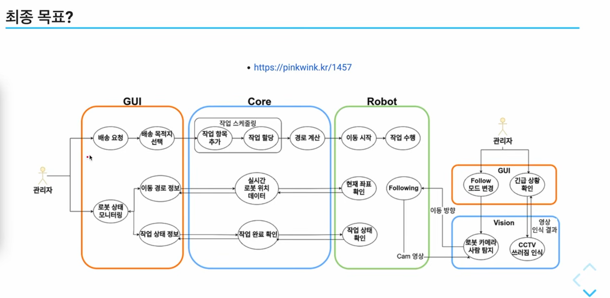
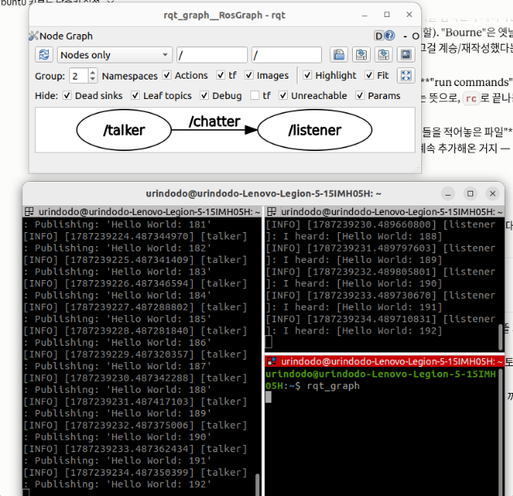

# Day 4 — R2R 입문과정 시작 & ROS 2 Humble 설치

**날짜**: 2026-08-20
**진도**: R2R 입문과정 0 ~ 2-2 (9/35개, 영상 89분, 입문 진도율 30.9%)
**결과**: **ROS 2 Humble 설치 완료 + talker/listener 통신 검증 성공** ✅

---

## 1. 강의 0 — R2R 강좌 소개

- 강사 **민형기 = PinkWink**. 기존 유튜브 영상이 단편적이라 느껴, 환경 구축부터 하나씩 따라가는
  형태로 새로 만든 강좌가 **R2R (Rush To ROS)**.
- 강좌 컨셉: "새롭게 정리해서 접근하기 쉬운 강의"
- **강좌의 최종 목표 아키텍처**



  - **GUI ↔ Core ↔ Robot** 3계층 + **Vision** 모듈 구조
  - GUI: 배송 요청 → 목적지 선택 / 로봇 상태 모니터링
  - Core: 작업 스케줄링(작업 항목 추가 → 작업 할당) → 경로 계산 / 실시간 로봇 위치 데이터 중계
  - Robot: 이동 시작 → 작업 수행 / 현재 좌표·작업 상태 회신, Following 모드
  - Vision: 로봇 카메라 사람 탐지, CCTV 쓰러짐 인식 → GUI로 영상 인식 결과 전달
  - 💭 *내 생각*: 이 구조를 웹으로 치면 REST(요청/응답)와 WebSocket(실시간 스트림)을 섞어 쓰는
    형태와 비슷해 보임. ROS 2의 **서비스(요청/응답)** 와 **토픽(지속 발행/구독)** 이 각각
    그 역할에 대응할 것으로 추정 — 이후 강의에서 확인할 것.

- **강사가 말한 학습 목표**: 수업이 끝나면 스스로 프로젝트를 굴릴 수 있게 하는 것.
  현 상태의 부족함을 스스로 진단하고, 필요한 기능을 ROS 패키지로 만들어낼 수 있는 수준.
- **커리큘럼 흐름**: 토픽/서비스 기본기 → URDF 기초 → (실물 로봇이 없으니) 가상 로봇 하나를 완성 →
  거기에 SLAM·Navigation 패키지를 직접 구성. 이 과정을 마치면 실물 로봇이 생겼을 때 ROS 패키지를
  스스로 구성할 수 있게 된다는 설계.

> 참고 링크(강의 중 소개): https://pinkwink.kr/1457

---

## 2. 1-1 ~ 2-1 — 개발 환경 구축

이미 Ubuntu 22.04 재설치를 마친 상태(Day 2 참고)라 대부분 확인 위주로 진행.

### 1-1. Ubuntu 22.04 설치

- Ubuntu는 **LTS(장기 지원) 버전이 2년마다** 나옴 (짝수 해 4월). 22.04에 맞는 Python·ROS 조합을 쓴다.
  - ※ 강의에서 "2년마다 리뉴얼"이라 한 건 LTS 기준. 일반 릴리스는 6개월마다 나옴.
- ISO 이미지를 받아 USB에 **굽는다(burning)** → balenaEtcher(balena.io) 추천. 부팅용 USB 최소 8GB.
  - → 나는 이미 구워진 USB를 받아서 진행했음 (Day 2 기록 참고)
- USB 꽂고 재부팅 → **F12**로 부팅 메뉴 진입 (또는 BIOS의 boot priority 변경)
- 윈도우와 듀얼부팅하려면 파티션 분할이 필요 → 설치 유형에서 "기타(Something else)" 선택.
  나는 디스크 전체를 밀고 설치했으므로 해당 없음.
- 개발 환경이므로 **시스템 언어·키보드 레이아웃 모두 English**, 사용자 이름/암호는 짧고 단순하게.
  (사용자 이름이 길면 터미널 프롬프트가 길어져서 불편)

#### 🔑 한/영 입력 전환 — 추가 해결책 발견

이전에 `gsettings set org.freedesktop.ibus.engine.hangul initial-input-mode 'hangul'` 로 한 번
해결했었는데, 이 강의를 보다가 GUI에서 설정하는 경로를 또 하나 찾음:

> 화면 오른쪽 위 **한영 표시 클릭 → Setup → Etc 탭 → "Commit in word unit" 체크**

- 결과: 소문자 `en` 상태에서는 전환이 안 되지만, 대문자 **`EN` 상태에서는 한/영 키로 서로 잘 전환됨**
- ⚠️ *왜 이 옵션이 전환 동작에 영향을 주는지는 아직 확실히 모름* — 이 옵션 자체는 원래
  "한 글자 단위가 아니라 단어 단위로 입력을 확정한다"는 뜻인데, 전환 키 동작과 연결되는 이유는
  미확인. 일단 **동작하는 설정 조합으로 기록**해두고, 재발하면 이 경로부터 확인할 것.

### 1-2. Terminal & Terminator

- 우분투에서 가장 많이 쓰는 도구는 **터미널**. 종료는 창 닫기 또는 `exit`.
- ROS를 쓰면 여러 노드를 동시에 띄워야 해서 **창 분할되는 터미널**이 필요 → **Terminator** 추천

```bash
sudo apt update
sudo apt install terminator
```

- 용량 작고 가벼움. 화면 분할이 ROS 작업에 매우 유용.
- 프롬프트 읽는 법: `사용자이름@PC이름:~$` — `@` 앞이 사용자 이름, `~`는 홈 경로
- 우분투 22.04(Jammy Jellyfish)는 로그인 배경에 해파리가 나옴. 20.04(Focal Fossa)의 비버가
  안 보인다고 놀라지 말 것 😄

### 1-3. 기본 터미널 명령어 (복습)

| 명령어 | 뜻 |
|---|---|
| `ls` | list. 현재 경로의 파일/디렉터리 목록 (※ "폴더"는 윈도우 용어) |
| `pwd` | print working directory. 현재 경로 |
| `clear` | 화면 지우기 |
| `mkdir` | make directory. 디렉터리 생성 |
| `rm` | remove. 삭제. **디렉터리는 `-r`(recursive) 옵션이 있어야 지워짐** |
| `sudo` | superuser do. 관리자 권한으로 실행 |
| `cd` | change directory. 경로 이동 |

- `cd` 만 치고 엔터 → 홈(`~`)으로 이동. `cd ~` 도 동일
- `cd ..` 상위로 / `cd ../..` 두 단계 위로
- **Ctrl + Alt + T**: 새 터미널 창 열기
- **Tab 자동완성**: 한 번 누르면 완성, 겹치는 게 여러 개면 **두 번 눌러 후보 목록 표시**

실습:
```bash
mkdir test
cd test
pwd
cd ..
sudo rm -r test
```

### 1-4. Chrome 설치 + Python 환경

```bash
sudo apt update && sudo apt upgrade
wget --version              # 없으면 sudo apt install wget
# wget으로 크롬 .deb 내려받아 홈 폴더에서 설치
```
- 설치 후 Settings → Default Applications → Web: Chrome 으로 기본 브라우저 지정

**Python 가상환경 개념 (강의 설명 정리)**
- "Python"은 두 가지를 뜻함: ① 언어 그 자체 ② 그 위에 얹힌 방대한 서드파티 **모듈** 생태계
- 모듈들은 각자 따로 개발되기 때문에 **의존성(dependency)** 이 생김 — 기능마다 요구하는 모듈
  버전이 달라서, 안 맞으면 안 돌아감
- 해결책이 **가상환경**: 프로젝트별로 버전 조합을 따로 격리해서 관리
- ⚠️ **이 강좌에서는 conda가 아니라 `venv`를 쓴다** — Anaconda 환경과 ROS 2 사이에 환경 충돌이
  있기 때문. (Day 2에서 정리했던 snap vs conda 격리 방식 차이와 같은 맥락 — 격리 메커니즘이
  서로 겹치면 충돌이 난다)

```bash
pip3 -v                              # 없으면 아래로 설치
sudo apt install python3-pip
pip3 install --upgrade pip           # pip 자체도 항상 최신 유지 권장
python3 --version                    # → Python 3.10.12 (내 환경)
```
- `pip` = Python 모듈(패키지) 관리자. 모듈 간 버전 의존성을 다루는 주체라 최신 유지가 유리.

### 1-5. Jupyter Notebook + Markdown

```bash
jupyter --version        # 없으면
pip3 install jupyter     # (pip 아니라 pip3 — Python 2는 단종, 3만 운영)
jupyter notebook         # 로컬 서버로 브라우저에 열림
```
- 코드 실행 결과를 바로 볼 수 있는 **interactive** 환경이 장점
- `Shift + Enter` 셀 실행, `Esc`로 명령 모드(셀 선택) 전환 — 셀 테두리 색으로 모드 구분
- **Markdown 셀** 지원 → 코드와 설명을 한 문서로 남길 수 있음
- 오늘 새로 안 것: `>` 가 **인용문(blockquote)** 표기라는 것. 그 외 이탤릭/볼드, 코드블록(``` ```) 등

### 1-6. VS Code

- 확장(Extension) 설치: **Python**, **Jupyter**, **Jupyter Keymap**(주피터 단축키 제공)
- `.py`(파이썬 스크립트)와 `.ipynb`(주피터 노트북) 모두 VS Code 안에서 편집·실행 가능
- 경로 표기: `.` = 현재 디렉터리, `..` = 상위 디렉터리
- `Ctrl + S` 저장 습관 (편집기 대부분 공통)

### 2-1. Sublime Text — *시청만, 설치는 생략*

- 강사는 ROS 작업 시 화면이 간결한 Sublime Text를 추천 (딥러닝/데이터 분석은 VS Code)
- **나는 VS Code로 계속 가기로 결정** — 이미 확장까지 세팅해뒀고, 도구를 늘릴 이유가 없다고 판단
- 다만 이 강의에서 건진 **멀티 커서 단축키**는 VS Code에서도 그대로 동작하는 꿀팁:

| 단축키 | 동작 |
|---|---|
| `Ctrl + D` | 커서가 놓인 단어와 **같은 단어를 하나씩 추가 선택** (누른 횟수만큼) → 변수명 일괄 수정에 최고 |
| `Ctrl + Shift + L` | 같은 단어를 **문서 전체에서 한 번에 선택** |

- (참고) Sublime 실행 명령은 `subl`, `subl .` 하면 현재 디렉터리를 통째로 열어줌

---

## 3. 2-2 — ROS 2 Humble 설치 ⭐ 오늘의 핵심

### ROS 2 배포판과 Ubuntu 버전은 짝이 맞아야 한다

ROS는 우분투 버전에 맞춰 배포판(코드네임)이 나온다.

| Ubuntu | ROS 2 배포판 |
|---|---|
| 22.04 (Jammy) | **Humble Hawksbill** ← 우리가 쓰는 것 |
| 20.04 (Focal) | Foxy Fitzroy / Galactic Geochelone |
| 18.04 (Bionic) | Dashing Diademata / Eloquent Elusor |

> 📌 **강의 메모 정정**: 필기에 "18.04는 노에틱?"이라고 적어뒀는데, **Noetic(노에틱)은 ROS 2가
> 아니라 ROS 1의 마지막 배포판**이고 대상은 Ubuntu **20.04**다. ROS 1과 ROS 2는 이름 체계가
> 섞여 보이지만 별개의 계보라는 점을 구분해둘 것.
> (Foxy=20.04, Humble=22.04는 별도 자료로 확인함 — 아래 참고자료)

### 실제 설치: 공식 문서를 따라가야 하는 이유

강사가 "한 줄로 설치되는 스크립트도 있지만 **공식 페이지 절차를 그대로 따라가라**"고 강조.
키를 어디에 등록하는지, 저장소가 어디에 추가되는지를 눈으로 봐야 나중에 문제가 생겼을 때
어디를 봐야 할지 알 수 있기 때문.

**⚠️ 실제로 겪은 것: 강의(약 2년 전)와 현재 공식 문서의 절차가 달라져 있었다.**
예전에는 GPG 키를 직접 `apt-key`/키링 파일로 등록하고 `sources.list.d`에 저장소를 손으로
추가했는데, 지금은 그 과정을 **`ros2-apt-source.deb` 패키지 하나 설치로 대체**하도록 바뀜.
→ 강의는 흐름 이해용으로 보고, **명령어는 공식 문서 기준으로** 진행함. (이게 강사가 말한
"공식 문서를 따라가라"의 실제 효용을 그대로 체감한 사례)

### 설치 5단계 + 명령어 해설

#### ① Set locale — 로케일 설정

```bash
locale
sudo apt update && sudo apt install locales
sudo locale-gen en_US en_US.UTF-8
sudo update-locale LC_ALL=en_US.UTF-8 LANG=en_US.UTF-8
export LANG=en_US.UTF-8
```

- **로케일(locale)**: 컴퓨터가 "어떤 언어/문자 인코딩을 기본으로 쓸지" 정하는 시스템 설정.
  여기서 중요한 건 언어보다 **UTF-8이라는 문자 인코딩** — 한글·특수문자 등 전세계 문자를
  안 깨지게 표시하는 표준이라, 없으면 ROS 2 로그 출력이 깨질 수 있음.
- `locale-gen`: "이 로케일을 시스템에 실제로 생성해라". `en_US.UTF-8`을 만드는 것이지 한글을
  설정하는 게 아님 — ROS 2는 영어+UTF-8 조합을 국제 표준 기본값으로 씀.
- `export LANG=...`: **`export`는 "이 변수를 지금 세션 전체에서 쓸 수 있게 등록해라"**는 뜻.
  지금 터미널에 즉시 적용.

#### ② Setup Sources — 저장소 설정

**②-1 Universe 저장소 켜기**
```bash
sudo apt install software-properties-common
sudo add-apt-repository universe
```
- 우분투 공식 저장소는 구역이 나뉘어 있음: `main`(캐노니컬 공식 지원), **`universe`(커뮤니티
  관리 오픈소스)**, `restricted`(독점 드라이버) 등. ROS 2 의존 패키지 일부가 universe에 있어서 켜줌.

**②-2 ROS 2 저장소 등록**
```bash
sudo apt install curl -y
export ROS_APT_SOURCE_VERSION=$(curl -s https://api.github.com/... | grep ... | awk ...)
curl -L -o /tmp/ros2-apt-source.deb "https://github.com/..."
sudo dpkg -i /tmp/ros2-apt-source.deb
```
- `curl`: `wget`과 비슷한 "인터넷에서 데이터 받아오는" 도구. 차이는 `wget`은 파일 다운로드 전용,
  `curl`은 API 응답 받기·텍스트 처리와 조합하기에 더 범용적.
- **파이프(`|`)**: `A | B | C` 는 "A의 출력 결과를 B의 입력으로 넘기고, B의 출력을 다시 C로" 라는 뜻.
  여기서는 GitHub API에서 최신 버전 정보(JSON)를 받아 → `grep`으로 버전이 적힌 줄만 골라내고 →
  `awk`로 그 줄에서 순수 버전 문자열만 뽑아냄. **공장 컨베이어벨트처럼 데이터가 단계별로 가공**되는 구조.
- `dpkg -i`: `.deb` 파일 하나를 그대로 설치하는 **저수준(low-level) 도구**. `apt`와 달리
  의존성 자동 해결은 안 해줌. 이 패키지는 저장소 정보만 담은 단순한 것이라 문제없이 설치됨.

#### ③ ROS 2 패키지 설치

```bash
sudo apt update
sudo apt upgrade
sudo apt install ros-humble-desktop
```
- `apt upgrade`를 먼저 하라고 문서가 경고하는 이유: 오래된 시스템 핵심 패키지(systemd, udev 등
  하드웨어·프로세스 관리 담당)가 새 ROS 2 패키지와 충돌하면, apt가 그것들을 **삭제**하는
  방향으로 의존성을 풀어버릴 수 있음.
- 패키지 선택지
  - `ros-humble-desktop` — RViz 등 GUI 도구까지 포함한 풀 버전 **(우리가 설치한 것)**
  - `ros-humble-ros-base` — GUI 없는 최소 버전 (라즈베리파이 등 headless 환경용)
  - `ros-dev-tools` — 개발/빌드 도구 모음
- 설치에 시간이 꽤 걸림.

#### ④ Environment setup — 환경 설정

```bash
echo "source /opt/ros/humble/setup.bash" >> ~/.bashrc
source ~/.bashrc
```
- `source 파일경로` = "그 파일 안의 설정을 지금 세션에 적용해라"
- 이 한 줄을 `~/.bashrc`에 추가해두면 **터미널을 열 때마다 자동으로 ROS 2 명령어를 쓸 수 있게** 됨
- `.bashrc`의 이름 유래: **bash + rc**, 여기서 `rc` = **"run commands"** (실행할 명령어들을
  적어놓은 파일). Bourne shell(`sh`)을 계승·재작성한 게 **B**ourne **A**gain **SH**ell = bash.
  즉 `.bashrc`는 "bash가 시작할 때 실행할 명령어 목록"이고, 우리는 거기에 한 줄씩 추가해온 것.

#### ⑤ Talker–Listener 통신 테스트

터미널 두 개(터미네이터로 분할)를 열고 각각 실행:

```bash
# 터미널 1
ros2 run demo_nodes_cpp talker

# 터미널 2
ros2 run demo_nodes_py listener
```

- 구조: **`ros2 run <패키지이름> <실행할 프로그램이름>`**
- `demo_nodes_cpp` / `demo_nodes_py` = ROS 2가 기본 제공하는 예제 패키지 (C++판, Python판)
- `talker` = 메시지를 계속 발행(publish)하는 노드 / `listener` = 그 메시지를 구독(subscribe)해 출력하는 노드
- **C++로 만든 노드가 보낸 메시지를 Python으로 만든 노드가 그대로 받는다** — 언어에 상관없이
  통신되는 게 ROS 2 구조의 핵심 (Day 1에 이걸 눈으로 확인한 셈)

**⚠️ 강사 주의사항**: 같은 공유기(네트워크)를 여러 명이 함께 쓰면, ROS 2 노드들이 서로를 자동으로
발견해버려서 **옆 사람의 talker 메시지가 내 listener에 섞여 들어올 수 있음**.
→ 이걸 격리하는 게 `ROS_DOMAIN_ID` 설정이고, 강의 **2-5**에서 다룸. (다음 진도)

### 검증 결과 ✅



- 왼쪽 터미널: `talker`가 `Publishing: 'Hello World: 181, 182, 183...'` 계속 발행
- 가운데 터미널: `listener`가 `I heard: [Hello World: 188, 189, 190...]` 정상 수신
- 위쪽 창: **`rqt_graph`** 실행 결과 — 노드 간 연결 구조를 그림으로 보여주는 도구

```bash
rqt_graph
```

그래프에 나온 것: **`/talker` ──`/chatter`──▶ `/listener`**

- 타원 = **노드(Node)**, 화살표 위 이름 = **토픽(Topic)**
- 즉 "talker 노드가 `chatter`라는 이름의 토픽으로 메시지를 발행하고, listener 노드가 그 토픽을
  구독한다"는 관계가 그대로 시각화됨
- 토픽 이름이 `chatter`인 것은 예제의 기본값. 나중에 이 이름을 바꿔가며 실습하게 될 예정.

**→ 설치 성공. 오늘의 목표(2-2)는 달성.**

---

## 4. 오늘의 회고

### 계획 대비 실적
- 계획: 입문 35개 전부 (4.8h) → **실제: 9개 (89분)**
- 원인 분석
  1. ROS 2 설치가 영상 시간(14분)보다 훨씬 오래 걸림 — 다운로드/설치 대기 시간이 큼
  2. 강의와 공식 문서의 절차가 달라져서, 명령어를 하나씩 대조하며 진행해야 했음
  3. 환경설정 구간은 "영상 보고 → 직접 실행 → 결과 확인"이라 영상 길이의 2~3배가 소요됨
- 다만 남은 구간(3-x 노드/토픽/서비스, 4-x, P-x Python)은 **개념 학습 위주**라 실습 부하가
  상대적으로 작을 것으로 예상 → 8/24 체크포인트에서 실제 페이스를 보고 일정 재배분할 것

### 배운 것 중 가장 중요한 것
1. **ROS 2는 노드(프로그램) 단위로 쪼개고, 토픽이라는 이름의 통로로 메시지를 주고받는다** —
   talker/listener + rqt_graph로 이 구조를 처음 눈으로 확인
2. **언어가 달라도(C++ ↔ Python) 통신이 된다** — 인터페이스가 언어에 독립적이라는 것
3. **공식 문서가 항상 기준** — 2년 된 강의와 실제 절차가 달랐던 걸 직접 겪음

### 미해결 / 확인할 것
- [ ] 한/영 "Commit in word unit" 옵션이 왜 전환 동작에 영향을 주는지 (동작은 하니 우선순위 낮음)
- [ ] `ROS_DOMAIN_ID` — 랩에서 여러 명이 같은 네트워크를 쓸 경우 반드시 설정 필요 (강의 2-5)

---

## 5. 다음에 할 일 (Day 2 = 8/21)

- [ ] 입문 2-3 bashrc 설정 ~ 2-5 ROS_DOMAIN_ID
- [ ] 3-1 Turtlesim ~ 3-9 Action (ROS 2 핵심 개념 구간)
- [ ] 4-1 ~ 5-2 Python으로 topic/service 다루기
- [ ] P-1 ~ P-9 ROS 유저를 위한 Python
- [ ] 진도에 따라 응용과정 착수 여부 판단

---

## 참고 자료

- [R2R 무작정 따라하는 ROS2 - 입문과정 (핑크랩 PinkLAB)](https://www.youtube.com/playlist?list=PL0xYz_4oqpvhj4JaPSTeGI2k5GQEE36oi)
- [ROS 2 Humble 공식 설치 문서 (docs.ros.org)](https://docs.ros.org/en/humble/Installation/Ubuntu-Install-Debians.html)
- [ROS2 Foxy vs ROS2 Humble — 배포판별 Ubuntu 대응 확인](https://roverrobotics.com/blogs/news/ros2-foxy-vs-ros2-humble)
- [PinkWink 블로그 — 강좌 소개 글](https://pinkwink.kr/1460)
